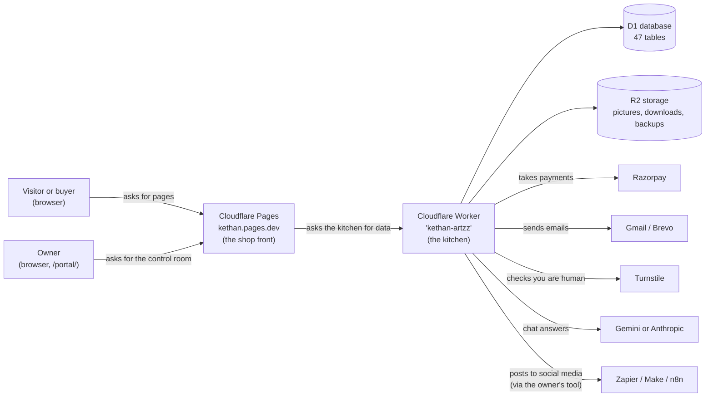
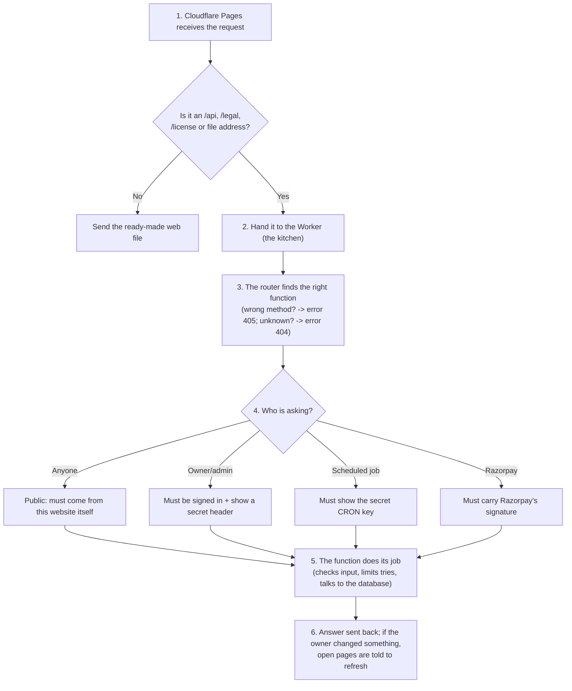
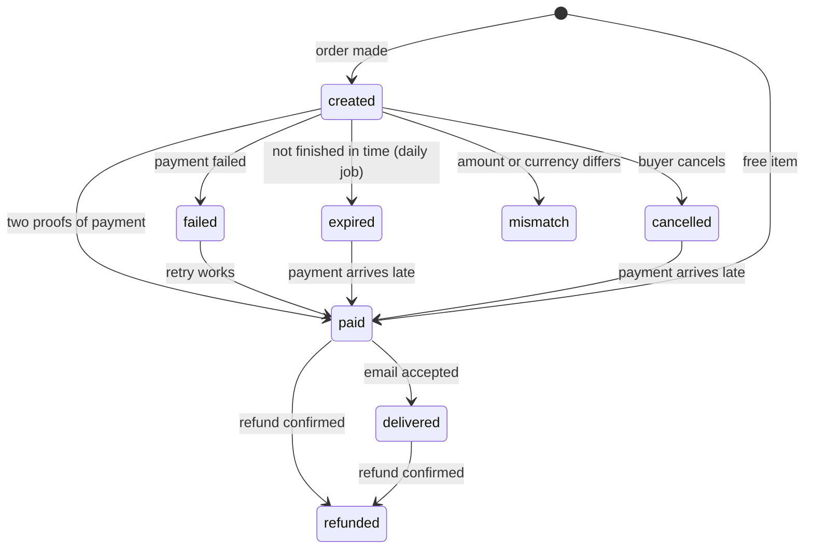
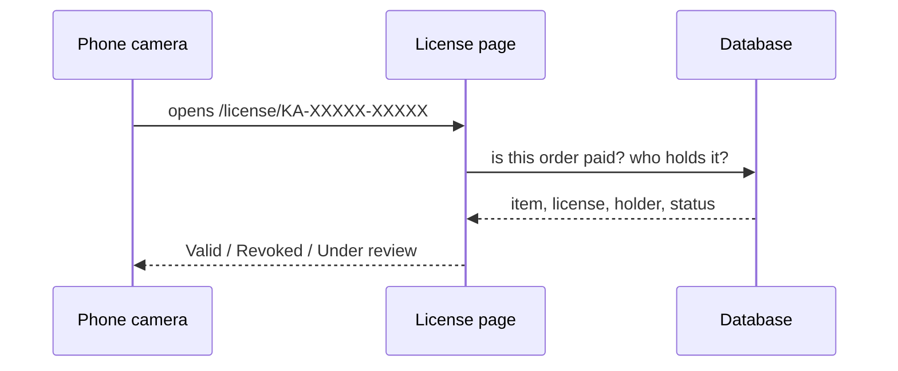
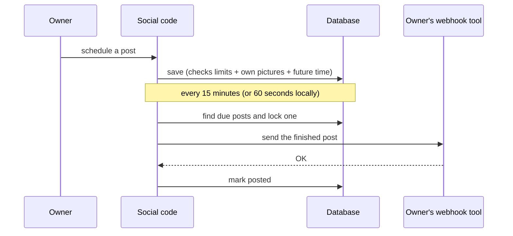
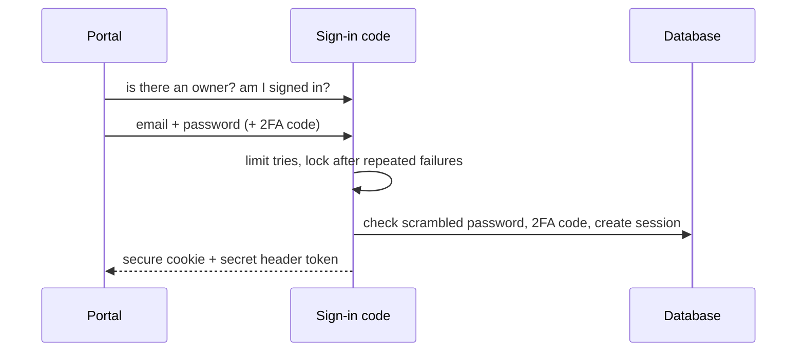
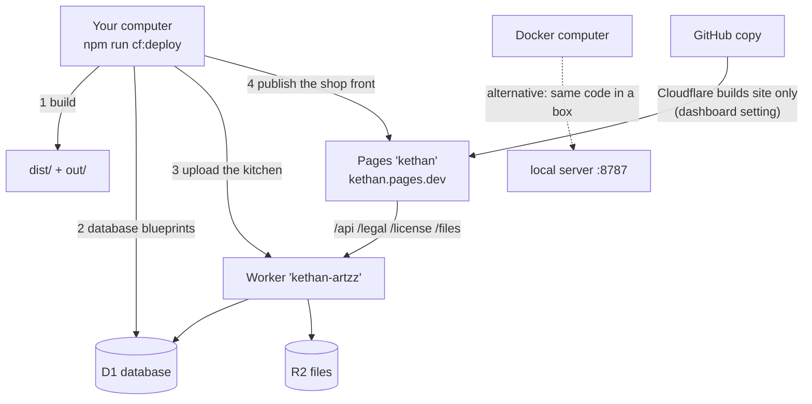

# BEGINNER NOTES — the KA (Kethan Artzz) website, explained from zero

> **Who this is for:** someone who has never programmed and knows nothing about how websites work.
> **How it relates to the other file:** `PROJECT_NOTES.md` is the detailed, technical version. This file tells the **same facts** in plain words. Every number here (for example *168 addresses*, *47 tables*, *183 tests*) is the same as in `PROJECT_NOTES.md`. Where you want the exact file names, look for the pointers like *(→ Notes §4)*.
> **One thing I assumed:** your request had an empty placeholder where a "beginner mode" block should go, so I used these rules: short sentences, everyday comparisons, every new word explained, and small steps.
> **Honesty rule:** if something is not known from the project, this file says **"not found"** or **"unclear"** instead of guessing.

---

## Part 1 — What is this project?

Think of this project as **one small business that lives on the internet**. It belongs to an artist called **Kethan Artzz** (a poster and graphic designer). The website does four jobs:

| # | The job | Everyday comparison |
|---|---|---|
| 1 | **Shows the artist's work** (a portfolio): an animated 3D logo at the start, an "About" page, posters, and a contact form | A gallery wall in a shop window |
| 2 | **Sells digital things** (artwork, design files) in Indian rupees (INR) or US dollars (USD) | The shop counter and cash register |
| 3 | **A private control room for the owner** (called the *portal*, at the address `/portal/`) | The back office where the owner does the accounts |
| 4 | **A chat helper** (the *AI assistant*) that answers visitors' questions | A friendly shop assistant |

**Who uses it**
- **Visitors** look around.
- **Buyers** pay and download.
- **The owner** (and, if the owner invites them, **admins**) run everything from the control room.

**What problem does it solve?** One person can show their work, sell things, and manage money, email, files, visitor numbers and social posts **without paying for many separate services**. It mostly runs inside the **free tier** (the free plan) of a company called **Cloudflare** (→ Notes §0).

---

## Part 2 — The big picture (a restaurant comparison)

Every website has the same basic pieces. Here they are as a restaurant:

| Restaurant | Website word | In this project |
|---|---|---|
| The **customer** | the **browser** (Chrome, Safari…) | Visitors, buyers, and the owner |
| The **menu and decor** | the **frontend** (what you see) | `index.html`, the store screens, the portal screens |
| The **kitchen** | the **backend** (hidden work) | The folder called `server/` |
| The **waiter** who takes orders to the kitchen | an **API** (a set of web addresses the screen uses to ask the kitchen for things) | 168 addresses such as `/api/store/catalog` |
| The **pantry / filing cabinet** | the **database** (organised facts) and **file storage** | Cloudflare **D1** (the database) and **R2** (the file storage) |
| The **building** | **hosting** (a computer on the internet that keeps the site running) | Cloudflare **Pages** and a Cloudflare **Worker** |
| The **card machine** | a **payment gateway** | **Razorpay** |
| The **post office** | **email** | Gmail (or Brevo) |



**Two key ideas to remember**

1. **The "kitchen" is written once and can run in more than one "building".** The real website uses the Cloudflare Worker. Your own computer (and Docker, explained later) uses a second small adapter. The kitchen's recipes (the business rules) are the same in both. (→ Notes §0)
2. **The browser never decides important things.** For example, the browser never decides the price. The server (kitchen) does. That way nobody can cheat by changing a number on their screen.

---

## Part 3 — The tools used (what each one is, in one line)

A **tool** here means software someone else wrote that this project uses, like using a ready-made oven instead of building one.

### Programming languages (the "spoken languages" of computers)
| Language | What it is | Used for |
|---|---|---|
| **JavaScript** | The language browsers understand | Almost everything: the server, the home page, the tests |
| **TypeScript** (version 5.7.2) | JavaScript with extra "labels" that catch mistakes. Here it is only *checked*, not run | The store and portal screens |
| **HTML and CSS** | HTML = the *structure* of a page (headings, buttons). CSS = the *looks* (colours, spacing) | The home page, which is one huge file of 10,616 lines |
| **SQL** | The language for talking to a database | The database set-up files and the questions the server asks |
| **Python** | Another language. Its version is **not found** in the project | One old helper that created the animated logo (`generator/`) |
| **JSON** | A simple way to write lists of facts as text | Settings and starter data |

### The frontend toolbox (what runs in the visitor's browser)
| Tool | What it is |
|---|---|
| **React** (18.3.1) and **react-dom** | A toolkit for building screens from small reusable pieces ("components"), like building with Lego |
| **Vite** (6.4.3) | A "packing machine": it takes all the source files and bundles them into the final small files visitors download (the `dist/` folder) |
| **Three.js** (0.185.1) | A toolkit for **3D graphics** in the browser: used for the panda mascot, an old (unused) 3D folder, and a (currently switched-off) painted background |
| **Three.js "r128"** | An older ready-made copy of Three.js used for the 3D "crystal" logo at the start |
| **gsap** (3.12.7) | An animation toolkit. Only the **old, unused** 3D folder uses it |
| **Phosphor icons** (2.1.10) | A set of little pictures (icons) used in one part of the portal |
| **Google Fonts** | Free fonts (letter styles) loaded from Google |
| Browser built-ins | **Shadow DOM** (a "private room" so the store's styling can't mess up the rest of the page), **Web Animations** (moving things), **IntersectionObserver** (notices when something scrolls into view) |

### The backend toolbox (what runs on the server)
| Tool | What it is |
|---|---|
| **Cloudflare Workers** | A tiny program that Cloudflare starts **only when a request arrives** (no server to keep running all day) |
| A **hand-written router** (about 90 lines) | The "receptionist" that reads the address of a request and sends it to the right function. No big framework is used |
| **Node.js** (version 22 or newer) | Lets JavaScript run on your own computer. Used for local work |
| **better-sqlite3** (11.10.0) | Lets your computer use a small database file (only for local use and tests) |
| **dotenv** (16.6.1) | Reads a private settings file called `.env` |
| **ua-parser-js** (1.0.41) | Reads the technical "I am Chrome on Windows" text a browser sends, to know the device |
| **wrangler** (4.144.0) | Cloudflare's command-line "delivery truck" for putting your site online |

### Storage (where information is kept)
| Tool | What it is |
|---|---|
| **Cloudflare D1** | A hosted database (a very organised set of spreadsheets). Named `ka-db` |
| **SQLite** | The kind of database D1 is. Locally it is just one file, `.data/ka.sqlite` |
| **FTS5** | The database's built-in **search engine** (used to search tips, messages and the assistant's knowledge) |
| **Cloudflare R2** | Hosted **file storage** (like a big cloud folder). Named `ka-files` |

### Security tools (all written by hand using Node's built-in "crypto" tools)
| Tool | Everyday comparison |
|---|---|
| **scrypt** password hashing | Instead of storing your password, the system stores a deliberately slow "scrambled fingerprint" of it, so a thief can't easily reverse it |
| **TOTP / two-factor (2FA)** | A second lock: a 6-digit code from a phone app that changes every 30 seconds |
| **AES-256-GCM encryption** | A strong safe for secrets (for example the 2FA seed and the social-media link) |
| **HMAC signatures** | A tamper-proof wax seal on a link or message |
| **Cloudflare Turnstile** | A "prove you're human" check (a friendlier CAPTCHA) |
| **Rate limits** | "Only so many tries per few minutes" |
| **CSRF token + SameSite cookies** | Stops a bad website from tricking your browser into acting as the owner |

### Testing and building tools
| Tool | What it does |
|---|---|
| **Node's built-in test runner** (`node --test`) | Runs automatic checks. There are **31 test files** |
| **postcss** (8.5.28) | Reads style files so tests can check them |
| Small **"verify" scripts** | Extra checks that use stand-ins instead of a real browser |
| **tsc** (the TypeScript checker) | Catches typing mistakes before building |

### Hosting and delivery tools
| Tool | What it does |
|---|---|
| **Cloudflare Pages** (project `kethan`) | Hosts the public website at `kethan.pages.dev` |
| **Cloudflare Worker** (`kethan-artzz`) | Runs the "kitchen" |
| **Docker** and **Docker Compose** | A way to pack the whole site into one portable "box" (explained in Part 14) |
| **Git / GitHub** | A time machine and online backup for the code. The online copy is called `Kethann/KA-Portfolio` |
| CI/CD (automatic deploy robots) | **Not found** in the project |

### Outside services the project talks to
| Service | What for | Does it need a secret key? |
|---|---|---|
| **Razorpay** | Taking payments and refunds | Yes (3 keys) |
| **Cloudflare Turnstile** | Human check | Yes (2 keys) |
| **Gmail** (or **Brevo**) | Sending emails | Yes |
| **Gemini** or **Anthropic** | The AI chat answers | Yes |
| **ipwho.is** or **ipstack** | Guessing a visitor's rough location from their address (optional) | ipstack only |
| **OpenStreetMap** | A map shown in the control room's Visitors window | No |
| **Zapier / Make / n8n** (the owner's own account) | Publishing social-media posts | The owner pastes a private link |

**What you need on your computer:** Node.js 22+, npm (it comes with Node), a Cloudflare account and `wrangler login` (only for putting the site online), Docker (optional), Python (only to re-run the old logo helper).

---

## Part 4 — The folders (a tour of the house)

Imagine the project as a house. Each folder is a room.

```
The project folder
├─ index.html        ← THE FRONT DOOR: the public home page (one very long file)
├─ client/           ← Everything that runs in the visitor's browser
│  ├─ src/           ← The store, tips, work gallery, panda, drawing studio
│  ├─ portal/        ← The owner's control room
│  └─ public/        ← Plain files copied as they are (rules about caching, icons)
├─ server/           ← THE KITCHEN: all the behind-the-scenes code
│  ├─ handler.js     ← The kitchen's front desk (lists every address it answers)
│  ├─ platform/      ← Two "adapters": one for Cloudflare, one for your computer
│  ├─ core/          ← Shared basics (router, database access, security, email, storage)
│  ├─ handlers/      ← Answers for the public (store, checkout, contact, license pages…)
│  ├─ store/         ← Money and delivery rules (orders, downloads, social posts)
│  ├─ admin/         ← Answers for the control room (owner only)
│  ├─ assistant/     ← The AI helper's brain
│  └─ visitors/      ← Counting visitors
├─ shared/           ← Code used by BOTH the browser and the kitchen (license seal, skill logos, social rules)
├─ migrations/       ← 6 numbered files that build the database (the blueprint)
├─ pages/            ← Small files for the Cloudflare Pages "shop front"
├─ images/           ← 195 pictures (posters in several sizes, logos, icons)
├─ scripts/          ← Helper commands (deploy, import old data…)
├─ generator/        ← The old helper that made the 3D logo + some checking scripts
├─ tests/            ← 31 files of automatic checks
├─ docs/             ← Written guides (setting up Cloudflare, Docker…)
└─ Dockerfile, docker-compose.yml  ← Instructions for packing the site into a Docker "box"
```

**Where does it start?** ("entry points" = the first thing that runs)

| What | Starting file | Who starts it |
|---|---|---|
| The public page | `index.html` | The visitor's browser |
| The live kitchen | `server/platform/cloudflare.js` | Cloudflare |
| The shop-front router | `pages/_worker.js` | Cloudflare Pages |
| The kitchen on your computer | `server/platform/node-dev.js` | The command `npm start` |
| The control room | `client/portal/index.html` | The browser at `/portal/` |
| The automatic checks | `tests/*.test.mjs` | The command `npm test` |

**Folders that appear by themselves** (made by a tool, not typed by a person):
- `dist/` — the finished website, made by Vite ("the packing machine").
- `out/` — `dist/` plus two extra helper files. Cloudflare's own builder publishes this one.
- `.data/` — your local database and uploaded files (only on your computer).
- `node_modules/` — all the ready-made tools, downloaded by `npm install`.
- `.wrangler/`, `shots/` — scratch folders. They are not part of the project's real content.

---

## Part 5 — What visitors see (the "frontend")

There are **three separate front-ends**. Don't mix them up:

| Front-end | Built how | What it is |
|---|---|---|
| **Home page** | Plain HTML/CSS/JavaScript in one file (`index.html`) | The portfolio, About, Contact |
| **Store, Tips, Work gallery** | **React** (reusable pieces), each inside a "private room" (Shadow DOM) | Loaded **only when needed** ("lazy loading", like fetching a book only when you want to read it) |
| **Owner portal** | React, looks like a computer desktop with windows | The control room |

Three pages are also built **by the server as plain pages** that work even without JavaScript: the **legal pages** (`/legal`), the **license-check page** (`/license/…`) and the **download page**.

### The home page
It does **not** use separate web addresses for its pages. It has four "pages" (Contact, About, Store, Tips) stacked like cards; the menu bar shows one card and hides the others. You can still share links such as `/?page=store`, `/?product=<name>` or `/?tip=<name>`. On a phone or tablet, **swiping from the screen's edge** moves to the next page.

| Page | What you see and can do |
|---|---|
| **Contact** | A form (name, email, subject, message) with an animated paper rocket |
| **About** (the landing page) | The artist's bio, **numbers** that count up, the **Skills** section, **Featured Work**, then the **Portfolio** folders |
| **Store** | The shop (a React program loaded when you open it) |
| **Tips** | Short articles |
| Extras | A picture viewer (lightbox), the **AI chat bubble**, a menu with the Typography studio, an "Image Upscaler (coming soon)" entry, Portfolio and Full screen |

**The opening animation:** a 3D "crystal" version of the KA logo built with the older Three.js "r128". The finished pictures are shipped with the site. The old Python helper that once made them is **not** run by the normal build, and whether today's pictures still match it is **unclear**.

**How the home page talks to the kitchen:** it calls only seven addresses: public settings, the portfolio content, a "has anything changed?" check (asked about every 15 seconds), the contact form, the "notify me" list, the AI chat, and the visit counter.

**"Publish once, see it everywhere":** when the owner publishes a change in the control room, open visitor pages notice (through that 15-second check, and instantly in the same browser) and refresh their content **without reloading**.

**The Skills section** (a favourite feature):
- A resume-style board with one row per category (design, motion, video, AI, arts, languages, frontend, backend, database, APIs…), each showing small **logo chips**.
- Click a category to see a detailed list with notes and skill levels.
- Beside it is a field of **softly blurred logos drifting past**. It stays centred while you scroll the skills.
- Logos come from a library of about **96** (real brand marks, Adobe-style tiles, line icons). If a skill has no logo, it shows letters. The owner can also upload their own logo, which always wins.
- On phones it shows 4 categories with a "Show all" button. If a visitor prefers reduced motion, the moving field becomes still.

### The Store (React)
- Two tabs: **Artzz** (artwork/designs) and **Artifacts** (downloadable tools/files).
- Filters (category, price: any / free / paid / on sale), sorting, ratings, download counts, reviews.
- **Buy** opens the **checkout dialog** (explained in Part 9). Prices always come from the server, in whole small units (e.g. paise/cents).
- The checkout is a **state machine**: it is always in exactly one step (*loading → ready → checking → creating → paying → confirming → success*, or *failed* / *cancelled*), which stops double-clicks from causing trouble.

### Other browser programs
- **Work panel:** stacks of images per category that open into a coverflow.
- **Panda mascot:** a 3D panda that sits by the chat bubble.
- **Typography studio:** a full-screen drawing/typing canvas with brushes. It runs **entirely in your browser; nothing is uploaded**.
- **Painted background:** built, but **switched off** (the line that starts it is commented out).

---

## Part 6 — The owner's control room (the "portal")

Open `/portal/`. It looks like a desktop: windows you can drag, a dock at the bottom, a menu bar at the top.

**Starting up:** first it asks the kitchen "is there an owner yet?". If not, it shows **setup** (create the first owner). If yes, it shows **sign in** (plus a 2FA code step if switched on). If your session ends while you work, the sign-in appears **on top** and your open windows and unsaved edits are kept.

**The 16 "apps" (windows):**

| App | What the owner does there |
|---|---|
| **Overview** | Sees the main numbers for a date range |
| **Products** | Creates and edits shop items: prices, sale dates, pictures, the downloadable file, history/restore, ratings |
| **Orders** | Looks at orders, re-sends emails, refunds, invoices, cancels download links |
| **Reports** | Revenue by day/week/month, as CSV |
| **Coupons** | Creates discount codes |
| **Downloads** | Sees download links and who used them |
| **Visitors** | Traffic, who is online now, a log, a map |
| **Messages** | The inbox from the contact form: replies, saved replies, a block list |
| **KA Assistant** | Teaches and watches the AI helper (knowledge, conversations, a test playground, rules) |
| **Social** | Writes and schedules social-media posts (Part 9) |
| **Tips** | Writes short articles |
| **Studio** | Colours, fonts, banner, links, animations, drag-to-arrange with live preview, and the checkout card design |
| **Content** | Portfolio pictures, site text, About numbers, the Skills editor, the "notify me" list, email wording |
| **License card** | Just the checkout-card editor (Part 9) |
| **Licenses & Legal** | License texts and the four legal pages |
| **Settings** | Password, 2FA, sessions, Team, store/tax, messages, reports, categories, system status, backups, activity log, appearance |

**Safety nets built into the portal:** it warns before you leave unsaved edits; and if two people edit the same thing, the second save is refused with a "changed somewhere else" message instead of silently overwriting.

---

## Part 7 — Behind the scenes (the "backend")

### The journey of one request
Every time a screen asks the kitchen for something, this happens (in order):



All answers carry safety labels (don't cache private data, don't open in frames, same-origin only). If something unexpected breaks, the visitor sees a plain "try again" message, and the log records **only** the address and error type (emails and tokens are removed from logs).

### The 168 addresses ("endpoints")
An **endpoint** is one address the screens can call. They fall into groups:

| Group | Examples | Who may use it |
|---|---|---|
| Public site | portfolio, contact, notify, health check, chat | Anyone (from this website) |
| Store | catalog, product, reviews, tips | Anyone |
| Checkout | quote, order, verify, status, cancel, downloads, rating, resend | Anyone (with the right order secret or link) |
| Payments | the Razorpay webhook | Only Razorpay (checked by a signature) |
| Public pages | `/legal`, `/license` | Anyone |
| Control room | everything under `/api/admin/…` (products, orders, team, social, settings…) | Signed-in owner/admin only |
| Scheduled jobs | daily, weekly, social | Only with the secret key |

The full table with file and function names is in *(→ Notes §4.3)*. For about 120 admin addresses, the exact shape of the data is deliberately left to the code itself.

### What each "department" in the kitchen does
| Department | Job |
|---|---|
| **orders** | The money rules: price quote, creating an order, checking payment, delivery, refunds |
| **coupons** | Discount rules (percent or fixed amount, limits, first-order-only, stacking; at most 3 codes) |
| **razorpay** | Talks to Razorpay and checks its signatures |
| **delivery** | Download links, emails, the download page, ratings |
| **license** | License codes (`KA-XXXXX-XXXXX`) |
| **social** | Social posts, scheduling, the webhook |
| **admin/** | Everything the control room needs |
| **assistant/** | The AI helper's steps |
| **visitors/** | Counting and locating visitors |
| **core/** | The shared basics: router, database, settings, security, email, file storage |

### Background jobs (things that run on a timer)
| Job | When | What it does |
|---|---|---|
| **Daily** | 01:00 UTC | A "heartbeat" note, expires unfinished orders, sends the daily report if switched on, deletes old visit data and old assistant logs, sends a usage warning |
| **Weekly** | Mondays 02:00 UTC | Saves a **backup** of every table (keeps the newest 8) and sends the weekly report |
| **Social** | Every 15 minutes (Cloudflare) or every minute (your computer) | Sends social posts that are due |
You can also trigger them by hand with the secret key. There are **no queues and no live two-way connections ("websockets")**: live updates use the 15-second check; the AI chat uses a one-way stream ("Server-Sent Events").

---

## Part 8 — Memory: the database and the files

**The database** is like a set of very strict spreadsheets. Each sheet is a **table**; each row is one thing (one order, one product); each column is one detail.

- It is **SQLite**: the live site uses Cloudflare **D1**; your computer uses one file; tests use a temporary one.
- **47 tables** (including 4 search helpers). Only the Worker ever touches the database. Browsers never do.
- **House rules inside the database itself** (so even a bug can't break them): an order's total must equal subtotal − discount + tax; a paid order must have two proofs of payment; a published paid product needs **both** an INR and a USD price; a coupon can't be used more times than allowed; a download link can't exceed its limit.
- Money is stored as **whole small units** (₹499 = 49,900 paise) to avoid rounding mistakes.

**The tables, in plain groups**
| Group | Tables (examples) | Holds |
|---|---|---|
| Settings and content | settings, legal pages, licenses, email templates | Text and options |
| Shop | categories, products, product media/files, tips, ratings, revisions | What is for sale |
| Sales | orders, order items, order events, coupons, redemptions, webhook events, invoice counter, download tokens/events | Money and delivery |
| Messages | messages, replies, saved replies, block list, notify sign-ups, email log | The inbox and email record |
| Analytics | visits, location cache, location quota | Visitor numbers |
| AI | knowledge sources/chunks, conversations, messages, daily usage, per-model usage, approved answers | The assistant |
| Security and operations | admin users, sessions, audit log, rate limits, backups | Who can enter, and a diary of actions |
| Social | social posts, hashtag sets | The new post planner |

**Migrations** are the numbered blueprint files in `migrations/` that build and change the tables: `0001` … `0005`. (There are **two files numbered 0004**. They still work, but that breaks the project's own numbering rule.) Online, `npm run cf:migrate` applies new ones; on your computer they apply automatically at start.

**Starter data:** the first time the portfolio is read, it is filled from a starter file (18 pictures, 3 folders). There is also starter knowledge for the AI, demo shop items (local only), an importer for the older version's data, and draft legal text that stays hidden until the owner publishes it.

**Files** live in three "drawers" in R2: `media` (public pictures), `deliverables` (private, only reachable through short-lived signed links), and `backups` (private). Uploads go **straight to storage** with a signed link, not through the kitchen.

**Caching** (reusing copies to be faster): there is no cache program. Only ordinary web caching rules and a table that remembers location look-ups.

---

## Part 9 — The features, explained step by step

### 9.1 The contact form
1. A visitor fills in name, email, subject and message and presses send.
2. The kitchen checks: not too many tries (5 per 15 minutes), a hidden "trap" field (only bots fill it — if filled it **pretends success**), valid input, and the **Turnstile** human check.
3. It also checks the owner's **block list**. Spam is filed as "spam" instead of the inbox.
4. The message is saved in the database, the owner gets an email with a link straight to it, and the visitor may get an automatic reply (a special "away" message outside business hours, Asia/Kolkata time).
5. The owner replies from the **Messages** window; the reply is emailed and recorded.

### 9.2 Browsing the store
The store asks the kitchen for the catalog (only **published** items, up to 500). The kitchen turns each row into a safe summary: price in each currency, whether it's on sale or free, ratings and download counts (if the owner shows them). Tips can be searched; the search words are made safe first so nobody can inject tricks.

### 9.3 Buying something (the most important process)
**An order goes through these stages** (like a parcel's tracking):



**The steps for a paid item**
1. **Quote:** the browser asks "what does this cost?". The server works out price, coupons, tax and the minimum charge (100 small units). The browser only displays the result.
2. **Order:** the buyer gives an email and **a name for the license (required, 2–80 characters)**. The server checks tries and Turnstile, then writes the order, its item and any coupon holds **all at once (all-or-nothing)**. It asks Razorpay to create a matching payment order and double-checks the amount.
3. **Pay:** Razorpay's own window opens (card, UPI, net banking…). **This website never sees card numbers.**
4. **Proof 1:** the browser returns a signature; the server checks it with a secret key.
5. **Proof 2:** Razorpay separately sends a "payment captured" message (a **webhook**). The server checks that signature too and that the amount matches. If the browser never returned, the server asks Razorpay directly instead.
6. **Paid:** only when **both proofs** exist does the order become *paid*. A guard in the database enforces this. This is why a faked browser message alone — or a stray webhook alone — can never get free goods.
7. **Delivery:** the server emails the download link, a `LICENSE.txt` file (with the buyer's name and code) and a receipt. Only after the email is accepted does the order become *delivered*. If email fails, it stays *paid* and the daily job retries after 10 minutes. The on-screen success page also shows a link, so the buyer is never stuck.

**Safety rules in this process:** the buyer's browser never sets prices; an order is locked to one currency; only INR and USD; if the owner pauses international sales, USD purchases are blocked; a closed store gives a "closed" message; a coupon that runs out mid-checkout is caught safely; the buyer's secret is stored only as a scrambled fingerprint.

**Free items:** the order is *paid* instantly, has no invoice number, the link and license appear straight away.

**Demo mode:** for local testing only (`KA_DEMO_PAYMENTS=1`), a pretend payment window replaces Razorpay. It is impossible in production.

### 9.4 Downloading
- The emailed link first shows a **confirm page** (so automatic email scanners can't use up your downloads). Pressing **Download** (with the human check) counts **one** download in a single safe step — only if the link is not used up, not expired, not revoked and the order is still paid — then sends the buyer to a file link that **works for only 60 seconds**.
- There is **no permanent public link** to a paid file.
- **Lost the email?** "Email me my links" always gives the same answer, whether or not the email has orders, so it can't be used to discover who the buyers are.
- **Rating:** the download page has a form; one rating per order and product.

### 9.5 Refunds
The owner presses refund in **Orders**. Rules: only paid orders, not free, not already refunding. If the buyer already downloaded, the owner must confirm (or the refund is blocked if that product forbids it). Downloads are switched off immediately; the order becomes *refunded* when Razorpay confirms.

### 9.6 The license card and the scannable seal ("scan to see who owns it")
- **Owner:** in the **License card** window the owner designs the checkout card: labels, logo, tag, fonts, positions, **signature** (text, font — built-in or uploaded in "Your fonts" —, size, slant, ink colour), the seal on/off, and the words on the back (heading, "Licensed to" label, signature label, an extra line, the delivery line on/off). The **Add your own signature font** button jumps to the font uploader, and a freshly uploaded font is selected automatically.
- **Buyer:** the checkout card flips. Clicking into the name field flips it to the back so the typed name appears under "Licensed to". After payment the back shows a real scannable **QR code seal**.
- **Scanning:** the QR contains `<site>/license/<code>`. The page that opens (it needs no JavaScript) shows the item, license, holder name (or a masked email), issue date and signature, and says **Valid**, **Revoked** or **Under review**. Unknown and unpaid codes look identical (so nobody can probe). A refund turns it to **Revoked**.
- **The code** looks like `KA-XXXXX-XXXXX` (50 random bits), created when the order is made and never derived from a secret.



### 9.7 The social-media planner (Social window)
**What it does:** write one post once, check it fits each network, then save a draft, schedule it, send it now, or copy the text and post by hand.

- **Pictures:** upload them or pick from the portfolio (up to 20).
- **Caption + hashtags:** hashtags are cleaned (letters, marks, digits and underscores only; never all digits; Indian scripts work). There are saved sets, built-in starter sets, suggestions from your caption, copy-all, and live counters.
- **Per-network limits** (checked identically in the browser and the server): Instagram 2,200 characters and 30 hashtags and needs a picture; X 280 characters (every link counts as 23); Facebook 63,206; LinkedIn 3,000; Threads 500; Pinterest 500 and needs a picture.
- **Preview** per network, a problems list, and a "mark posted by hand" tick per network.
- **Big design choice:** the website **never logs into Instagram/X/etc.** (they need special approval and your passwords). Instead it hands the finished post to **your own Zapier / Make / n8n link** (a *webhook*), and that tool posts using its own logins. The link is checked (must be `https`, a real public name, not an internal address), stored **encrypted**, and never shown again.
- **Scheduling:** a timer sends due posts (every 15 minutes online). With no webhook connected, due posts just stay "due" for manual posting. A send that gets stuck for 15 minutes is marked failed so you can retry. Sent posts can't be edited; stale edits are refused.



### 9.8 Signing in to the control room

- First setup needs a **setup code** (`local-setup` locally; `ADMIN_SETUP_TOKEN` online). Passwords need 12+ characters.
- Too many wrong tries: a per-IP limit and a **growing lock-out** on the account.
- The session cookie is `HttpOnly`, `SameSite=Strict`, and `Secure` on https; the server stores only a fingerprint of it. A session lasts at most 12 hours, or ends after 2 hours of inactivity.
- **Team:** the owner adds people with a **temporary password** they must change at first sign-in. There are **exactly two roles: owner and admin**. Admins can't open the Team page. Nobody can remove the last owner or themselves. Switching someone off ends their sessions at once.
- A third limited "worker" role the owner asked about does **not exist**.

### 9.9 The AI assistant
1. The chat bubble sends the conversation (limit: 8 messages per 10 minutes per visitor).
2. The kitchen checks input size, a **daily money cap** (default US$0.50), and strips card numbers.
3. It finds relevant facts from the owner's own knowledge (plus live shop data).
4. It asks Gemini (or Anthropic) for an answer and streams it back.
5. Unbreakable rules are enforced **in code**, not just in instructions: never invent prices or coupon codes, never ask for card numbers, never reveal private details, never pretend to be human. Secrets and stray email addresses are removed from answers.
6. The owner can rate answers; a 👍 answer may be reused later.

### 9.10 Counting visitors and the location question
- The home page keeps a random visitor ID (no cookies) and sends a note when a page is shown, every 30 seconds while it's open, and when you leave. The server stores IP, rough location, device and bot flag.
- **The location question:** there is **no button**. After about **one minute** of real use, your browser's own pop-up asks once whether to share your location. Only **Allow** shares anything; the server keeps a rounded position (accuracy 1,000 m or better) for **7 days**. If you say no, it isn't asked again.

### 9.11 Shorter features
- **Coupons:** percent or fixed amount, per-currency amounts, start/end dates, total and per-email limits, first-order-only, scoped to products/categories, stacking (up to 3 codes).
- **Legal pages:** four pages (terms, privacy, refunds, delivery) start as hidden drafts and are public only when published.
- **Email templates:** ten built-in emails (contact notice, auto-reply, notify confirm, order delivery, receipt, resend links, report, alert, reply, launch), all editable in the portal.
- **Backups and usage:** weekly backup of every table (newest 8 kept); a popup and a monthly email at 80% of the free plan.
- **Typography studio** and **Panda mascot:** see Part 5.

---

## Part 10 — Safety, in everyday terms

| Risk | Protection |
|---|---|
| Someone guesses the owner password | Slow password scrambling, per-IP limit, growing lock-out, optional 2FA |
| Another website tricks your browser into acting as you | Strict cookies + a secret header on every change + same-origin rule |
| Bots spamming forms | Turnstile, hidden trap field, rate limits (e.g. quotes 40/10 min, orders 10/10 min, contact 5/15 min…) |
| Fake payments | Two independent proofs; amounts re-checked; database rules |
| Stealing paid files | Links expire in 60 seconds; random 256-bit download tokens, only a fingerprint stored |
| Probing who bought | Same answer for known/unknown emails and license codes |
| Leaked secrets | Never sent to the browser; encrypted at rest where stored |
| A bad "webhook" link attack | Only public https names, no IP numbers, 12-second timeout, no redirects |

**Honest findings (known weak spots):**
1. A few secret files exist on this computer (`.env`, `.dev.vars`, and three small helper files in `.data/`). They are hidden from Git, but delete the ones you no longer need.
2. The startup safety check for missing secrets runs **only on the computer-based server**, not on Cloudflare (there, each secret is checked when it is used).
3. Outside "production", a built-in **practice key** is used. Fine on your computer, not for a real self-hosted site.
4. The home page and portal send **no Content-Security-Policy** (an extra browser safety label). The home page's many inline scripts make that hard. The license, legal and download pages do send one.
5. No cross-site (CORS) permissions are ever granted; other websites' calls are refused.
6. Raw IP addresses are stored (visits, orders, downloads, messages). Precise location is purged after 7 days. The legal drafts describe this.
7. Some old comments in `index.html` mention files that don't exist.

**Who can do what:** *Owner* = everything including Team. *Admin* = everything except Team. Buyers have no accounts: they are recognised by an order number plus a private secret in their browser, and by their emailed link. **There are no visitor/buyer accounts in the project.**

---

## Part 11 — Settings you may need ("environment variables")

An **environment variable** is a named setting kept outside the code (like a note on the fridge). Secrets are **never** put in files you share. On Cloudflare, normal settings sit in `wrangler.jsonc` (`KA_ENV`, `SITE_NAME`, `PUBLIC_SITE_URL`) and secrets are added with `npx wrangler secret put NAME`. On your computer they live in a private `.env` file.

| Group | Names | In plain words |
|---|---|---|
| Site | `KA_ENV`, `PUBLIC_SITE_URL`, `SITE_NAME`, `OWNER_EMAIL` | Is it live? What is the address? Name in emails? Where do messages go? |
| Secrets that protect | `DOWNLOAD_TOKEN_SECRET`, `ADMIN_ENCRYPTION_KEY`, `ADMIN_SETUP_TOKEN`, `CRON_SECRET`, `ALLOWED_ORIGINS` | Sign file links; encrypt secrets; first-owner code; job key; extra allowed websites |
| Human check | `TURNSTILE_SITE_KEY`, `TURNSTILE_SECRET_KEY` (`TURNSTILE_DISABLED` for local only) | Bot check |
| Payments | `RAZORPAY_KEY_ID`, `RAZORPAY_KEY_SECRET`, `RAZORPAY_WEBHOOK_SECRET` (`RAZORPAY_API_BASE`, `KA_DEMO_PAYMENTS` only for testing) | Take money |
| Email | `GMAIL_USER`, `GMAIL_APP_PASSWORD`, or `BREVO_API_KEY` (+ `MAIL_FROM`, `MAIL_FROM_NAME`, `MAIL_SIGNATURE`) | Send emails |
| AI | `AI_PROVIDER`, `AI_MODEL`, `AI_FALLBACK_MODELS`, `GEMINI_API_KEY`, `ANTHROPIC_API_KEY`, `AI_PRICE_IN`, `AI_PRICE_OUT` | Chat helper |
| Location | `GEO_PROVIDER`, `GEO_FALLBACK`, `IPSTACK_ACCESS_KEY`, `IPSTACK_HTTPS`, `IPSTACK_ALLOW_HTTP` | Rough visitor location |
| Local/Docker only | `KA_DATA_DIR`, `PORT`, `HOST`, `KA_DEV_COUNTRY`, `KA_API_PORT`, `KA_PLATFORM` (set automatically) | Where data lives, which port, pretend country |

**Must-haves online:** `DOWNLOAD_TOKEN_SECRET`; `ADMIN_ENCRYPTION_KEY` (for 2FA and Social); `ADMIN_SETUP_TOKEN` (once); Turnstile secret (otherwise protected forms refuse); Razorpay keys (to take paid orders); one email provider (otherwise emails fail in production).

**The important config files**
| File | Plain meaning |
|---|---|
| `package.json` | The project's ID card: its commands ("scripts") and its list of tools |
| `tsconfig.json` | Rules for the type checker (it only checks) |
| `vite.config.mjs` | How the packing machine builds the 7 bundles (portal, gallery, poster, panda, studio, store, skill-logos) and what to copy |
| `wrangler.jsonc` | The Worker's identity card: name, database, file storage, timers, public settings |
| `pages/wrangler.jsonc`, `pages/_worker.js`, `pages/_routes.json` | The shop front and its rule for "which addresses go to the kitchen" |
| `client/public/_headers` | Safety and caching labels for web files (fixed-name lazy files are never cached for a year; the portal is "do not index") |
| `client/public/_redirects` | `/creator` → `/portal/` |
| `Dockerfile`, `docker-compose.yml`, `.dockerignore` | The Docker box recipe |
| `.env.example` | A list of setting **names** only |

**Different places it runs**
| | On your computer | In Docker | Live on Cloudflare |
|---|---|---|---|
| Kitchen | `node-dev.js` | `node-dev.js` | `cloudflare.js` |
| Database | local file | file in `/data` | D1 |
| Files | `.data/storage` | `/data/storage` | R2 |
| Emails | saved as files in `.data/outbox` unless Gmail/Brevo is set | same | Gmail or Brevo required |
| Payments | real keys or demo mode | same | real keys only |
| Timed jobs | timers inside the program | timers | Cloudflare timers |
There is **no staging** (practice) environment in the project.

---

## Part 12 — Running it on your own computer

**You need:** Node.js version 22 or newer (it includes `npm`). No database program to install — the database is just a file.

**Step by step** (type each line into a terminal such as PowerShell, then press Enter):
1. **Get the code:** `git clone https://github.com/Kethann/KA-Portfolio.git`, then `cd KA-Portfolio`.
2. **Install the tools:** `npm install` (downloads everything the project uses into `node_modules/`).
3. **Settings (optional the first time):** copy `.env.example` to `.env` and fill in only what you use. Everything has a safe local fallback.
4. **Start:** `npm start`. This first **builds** the site (and runs a few checks), then starts the local kitchen.
5. **Open:** `http://127.0.0.1:9878` for the site, and `http://127.0.0.1:9878/portal/` for the control room.
6. **First visit to the portal:** it shows **setup**. Locally the setup code is `local-setup`. Choose an email and a strong password.
7. **Emails** don't really send locally: they appear as small files in `.data/outbox/`.

**Things to know**
- There is **no separate live-reload server**: after editing files under `client/`, run `npm run build:cf` and refresh the page. (The build tool does include a "dev server" setting, but no command uses it, and whether it still works is **unclear**.)
- Handy extras: `npm run db:seed-demo` (demo shop items, local only), `KA_DEV_COUNTRY=IN npm start` (pretend to be in India), `KA_DEMO_PAYMENTS=1` (pretend payment window), `TURNSTILE_DISABLED=1`.

**The commands ("scripts"), one line each**
| Command | What it does |
|---|---|
| `npm start` / `npm run dev` | Builds, then starts the local server |
| `npm run build` | Full build **plus** extra checks, ending by preparing the `out/` folder |
| `npm run build:cf` | Faster build for Cloudflare (also prepares `out/`) |
| `npm test` | Runs all automatic checks |
| `npm run cf:dev` | Builds and runs Cloudflare's local test mode |
| `npm run cf:migrate` | Applies new database changes online |
| `npm run cf:deploy` | **Builds and puts everything online** (database changes, Worker, Pages) |
| `npm run cf:deploy-pages` | Puts only the Pages site online |
| `npm run cf:upload-files` | Copies local uploads to online storage |
| `npm run db:import-legacy` | One-time import of the older version's data |
| `npm run db:seed-demo` | Demo shop items (local only) |
| `npm run docker:build`, `npm run docker:up` | Docker build / start |

**Common error messages and what they mean**
| Message | Meaning |
|---|---|
| "Port … is already in use" | Another copy is already running. (The message prints 8787 even though the normal local port is 9878 — a small inconsistency.) |
| "KA_DATA_DIR is not set…" | A file or email step ran without a data folder; start with `npm start` |
| "Build first: …" | You must build before staging or deploying |
| "[ka] Dev env warning: … not set" | Harmless locally; set it for real use |
| "Production start blocked…" | On the computer-based server with `KA_ENV=production`, a secret is missing |
| A Cloudflare build: `Output directory "out" not found` | The build didn't create `out/`. This is now fixed by the extra staging step |

---

## Part 13 — Testing (how we know it works)

A **test** is a small automatic checker: it runs part of the program and confirms the answer is right. Last run: **183 checks passed**, in **31 test files**. After them, a set of small "UI checks" runs too.

- **How it works without a network:** a helper builds a complete copy of the kitchen with a temporary database, fake email and temporary file storage. Razorpay and the AI services are **simulated** (using real signature maths), and the social webhook is simulated too.
- **Run them:** `npm test`, or one file: `node --test tests/social.test.mjs`.

| What is checked | Test files |
|---|---|
| Sign-in, sessions, 2FA, "every owner address refuses strangers" | admin, team, api-foundation |
| Checkout, webhooks, coupons, refunds, license seal, demo pay, database rules, ratings, delivery | checkout (21 checks), checkout-demo, db-security, ratings, delivery |
| Content, legal pages, live updates, site settings (skills, card), usage, store | admin-content, legal, live, site-settings, usage, store-public |
| AI and visitors | assistant (16), visitors |
| **Social planner** | social (12) |
| Deployment safety | deploy |
| Screen logic (without a real browser) | gallery, folder, workstacks, panda, poster, homepage-ui, mobile-ui, liquid-glass, paper-motion, studio-engine |

**What is NOT checked:** real-browser looks, the real Razorpay/AI/Cloudflare services, building the Docker image, Cloudflare's own Git build, the helper scripts, the portal screens beyond type checking (no React component tests found), accessibility audits.

---

## Part 14 — Putting it online (building and deploying)

**Building** = turning the source files into the finished website.
- `npm run build:cf` makes `dist/` (the site) and `out/` (the site + the router files).
- `npm run build` does the same plus extra checks.
- Before building, two guards run: the type checker, and a check that all 16 inline scripts in `index.html` can be read. A mistake stops the build.

**Three ways to put it online** (from what the project contains):

**A. From your computer — the documented way:** `npm run cf:deploy`. It does four things in order: (1) builds; (2) applies new database blueprints to the live database; (3) uploads the Worker (the kitchen) with its timers and settings; (4) publishes the Pages site. You need to be logged in with `npx wrangler login` and have done the one-time setup in `docs/operations/CLOUDFLARE.md` (create the database `ka-db`, the file storage `ka-files`, a Turnstile widget, and add secrets).

**B. Cloudflare building it from GitHub:** if Cloudflare Pages is connected to the GitHub copy, every push can trigger a build. The project is now prepared for that: set the build command to `npm run build` and the output folder to `out`. **Those dashboard settings are not saved in the project** (so they are "unclear from the code alone"). **Important:** this updates **only the Pages site**, not the Worker or the database. When a change touches the kitchen or the database, still run `npm run cf:deploy`.

**C. Docker (self-hosting):** a "box" holding the whole site.
- Docker *image* = the recipe/package; *container* = a running copy; *volume* = a folder that survives restarts (here `ka-data`, holding the database, uploads and email outbox).
- `docker compose up --build`, then open `http://localhost:8787` (site) and `/portal/`.
- The recipe builds the site, trims unneeded tools, and runs as a normal (not admin) user with a health check on `/api/health`.
- **Caveat:** the image build itself was **not tested** (Docker wasn't installed where this was written); only the start-up path was exercised.

**Automatic robot deploys (CI/CD):** **not found.** There are no GitHub Actions or similar. To add one you would need a Cloudflare token and account id stored as secrets and a workflow running `npm ci && npm run cf:deploy`.



---

## Part 15 — One purchase, told as a story ("Asha buys a poster kit")

1. **Asha opens the site.** Her browser downloads `index.html`. The page asks "what settings and which currency?". Cloudflare knows she is in India, so **INR** is suggested.
2. **She opens the Store.** The store program is fetched only now (lazy loading) and asks the kitchen for the catalog. Only published items come back.
3. **She presses Buy.** The checkout dialog opens and asks the kitchen for a **quote**. The kitchen picks the INR price (sale price if a sale is on), applies coupons and tax, and replies.
4. **She types her email and the name for her license.** When she clicks the name box, the 3D card flips and shows "Licensed to Asha …" as she types. If she leaves it empty, she's told "Enter the name for your license."
5. **She presses Pay.** The kitchen checks the human test, writes the order (all-or-nothing), asks Razorpay to create a payment order, and returns the details.
6. **Razorpay's window opens.** She pays with UPI. Razorpay gives her browser a payment ID and a signature.
7. **Proof 1:** the kitchen checks that signature with its secret key.
8. **Proof 2:** Razorpay's own message arrives; the kitchen checks its signature and that the amount matches.
9. **The order becomes PAID** — only because both proofs exist. Coupon holds are confirmed and a gapless invoice number is taken.
10. **Delivery:** the kitchen emails the download link, `LICENSE.txt` (with her name and code) and a receipt. The order becomes DELIVERED.
11. **The success screen** shows a link and her **QR seal** on the back of the card.
12. **She downloads.** The emailed link opens a confirm page; she presses Download; the kitchen counts one download and sends her to a 60-second file link.
13. **Anyone scans the seal.** It opens the license page: item, license, "Asha …", date, **Valid**. If the owner later refunds, it says **Revoked**.
14. **The owner sees the sale** in Overview and Orders, with a timeline of every step.

---

## Part 16 — Glossary (every word, in one simple line)

| Word | Meaning |
|---|---|
| **Browser** | The program you use to visit websites (Chrome, Safari…) |
| **Website / web page** | Files a browser turns into something you can see and click |
| **Frontend** | The part you see and click |
| **Backend / server** | The hidden part that stores things and does the work |
| **API** | A list of addresses a screen uses to ask the server for things |
| **Endpoint** | One address in that list |
| **Request / response** | The question a browser asks / the server's answer |
| **Router** | The code that sends each request to the right function |
| **Handler** | The function that answers one kind of request |
| **Middleware / guard** | A check done before the real work (are you allowed?) |
| **Framework** | A big ready-made toolkit; this project avoids one on the server |
| **Library / tool** | Ready-made code someone else wrote |
| **Dependency** | A tool your project needs to work |
| **npm** | The "app store" for JavaScript tools |
| **Script (in package.json)** | A named command like `npm test` |
| **Node.js** | Lets JavaScript run outside a browser |
| **JavaScript** | The language browsers understand |
| **TypeScript** | JavaScript plus labels that catch mistakes |
| **HTML / CSS** | Structure / looks of a page |
| **JSON** | Facts written as simple text |
| **SQL** | The language for databases |
| **React** | A toolkit to build screens from reusable pieces |
| **Component** | One reusable piece of a screen |
| **SPA** | One web page whose content changes without reloading |
| **SSR (server-side rendering)** | The server builds the page's HTML itself |
| **Shadow DOM** | A private room for a component so its styles can't leak out |
| **Vite / bundle / build** | The packing machine / its output files / the act of packing |
| **Lazy loading** | Fetching something only when it's needed |
| **Three.js** | A toolkit for 3D in the browser |
| **Cloudflare** | A company providing hosting and security |
| **Worker** | A small program Cloudflare runs when a request arrives |
| **Pages** | Cloudflare's website hosting |
| **Binding** | A named connection a Worker is given (database, storage…) |
| **Service binding** | One Cloudflare project calling another directly |
| **D1** | Cloudflare's hosted database |
| **R2** | Cloudflare's hosted file storage |
| **Database / table / row** | Organised facts / one sheet / one entry |
| **SQLite** | A small kind of database |
| **Migration** | A numbered file that changes the database's shape |
| **FTS5** | The database's built-in search |
| **Foreign key** | A link from one table's row to another's |
| **Minor units** | Money as whole small units (paise/cents) |
| **Cron trigger** | A timer that wakes the program on a schedule |
| **Environment variable** | A named setting kept outside the code |
| **Secret** | A private setting like a password or key |
| **Razorpay** | The payment company used |
| **Webhook** | A message one service sends your server when something happens |
| **Idempotent** | Safe to repeat; same result |
| **HMAC / signature** | A tamper-proof seal on a message or link |
| **Hash / scrypt** | A one-way scramble; scrypt is deliberately slow |
| **Encryption (AES-256-GCM)** | Locking data so only the key holder can read it |
| **2FA / TOTP** | A second lock: a 6-digit code that changes every 30 seconds |
| **Session / cookie** | How the site remembers you are signed in |
| **HttpOnly / SameSite / Secure** | Cookie safety flags |
| **CSRF** | An attack tricking your browser into acting for you |
| **CORS** | Browser rules for cross-website requests (here: all refused) |
| **Rate limit** | Only so many tries in a time window |
| **Turnstile** | Cloudflare's "prove you're human" check |
| **SSE** | The server streaming text to the browser (AI replies) |
| **Signed URL** | A link that expires and can't be forged |
| **License seal / code** | The `KA-XXXXX-XXXXX` code in a QR that proves a license |
| **State machine** | A process that is always in exactly one defined step |
| **Docker / image / container / volume** | A portable box / its recipe / a running box / a folder that survives |
| **Git / GitHub** | A time machine for code / the online home for it |
| **CI/CD** | Robots that test and deploy automatically (not present here) |
| **Test** | An automatic checker |
| **Mermaid** | A text format that draws the diagrams in these notes |
| **Service worker** | A browser background feature; **not used** here |

---

## Part 17 — Where to start learning (a gentle order)

1. **Read** `README.md`, then `docs/operations/CLOUDFLARE.md` (the map of services).
2. **Run it** (Part 12) and click around: home page, store, `/portal/`.
3. **Learn the words** in Part 16 until the diagram in Part 2 makes sense.
4. **Skim** `package.json` (the commands) and `wrangler.jsonc` (the live settings).
5. **Follow one request:** `server/handler.js`, then `server/core/router.js`, then `server/core/http.js`.
6. **Look at the blueprint:** `migrations/0001_init.sql` (focus on `orders`, `products`, `download_tokens`).
7. **Follow the money:** `server/store/orders.js` and `server/handlers/checkout.js`.
8. **See the buyer's screen:** `client/src/store/Checkout.tsx`, `checkout/machine.ts`, `PassCard.tsx`.
9. **See the control room:** `client/portal/src/main.tsx`, then the simple Tips window, then Social.
10. **Read the tests** (`tests/checkout.test.mjs`): they double as examples.
11. Only then peek at `index.html`'s labelled sections and the AI/visitor code.

**The few ideas worth learning first:** how a website request travels (Part 7), what a database table is, why payments need two proofs, cookies and sessions, and what "build" and "deploy" mean.

---

## Part 18 — Messy, unused or unclear things (honest list)

| What | Detail |
|---|---|
| **Old 3D folder gallery** | Several `client/src` files, some code and styles in `index.html`, and two test files are no longer used by the site; comments say so. `gsap` is used only by it |
| **Painted background** | Built but never switched on; its pictures (and ~22 MB of unused source images) are still in the project |
| **Unused scripts** | `reset-local-portal-password.mjs`, `check_live.cjs`, `verify_inline.cjs` are referenced nowhere |
| **`generator/` folder** | The README calls it "an older demo generator"; unclear whether today's logo pictures still match it |
| **Two migrations numbered 0004** | They work but break the numbering rule |
| **Small inconsistencies** | The local-port message prints 8787 while the default is 9878; `.env.example` still says "PGlite" for the data folder; `index.html` comments mention missing files; one poster README describes a file that isn't there |
| **Docs moved** | The root note files were moved into `docs/` sub-folders by another editor; this change was uncommitted |
| **No third role** | There is no "worker" role; no staging environment; no automatic deploy; no React component tests |
| **No TODO/FIXME** | None found in the source files |
| **One fix made while writing the notes** | The fixed-name `skill-logos.js` file now has a "don't cache for a year" rule like the other lazy files |

**Questions the owner may want to decide:** remove the dead folder gallery and unused images? keep the `generator/`? repair the 0004 numbering? add an automatic deploy? add a limited "worker" role?

---

## Part 19 — Coverage check (everything from PROJECT_NOTES.md, in simpler form)

| PROJECT_NOTES.md section | Where it appears here |
|---|---|
| §0 Summary + architecture diagram | Parts 1–2 |
| §1 Tools & technologies (languages, frontend, backend, database, AI, security, testing, build, DevOps, third-party) + machine needs | Part 3 |
| §2 Folder structure, entry points, generated folders | Part 4 |
| §3 Frontend (home page, store/checkout, other bundles, portal, API calls, forms, errors) | Parts 5–6 |
| §4 Backend (start-up, request journey, 168 endpoints, services, jobs, errors) | Part 7 |
| §5 Database (tables, relations, migrations, seed data, files, cache) | Part 8 |
| §6 Features 6.1–6.13 (live publishing, skills, contact, store, checkout, delivery, refunds, license seal, social, sign-in/team, assistant, visitors/location, extras) | Parts 5, 9 |
| §7 Security (sign-in, roles, env variables, findings) | Parts 9.8, 10, 11 |
| §8 Configuration + dev/Docker/production differences | Part 11 |
| §9 Run locally + scripts + common errors | Part 12 |
| §10 Testing | Part 13 |
| §11 Build & deployment (3 ways, no CI/CD, diagram) | Part 14 |
| §12 End-to-end walkthrough | Part 15 |
| §13 Glossary | Part 16 |
| §14 Learning path | Part 17 |
| §15 Gaps and issues | Part 18 |
| Verification report | The checks behind this file are listed below |

**How this file was checked:** facts were taken from `PROJECT_NOTES.md` (nothing new added); where a number or name was reused (168 endpoints, 47 tables, 31 test files / 183 checks, 16 apps, 7 bundles, 5 daily tasks, KEEP = 8 backups, rate limits, ports, version numbers) it was compared with the original. The Mermaid diagrams were run through the real Mermaid parser.
