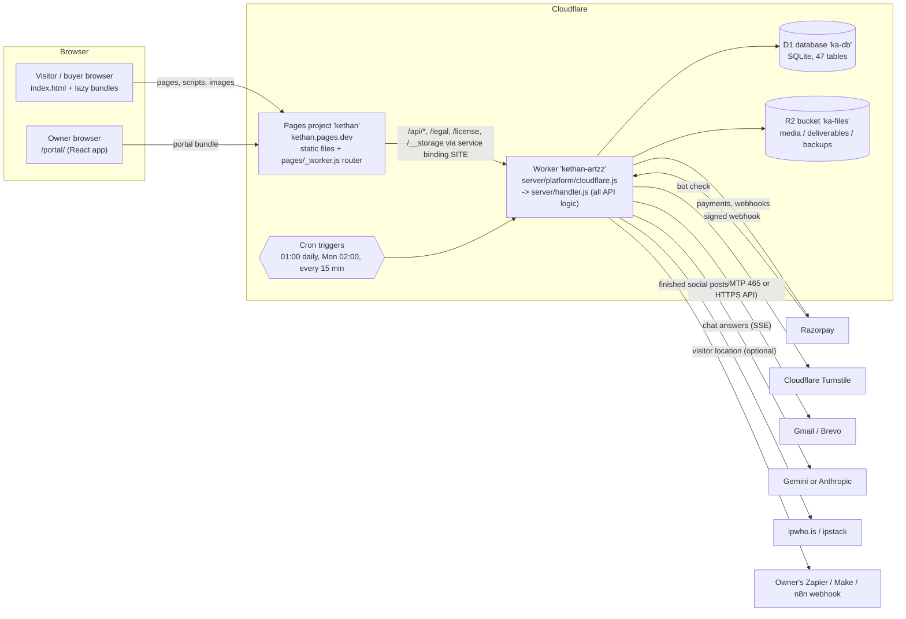
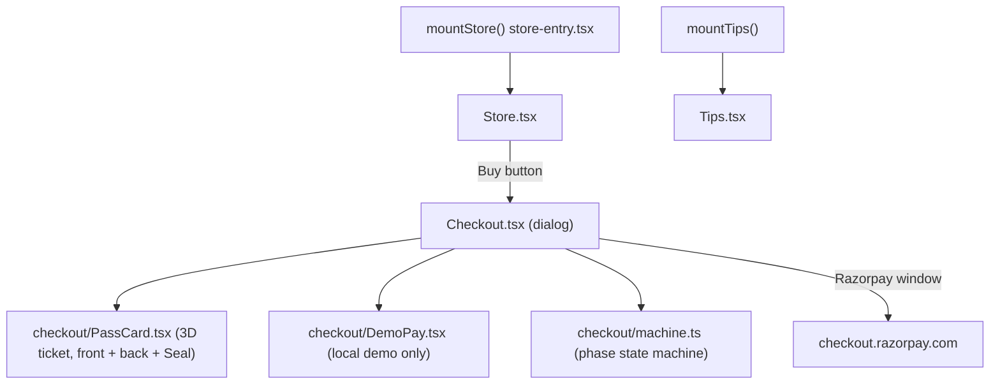
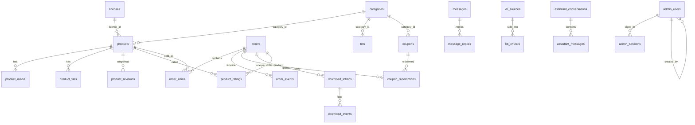
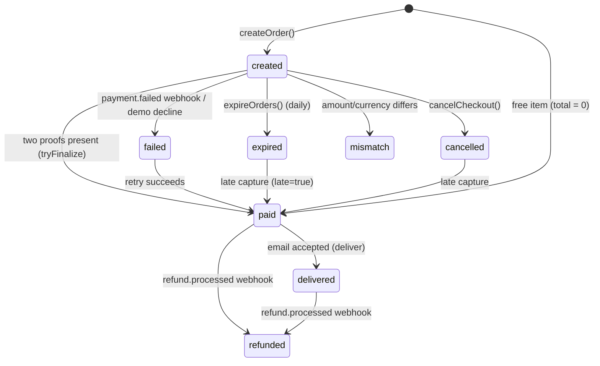
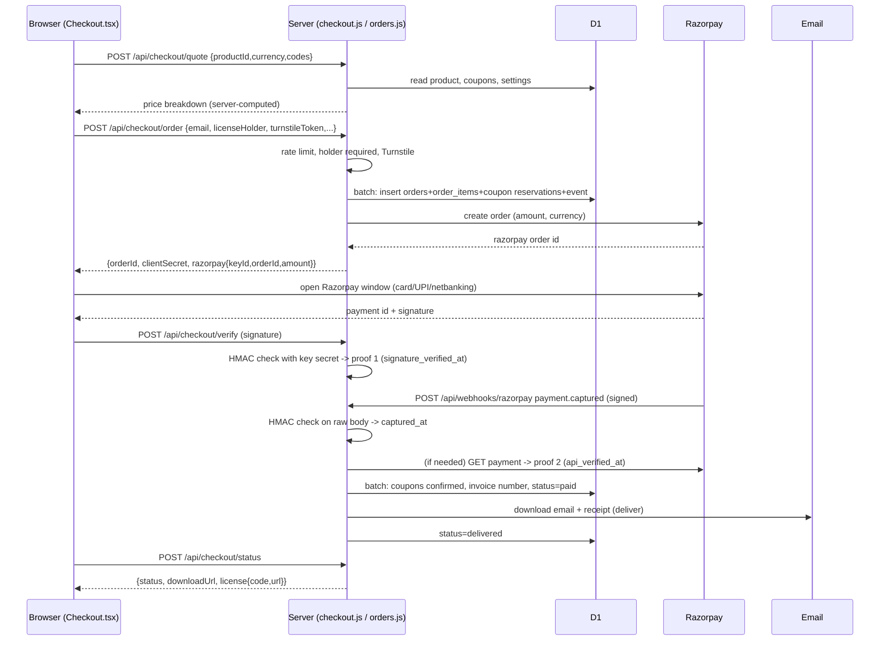
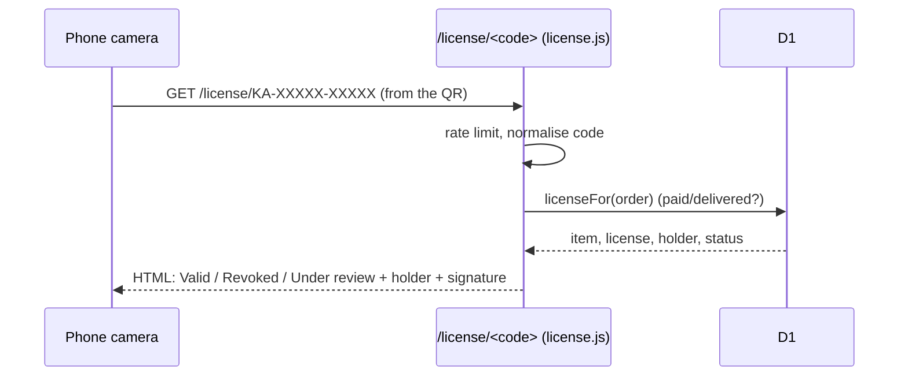
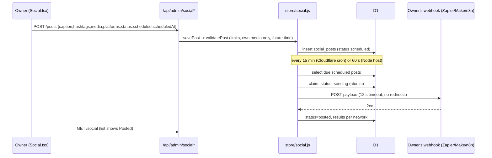
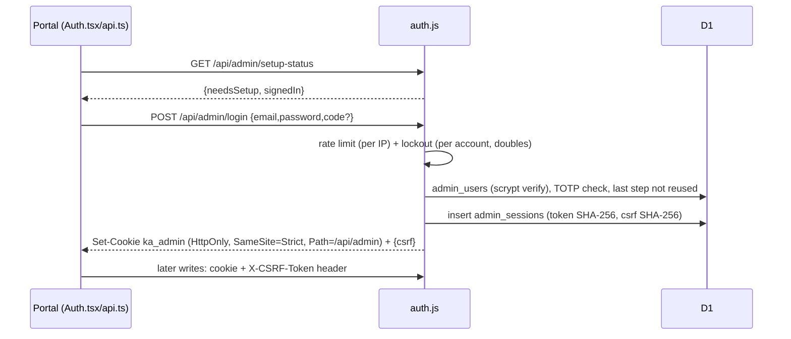
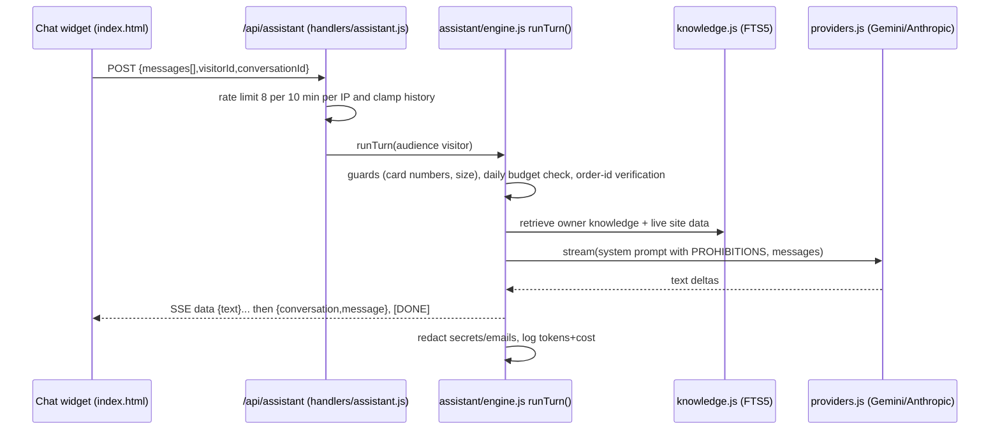
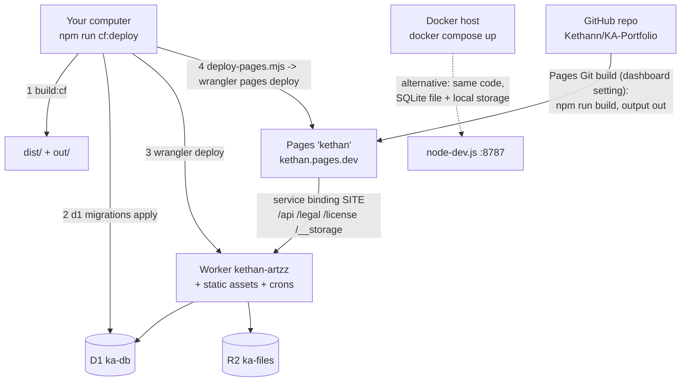

# PROJECT NOTES — KA (Kethan Artzz) portfolio + store + creator portal

> **How to read this document.** Every claim cites where it comes from: a file path and, where useful, a function (`file` → `function()`). Things that could not be confirmed from the code or config say **NOT FOUND IN CODE** or **UNCLEAR**. Versions come from `package.json` / `package-lock.json` / `Dockerfile` / `wrangler.jsonc`, never from memory. No secret values are copied anywhere (see §7.4).
>
> **Assumptions about you (the template's placeholders were left blank):** project name = "KA / Kethan Artzz"; your level = *a programmer who is comfortable with general coding but new to React, Cloudflare Workers/D1/R2, Docker and payment integrations*. Terms are defined the first time they appear, and §13 is a glossary.
>
> **State of the project this was written against:** git branch `main`, last commit `adec55c` plus uncommitted work by another editor (the root `*.md` notes were moved into `docs/` sub-folders — see §15). Test run at the time: **183 tests pass** (`npm test`).

---

## 0. Project Summary

**What it is, in plain words.** KA is one website with four faces:

1. **A public portfolio** for a visual artist (Kethan Artzz): an animated 3D "crystal" logo opening, an About page (skills, numbers, featured work), a Portfolio of posters, and a Contact form.
2. **A store** that sells digital items ("Artzz" = artwork/designs, "Artifacts" = downloadable tools/files) in Indian rupees (INR) or US dollars (USD). Payments run through **Razorpay**; after payment the buyer gets an email with a signed, expiring download link, a receipt, and a **license seal** (a scannable code that opens a public "is this license valid, and who holds it?" page).
3. **A private owner portal** ("KA Portal", `/portal/`): a desktop-style web app with draggable windows for products, orders, coupons, reports, visitors, messages, the AI assistant, the Studio (look & feel), a **Social** post planner, the **License card** editor, legal pages and settings.
4. **An AI chat assistant** ("KA Assistant") that answers visitors' questions from the owner's own knowledge base, with a daily spending cap.

**Who uses it.** *Visitors* browse; *buyers* check out and download; *the owner* (and optionally *admins* the owner adds) run the business from the portal.

**Problem it solves.** One person can show their work, sell digital goods and run everything (money, email, files, analytics, posts) without renting several separate SaaS tools — and runs mostly inside Cloudflare's free tier (`docs/operations/CLOUDFLARE.md` "Free plan" section).

### Big-picture architecture



Sources: `docs/operations/CLOUDFLARE.md` (resource names), `wrangler.jsonc` (Worker, D1, R2, crons, vars), `pages/wrangler.jsonc` (service binding `SITE` → `kethan-artzz`), `pages/_worker.js` (router), `server/platform/cloudflare.js` (`fetch`, `scheduled`).

**One host-neutral core.** All business logic lives in `server/handler.js` → `handle(request, platform)`. Two thin "host adapters" call it: `server/platform/cloudflare.js` (production) and `server/platform/node-dev.js` (local/Docker). This is why the same code also runs in tests (`tests/helpers/app.mjs`).

---

## 1. Tools & Technologies Used

### 1.1 Machine prerequisites

| Tool | Required version | Evidence |
|---|---|---|
| Node.js | `>=22.0.0` (the machine used for these notes runs v22.23.2; Docker image uses `node:22-bookworm-slim`) | `package.json` → `engines`; `Dockerfile` |
| npm | any that reads lockfile v3 (10.x used here) | `package-lock.json` → `lockfileVersion: 3` |
| Cloudflare account + `wrangler login` | needed only for deploying | `docs/operations/CLOUDFLARE.md`; `package.json` → `cf:*` scripts |
| Docker + Docker Compose | optional (self-hosting) | `Dockerfile`, `docker-compose.yml`, `docs/operations/DOCKER.md` |
| Python 3 | only to re-run the hero generator (`generator/build_cinematic.py`); version **NOT FOUND IN CODE** | `generator/build_cinematic.py` |
| A Chrome-family browser | not required by any repo script (the repo's UI checks use stubs, not a browser) | `generator/scripts/verify_*.cjs` comments |

### 1.2 Languages

| Name | Version | Category | What it is | Where used |
|---|---|---|---|---|
| JavaScript (ES modules) | ES2022+, Node ≥22 / Workers runtime | language | The language of the server and the homepage | `server/**`, `scripts/**`, `tests/**`, inline scripts in `index.html` |
| TypeScript | 5.7.2 (`package-lock.json`) | language | JavaScript with types; here only **type-checked** (`noEmit`), Vite compiles the code | `client/src/**`, `client/portal/src/**`; `tsconfig.json` |
| HTML / CSS | — | language | Page structure and styling | `index.html` (10,616 lines, mostly inline `<script>`/`<style>`), `client/**/*.css` |
| SQL (SQLite dialect) | SQLite as shipped by D1 / better-sqlite3 | language | Database schema and queries | `migrations/*.sql`, queries inside `server/**` |
| Python | NOT FOUND IN CODE | language | Offline generator for the crystal-shard animation | `generator/build_cinematic.py` |
| JSON / JSONC | — | data | Config and seed data | `wrangler.jsonc`, `server/portfolio-seed.json`, `server/knowledge.json` |

### 1.3 Frontend

| Name | Version | Category | What it is (1 line) | Why/where in THIS project |
|---|---|---|---|---|
| React | 18.3.1 | library | UI library: build screens from components | Store/Tips/Gallery bundles (`client/src/**`), the whole portal (`client/portal/src/**`) |
| react-dom | 18.3.1 | library | Puts React components into the page | `createRoot` in `client/src/gallery-entry.tsx`, `client/src/store/store-entry.tsx`, `client/portal/src/main.tsx` |
| Vite | 6.4.3 | build tool | Bundles/minifies source into `dist/` | `vite.config.mjs`; `npm run build:cf` |
| three (Three.js) | 0.185.1 | library | 3D graphics in the browser | Panda mascot (`client/src/panda*.ts`), poster background (`client/src/poster-background.ts`), the **old** folder scene (`FolderScene.tsx`, dead — §15) |
| three r128 (prebuilt file) | r128 | library | An older Three.js build loaded as a plain `<script>` for the crystal hero | `public/three-r128.min.js` → emitted as `dist/assets/three-r128.min.js` by the `local-crystal-runtime` plugin in `vite.config.mjs`; loaded at `index.html` line ~1927 |
| gsap | 3.12.7 | library | Animation library | **Only** the dead folder scene (`client/src/FolderScene.tsx`, `folderMotion.ts`) and `tests/folder.test.mjs` |
| @phosphor-icons/react | 2.1.10 | library | Icon set | `client/portal/src/shell/Chrome.tsx` (the rest of the portal uses its own `icons.tsx`) |
| Google Fonts (Manrope, JetBrains Mono, Fraunces, …) | n/a (CDN) | service | Web fonts | `client/portal/index.html`, `index.html` (`fonts.googleapis.com`) |
| Web Animations API, IntersectionObserver, Shadow DOM | browser built-ins | platform | Used for the Skills field, reveals, and to isolate the store/gallery CSS | `index.html` (Skills), `client/src/store/store-entry.tsx`, `gallery-entry.tsx` (`attachShadow`) |

### 1.4 Backend

| Name | Version | Category | What it is | Why/where |
|---|---|---|---|---|
| Cloudflare Workers runtime | `compatibility_date 2026-09-01`, flag `nodejs_compat` | runtime | Serverless JavaScript at Cloudflare's edge | `wrangler.jsonc`; entry `server/platform/cloudflare.js` |
| Custom router | — | framework (hand-written) | ~90 lines; no Express/Hono | `server/core/router.js` → `createRouter()` |
| Node `http` server | Node ≥22 | runtime | Local/Docker host adapter | `server/platform/node-dev.js` → `createDevServer()` |
| better-sqlite3 | 11.10.0 | library (dev-only) | SQLite driver for local/tests | `server/dev/sqlite.js`; in `devDependencies`, installed explicitly in `Dockerfile` |
| dotenv | 16.6.1 | library | Loads `.env` for local runs | `server/platform/node-dev.js`, `scripts/*.mjs` |
| ua-parser-js | 1.0.41 | library | Parses the browser "User-Agent" into device/browser/OS | `server/admin/auth.js` (sessions list), `server/visitors/track.js` |
| wrangler | 4.144.0 | CLI (dev dep) | Cloudflare's deploy/migrate tool | `package.json` scripts `cf:*`; `scripts/deploy-pages.mjs` |

### 1.5 Database & Storage

| Name | Version | Category | What it is | Why/where |
|---|---|---|---|---|
| Cloudflare D1 | managed (database `ka-db`, id in `wrangler.jsonc`) | database | Cloudflare's hosted SQLite | binding `DB`; `server/core/db.js` → `d1Driver()` |
| SQLite (local file) | via better-sqlite3 | database | Same engine, a file | `.data/ka.sqlite` (ignored by git); `server/dev/sqlite.js` → `openSqlite()` |
| SQLite FTS5 | built into SQLite | feature | Full-text search | tables `tips_fts`, `messages_fts`, `kb_chunks_fts`, `assistant_messages_fts` in `migrations/0001_init.sql` |
| Cloudflare R2 | managed (bucket `ka-files`) | object storage | Cloudflare's file storage (S3-like) | binding `FILES`; `server/core/storage.js` → `r2Storage()` |
| Local file storage | — | storage | Files under `.data/storage` | `server/core/storage.js` → `localStorage()` |

### 1.6 AI

| Name | Version | Category | What it is | Why/where |
|---|---|---|---|---|
| Google Gemini API | default model `gemini-3.5-flash-lite` with fallback chain | service | Generates chat answers | `server/assistant/providers.js` (`GEMINI_CHAIN`); key `GEMINI_API_KEY` |
| Anthropic API | default `claude-haiku-4-5-20251001` | service | Alternative provider | same file; key `ANTHROPIC_API_KEY`; choose with `AI_PROVIDER` |

### 1.7 Auth & Security (all hand-written with Node `crypto`)

| Name | What it is | Where |
|---|---|---|
| scrypt password hashing | slow hash so stolen hashes are hard to crack | `server/core/crypto.js` → `hashPassword()`, `verifyPassword()` |
| TOTP 2-factor (RFC 6238) | 6-digit authenticator-app codes | `server/core/crypto.js` → `newTotpSecret()`, `verifyTotp()`; `server/admin/auth.js` → `twoFactor*()` |
| AES-256-GCM encryption | encrypts secrets at rest (2FA seed, Social webhook link) | `server/core/crypto.js` → `encrypt()`, `decrypt()` |
| HMAC-signed links | tamper-proof expiring file URLs | `server/core/crypto.js` → `hmacHex()`; `server/core/storage.js` → `signedUrl()` |
| Cloudflare Turnstile | privacy-friendly CAPTCHA | `server/core/guard.js` → `verifyTurnstile()` |
| DB-backed rate limits | counts attempts per key | `server/core/guard.js` → `rateLimit()`; `server/core/atomic.js` → `rateLimitHit()`; table `rate_limits` |
| CSRF token + SameSite cookies | stops other sites acting as the owner | `server/admin/auth.js` → `requireAdmin()` |

### 1.8 Testing

| Name | Version | What | Where |
|---|---|---|---|
| Node test runner (`node --test`) | built into Node 22 | runs all tests | `package.json` → `test`; `tests/*.test.mjs` (31 files) |
| postcss | 8.5.28 | parses CSS in tests | `tests/gallery-build.test.mjs`, `generator/scripts/verify_ui.cjs` |
| Custom "verify" scripts | — | event-level UI checks with stubs (no real browser) | `generator/scripts/verify_scripts.cjs`, `verify_startup.cjs`, `verify_ui.cjs` |

### 1.9 Build & Dev tools

| Tool | What | Where |
|---|---|---|
| Vite 6.4.3 | production bundler (7 entry points) | `vite.config.mjs` |
| tsc (TypeScript 5.7.2) | type-check only | `package.json` → `build`, `build:cf`; `tsconfig.json` |
| `scripts/stage-pages.mjs` | assembles the Pages bundle in `out/` | run at the end of `build` and `build:cf` |
| `scripts/deploy-pages.mjs` | publishes Pages with `wrangler pages deploy` | `cf:deploy` |

### 1.10 DevOps / Deployment

| Tool | What | Where |
|---|---|---|
| Cloudflare Pages (project `kethan`) | serves the public site at `kethan.pages.dev` | `pages/wrangler.jsonc`, `pages/_worker.js`, `pages/_routes.json` |
| Cloudflare Worker (`kethan-artzz`) | runs the API | `wrangler.jsonc` |
| Docker + Compose | one-container self-hosting | `Dockerfile`, `docker-compose.yml`, `.dockerignore` |
| Git remote | `origin` = `https://github.com/Kethann/KA-Portfolio.git` | `git remote -v` |
| CI/CD files | **NOT FOUND IN CODE** — no `.github/workflows`, no `vercel.json`, `netlify.toml`, `render.yaml` or `Procfile` in the repository (the old Vercel/GitHub-Pages workflows were deleted in commit `18be13a`) | repository tree |

### 1.11 Third-party APIs / services

| Service | Used for | Where | Needed secrets (names only) |
|---|---|---|---|
| Razorpay | payments, refunds, signed webhooks | `server/store/razorpay.js`; browser loads `https://checkout.razorpay.com` in `client/src/store/Checkout.tsx` | `RAZORPAY_KEY_ID`, `RAZORPAY_KEY_SECRET`, `RAZORPAY_WEBHOOK_SECRET` |
| Cloudflare Turnstile | bot checks on forms/downloads/coupons | `server/core/guard.js`; widget helper `window.kaTurnstile` in `index.html` | `TURNSTILE_SITE_KEY`, `TURNSTILE_SECRET_KEY` |
| Gmail SMTP | transactional email | `server/core/smtp.js`, `server/core/email.js` | `GMAIL_USER`, `GMAIL_APP_PASSWORD` |
| Brevo | alternative email API | `server/core/email.js` | `BREVO_API_KEY`, `MAIL_FROM`, `MAIL_FROM_NAME` |
| Gemini / Anthropic | assistant answers | `server/assistant/providers.js` | `GEMINI_API_KEY` / `ANTHROPIC_API_KEY` |
| ipwho.is, ipstack | optional IP → location lookups | `server/visitors/geo.js` | `GEO_PROVIDER`, `IPSTACK_ACCESS_KEY`, `GEO_FALLBACK` |
| OpenStreetMap embed | map in the portal Visitors window | `client/portal/src/apps/Visitors.tsx` (iframe) | none |
| Zapier / Make / n8n (owner's own) | publishing Social posts | `server/store/social.js` → `sendPost()` | the webhook link is saved encrypted via the portal |

---

## 2. Folder & File Structure

### 2.1 Annotated tree (tracked files; generated/ignored folders in 2.4)

```
KA-Crystal-Reconstruction/
├─ index.html                 ENTRY (public site). One 10.6k-line page: CSS + 16 inline <script> blocks
├─ package.json / package-lock.json   scripts + dependencies (§9)
├─ vite.config.mjs            bundler config (root = client/, output = dist/)      §8
├─ tsconfig.json              type-check settings (client/src + client/portal/src)  §8
├─ wrangler.jsonc             Cloudflare Worker config: assets, D1, R2, crons, vars §8
├─ Dockerfile, docker-compose.yml, .dockerignore   container setup               §11
├─ .env.example               names of environment variables (no values)          §7.3
├─ .gitignore
├─ README.md
├─ client/                    Everything the browser runs (Vite root)
│  ├─ public/                 copied as-is into dist/: _headers, _redirects, manifest.webmanifest, robots.txt, portal/{manifest,theme-boot.js}
│  ├─ src/                    PUBLIC-SITE bundles (React + Three.js)
│  │  ├─ gallery-entry.tsx    ENTRY → dist/assets/gallery.js: exports mountStacks() (Work panel) and mount() (OLD folder gallery, unused)
│  │  ├─ WorkStacks.tsx       the Work panel: image stacks per category + coverflow (745 lines)
│  │  ├─ panda.ts, panda-*.ts the 3D panda mascot (ENTRY panda.ts → dist/assets/panda.js)
│  │  ├─ poster-background.ts ENTRY → dist/assets/poster.js: shader painted-plaster backdrop (currently DISABLED in index.html, §15)
│  │  ├─ skill-logos-entry.ts ENTRY → dist/assets/skill-logos.js: lazy table of skill logos (re-exports shared/skill-logos.js)
│  │  ├─ studio/              the "Typography" drawing studio (ENTRY studio-entry.ts → dist/assets/studio.js; engine.ts = brush renderers)
│  │  ├─ store/               the Store + Tips + Checkout (ENTRY store-entry.tsx → dist/assets/store.js)
│  │  │  ├─ Store.tsx, Tips.tsx, Checkout.tsx, api.ts, hooks.ts, overlay.ts
│  │  │  └─ checkout/         PassCard.tsx (the 3D "ticket"), machine.ts (checkout state machine), DemoPay.tsx, cards.ts, confetti.ts, checkout.css
│  │  ├─ Gallery.tsx, FolderScene.tsx, FolderCover.tsx, Preview.tsx, folderGeometry.ts, folderMotion.ts, folder-covers.css, gallery.css
│  │  │                       the OLD 3D-folder gallery — DEAD CODE (§15)
│  │  ├─ types.ts, style.css, workstacks.css, assets/images/poster/*   shared types/styles/textures
│  └─ portal/                 THE OWNER PORTAL (ENTRY client/portal/index.html → dist/portal/)
│     ├─ index.html, src/main.tsx   boot: setup / sign-in / desktop
│     ├─ src/api.ts, hooks.ts, ui.tsx, icons.tsx, format.ts, money.tsx, qr.ts, zip.ts, *.css
│     ├─ src/shell/           Auth.tsx, Chrome.tsx (dock, menu bar, search), desk.tsx (window manager), Window.tsx, UsageAlert.tsx, fullscreen.tsx
│     └─ src/apps/            16 "apps" (registry.ts): Overview, Products, Orders, Reports, Coupons, Downloads, Visitors, Messages, Assistant,
│                             Social, Tips, Studio, Content, License, Legal, Settings (+ common.tsx, siteDoc.ts)
├─ server/                    ALL BACKEND CODE (host-neutral)
│  ├─ handler.js              ENTRY of the API: builds the router, registers every route
│  ├─ platform/               cloudflare.js (Worker adapter, ENTRY in production), node-dev.js (local/Docker adapter, ENTRY for `npm start`)
│  ├─ core/                   router, http, db, env, env-validate, settings, crypto, guard, atomic, validate, markdown, email, smtp, storage, blocklist
│  ├─ handlers/               public.js, store-public.js, checkout.js, license.js, legal.js, assistant.js, cron.js
│  ├─ store/                  orders.js, delivery.js, razorpay.js, coupons.js, license.js, social.js (business logic)
│  ├─ admin/                  auth, team, catalog, sales, content, messages, system, visitors, usage, assistant, social, site-document (portal API)
│  ├─ assistant/              engine, providers, knowledge, quota, learning
│  ├─ visitors/               track.js (beacon), geo.js (location)
│  ├─ jobs/                   backup.js, hooks.js (task registry for cron)
│  ├─ dev/sqlite.js           local/test SQLite + migration runner
│  ├─ content/legal-drafts.js starter legal text
│  ├─ portfolio-seed.json     the first copy of the portfolio document (18 images, 3 folders)
│  └─ knowledge.json          starter knowledge for the assistant (24 lines)
├─ shared/                    code imported by BOTH server and browser
│  ├─ seal.js (+.d.ts)        QR-style license seal generator
│  ├─ skill-logos.js (+.d.ts) brand logos + name matching for the Skills section
│  └─ social.js (+.d.ts)      per-network limits, hashtag parsing, post checks
├─ migrations/                0001_init … 0005_social (6 SQL files)               §5
├─ pages/                     Cloudflare Pages router: _worker.js, _routes.json, wrangler.jsonc
├─ public/three-r128.min.js   Three.js r128 classic script
├─ images/                    195 files: portfolio posters (webp+avif in several widths), logos/icons
├─ scripts/                   deploy-pages, stage-pages, import-legacy, seed-demo, upload-files-to-r2, reset-local-portal-password
├─ generator/                 offline hero-animation source (build_cinematic.py, atlas, manifest) + generator/scripts/verify_*.cjs, optimize-backgrounds.cjs, check_live.cjs
├─ tests/                     31 test files + tests/helpers/app.mjs
└─ docs/                      operations/ (CLOUDFLARE.md, DOCKER.md), project/, planning/, reviews/ (moved here by another editor — uncommitted)
```

### 2.2 Entry points (where things start)

| Entry | File | Started by |
|---|---|---|
| Public page | `index.html` | the browser (served at `/`) |
| Production API | `server/platform/cloudflare.js` → `export default { fetch, scheduled }` | Cloudflare (`wrangler.jsonc` → `main`) |
| Public router on Pages | `pages/_worker.js` → `fetch()` | Cloudflare Pages |
| Local/Docker server | `server/platform/node-dev.js` (bottom block) | `npm start` / Docker `CMD` |
| Portal | `client/portal/index.html` → `src/main.tsx` | the browser (served at `/portal/`) |
| Lazy bundles | `gallery.js`, `store.js`, `panda.js`, `studio.js`, `poster.js`, `skill-logos.js` | `import('./dist/assets/…')` calls in `index.html` |
| Tests | `tests/*.test.mjs` | `npm test` |

### 2.3 Who depends on whom (the important edges)

- `index.html` → `/api/public-config`, `/api/portfolio`, `/api/live`, `/api/contact`, `/api/notify`, `/api/assistant`, `/api/visit`; lazy-imports the six bundles.
- `store.js` (`client/src/store/*`) → `/api/store/*`, `/api/tips*`, `/api/checkout/*`, `/api/downloads/resend`; imports `shared/seal.js` (license seal drawing).
- Portal apps → `/api/admin/*` through `client/portal/src/api.ts`; `Social.tsx` imports `shared/social.js`; `Content.tsx` imports `shared/skill-logos.js`.
- `server/handler.js` → every `register*()`; `server/admin/social.js` → `server/store/social.js` → `shared/social.js`; `server/admin/site-document.js` → `shared/skill-logos.js`.
- Everything on the server reads configuration only through `server/core/env.js` → `env()`.

### 2.4 Generated / ignored folders (what makes them)

| Folder | Made by | Notes |
|---|---|---|
| `dist/` | `vite build` (`npm run build:cf`) | the built site; also copies `images/` and writes `dist/index.html` (plugin `stage-crystal-homepage` in `vite.config.mjs`) |
| `out/` | `scripts/stage-pages.mjs` | `dist/` + `_worker.js` + `_routes.json`; what a Cloudflare Git build publishes |
| `pages/out/` | `scripts/deploy-pages.mjs` (deleted again after deploy) | |
| `.data/` | local server | SQLite DB, uploads, email "outbox", local helper files |
| `server/data/` | the *old* creator server | legacy data read by `scripts/import-legacy.mjs` |
| `.wrangler/` | wrangler | local state |
| `node_modules/` | `npm ci` | |
| `shots/` | local browser checks (not by repo code) | ignored via `.gitignore` |

---

## 3. Frontend

The project has **three separate front-ends**. They share the same Cloudflare site but are built differently, so treat them one by one.

| Front-end | Technology | Rendering | Where |
|---|---|---|---|
| **Public homepage** | Hand-written HTML/CSS + **vanilla JavaScript** (no framework) in one file, plus lazily loaded React/Three.js bundles | Static file; all dynamic content is fetched by JavaScript after load (a "single-page" feel with no server-side rendering) | `index.html` |
| **Store / Tips / Work panel** | React 18 + TypeScript, each mounted inside a **Shadow DOM** (an isolated mini-document so its CSS can't leak) | Client-side rendering | `client/src/store/*`, `client/src/WorkStacks.tsx` |
| **Owner portal** | React 18 + TypeScript "desktop" with windows | Client-side rendering (SPA), `noindex` | `client/portal/**` |

Plus two **server-rendered HTML pages** that work without JavaScript: the legal pages (`/legal`, `server/handlers/legal.js`) and the license check page (`/license/<code>`, `server/handlers/license.js`), and the download page (`server/store/delivery.js` → `downloadPage()`).

### 3.1 Public homepage (`index.html`)

**Styling:** CSS written directly in `<style>` blocks inside `index.html`, using CSS variables (`--ink`, `--amber`, glass-panel variables `--glass-bg` …). No Tailwind/CSS-in-JS.
**State management:** plain JavaScript variables and DOM updates — e.g. `activeSection`, `skillsData`, `fieldLive` (no store library).
**Routing:** there are **no URL paths** for pages. Four "pages" (Contact, About, Store, Tips) are `<section>` elements that are shown/hidden by `switchSection()`; the nav bar is built from `NAV_ITEMS` (`index.html` ~line 6585). Deep links use query strings: `/?page=store|tips|contact`, `/?product=<slug>`, `/?tip=<slug>` (`index.html` ~lines 7070–7090). Swiping at the screen edge on phones/tablets moves between pages (script block "SWIPE BETWEEN PAGES", ~line 10489).

**Pages / screens**

| Page (nav item) | Section id | What the user sees and can do |
|---|---|---|
| Contact | `section-contact` | The "paper-rocket" contact form (name, email, subject, message, honeypot, Turnstile) → `POST /api/contact` (script "CONTACT FORM", ~line 7898) |
| About (the landing page) | `section-about` + `section-portfolio` | Bio headline, **About numbers** (count-up), **Skills** (category chips + cards of logo chips + a floating, blurred logo field), **Featured Work** (strip + `WorkStacks` coverflow), then the **Portfolio** folder shelf |
| Store | `section-store` | The React store (`mountStore`) |
| Tips | `section-tips` | The React tips list/reader (`mountTips`) |
| Gallery (`section-gallery`) | hidden by default | Holds `#gallery-coverflow`; reachable internally (`PAGE_SECTIONS.gallery`) |
| Overlays | — | Lightbox (`#lightbox`), AI chat widget (`#assistant-launcher` + panel), menu (Typography studio, Image Upscaler "coming soon", Portfolio, Full screen) |

**Hero (the opening animation):** a Three.js (r128, classic script) "crystal reconstruction" of the KA logo; assets `images/crystal-atlas.webp`, `images/crystal-cutout.webp`; the finished images are shipped; they were produced with the offline generator `generator/build_cinematic.py`, which `README.md` calls an older demo generator and which `npm run build` does not run (§15).

**Key script blocks** (labels from `index.html`): API BASE CONFIG (line 5), PUBLIC SERVICES (1759), INIT (2498), FRAME LOOP (4240), LIGHTBOX (6024), COVERFLOW FACTORY (6151), NAV + SECTIONS (6573), ABOUT PAGE (7106; parts A–D = intro, reveals, **Skills**, featured strip), CONTACT (7513/7898), CREATOR-PANEL PORTFOLIO WIRING (8045: applies the saved document), live updates (8377), visitor beacon (8558), swipe navigation (10489).

**How it talks to the backend** (the homepage's complete call list, verified by search): `GET /api/public-config`, `GET /api/portfolio`, `GET /api/live` (polled every ~15 s and on a `BroadcastChannel('ka-live')` message from the portal so published changes appear without reload), `POST /api/contact`, `POST /api/notify`, `POST /api/assistant` (Server-Sent Events), `POST /api/visit` (beacon). All go through `kaApiUrl()` (`KA_API_BASE = ""` = same origin).

**Loading the bundles:** `import('./dist/assets/store.js')` (Store/Tips), `gallery.js` (Work panel `mountStacks`), `panda.js`, `studio.js`, and the new `skill-logos.js` (loaded when the Skills block is within 500 px of the viewport — `loadSkillLogos()`). In production `dist/index.html` is written by the Vite plugin with `./dist/assets/` rewritten to `./assets/`.

**Skills section details** (`index.html`, "Part C"): data comes from `/api/portfolio` → `skills` (defaults in `server/admin/site-document.js` → `SKILLS_DEFAULT`; first paint uses `DEFAULT_SKILLS`). `renderSkillBoard()` shows one row per category with logo chips; choosing a category chip shows a detailed list with notes and level meters. `skillLogo()` picks, in order: the owner's uploaded `logoUrl`, a library logo from `shared/skill-logos.js` (`skillLogoFor()`), else letters. The floating field uses the Web Animations API (`spawnFloat()`, `spawnFarLayer()`), starts/stops with an IntersectionObserver, and the field is `position: sticky` and centred while the board scrolls.

### 3.2 Store, Tips and Checkout (React, `client/src/store/`)

**Entry:** `store-entry.tsx` → `mountStore()` / `mountTips()` (both render into a shadow root; dialogs go to a body-level layer via `overlay.ts` → `overlayLayer()` so they can cover the nav).



**What the user does (Store.tsx):** two tabs (`artzz`, `artifacts`), category chips, price filter (Any / Free / Paid / On sale), sorting/grouping, currency (INR/USD; suggested from `/api/public-config`), ratings and download counts (if the owner shows them), product detail with media gallery and reviews (`GET /api/store/products/:slug/reviews`).
**Checkout.tsx:** fields: email (required), **"Name on the license" (required, 2–80 chars)**, optional coupon codes (Turnstile-protected), "remember my email and name" (localStorage keys). Clicking into the name field flips the card to its back so the typed name appears on "Licensed to". Server calls: `/api/checkout/quote`, `/order`, `/verify`, `/status`, `/cancel`, `/demo-pay`, and `/api/downloads/resend`.
**State machine** (`checkout/machine.ts`): phases `loading → idle → validating → creating → paying → confirming → success | failed | cancelled` (see its header diagram) — one explicit phase at a time instead of scattered booleans.
**Money display:** prices arrive from the server as integer minor units (paise/cents); the browser never computes prices (`Checkout.tsx` header comment).
**Forms/validation/errors:** client-side email regex and name length checks before submit (`Checkout.tsx` → `submit()`); server re-validates (`server/handlers/checkout.js`); errors are shown inline (`.kco-err`) or as a toast; offline detection via `navigator.onLine` (`store/api.ts` → `send()`).

### 3.3 Work panel and other bundles
- `WorkStacks.tsx` (via `gallery-entry.tsx` → `mountStacks()`): per-category image stacks; clicking opens a magnetic coverflow; props come from the portfolio document.
- `panda.ts` → `mountPanda()`: Three.js panda that perches on the assistant launcher (`panda-character.ts`, `panda-activity.ts`, `panda-travel.ts`).
- `studio/studio-entry.ts` → `openStudio()`: full-screen drawing/typography canvas; runs fully in the browser, nothing uploaded (header comment).
- `poster-background.ts` → `startPosterBackground()`: **built but currently never called** — the line that would start it is commented out in `index.html` (~line 1331).

### 3.4 Owner portal (`client/portal/`)

**Boot (`src/main.tsx` → `App()`):** calls `GET /api/admin/setup-status`; if signed in, `GET /api/admin/session` (returns the CSRF token which is kept only in memory by `api.ts` → `setCsrf()`); otherwise shows **setup** (first owner) or **sign-in** (`shell/Auth.tsx` → `AuthScreen`, with a 2FA code step). A 401 anywhere re-shows sign-in over the desktop without losing open windows/unsaved edits (`onSignedOut`).
**Desktop shell:** `shell/desk.tsx` (window manager: open/close/minimise/zoom/tile, geometry saved in `localStorage` key `ka.portal.geom`, URL hash `#app/route` kept in sync), `shell/Chrome.tsx` (dock, menu bar, global search → `/api/admin/search`, live pulse → `/api/admin/pulse`), `shell/Window.tsx`, `shell/UsageAlert.tsx` (free-plan usage popup from `/api/admin/usage`).
**API client:** `src/api.ts` → `api()`: base `/api/admin`, sends the CSRF header on writes, announces writes (`ka:changed` event so other windows refresh; `BroadcastChannel('ka-live')` so open site tabs refresh), maps 401 → signed-out. `upload()` asks `POST /api/admin/uploads` for a signed URL and sends the file straight to storage (multi-part for big files).

**Apps** (`src/apps/registry.ts`, each lazy-loaded; `useLoad()` fetches, `useDraft()` keeps edits, `useUnsavedGuard()` warns on leaving):

| App (id) | File | What the owner does there | Main API |
|---|---|---|---|
| Overview | `Overview.tsx` | dashboard numbers for a date range | `GET /overview` |
| Products | `Products.tsx` | create/edit products, prices, sale windows, media, deliverable file (optionally repackaged with `LICENSE.txt` in the browser via `zip.ts`), history/restore, ratings | `/products*`, `/categories`, `/licenses` |
| Orders | `Orders.tsx` | list/filter, resend email/receipt, refund, invoice, revoke link | `/orders*`, `/links/:id/revoke` |
| Reports | `Reports.tsx` | revenue by day/week/month, CSV | `/reports*` |
| Coupons | `Coupons.tsx` | create/pause/delete discount codes, usage | `/coupons*` |
| Downloads | `Downloads.tsx` | download links and events | `/downloads`, `/links/:id/revoke` |
| Visitors | `Visitors.tsx` | traffic, live visitors, log, map (OpenStreetMap iframe) | `/visitors*` |
| Messages | `Messages.tsx` | inbox, replies, canned replies, blocklist | `/messages*`, `/canned*`, `/blocklist*` |
| KA Assistant | `Assistant.tsx` | knowledge sources, conversations, playground, rules (tabs Overview / Knowledge / Repeated questions / Conversations / Playground / Rules & settings) | `/assistant*` |
| **Social** | `Social.tsx` | write posts, hashtags, schedule/send, connect webhook (§6.9) | `/social*` |
| Tips | `Tips.tsx` | write Markdown tips | `/tips*` |
| Studio | `Studio.tsx` | colours, type, banner & nav, links, element animation, "Arrange" drag editor with live preview, checkout pass design | `/site` |
| Content | `Content.tsx` | portfolio images/folders, site text, About numbers, **Skills editor**, upscaler list, email templates (tabs Portfolio / Site text / Upscaler & list / Emails) | `/site`, `/email-templates*`, `/notify*` |
| **License card** | `License.tsx` | the pass editor alone (it renders `Studio` with `only="pass"`) | `/site` |
| Licenses & Legal | `Legal.tsx` | license templates and the four legal pages | `/licenses*`, `/legal*` |
| Settings | `Settings.tsx` | sections: Account & security (password, 2FA with QR from `qr.ts`, sessions), Team, Store & tax, Messages, Reports, Categories, System status, Backups, Activity log, Appearance | `/account`, `/team*`, `/settings/:key`, `/system*`, `/backups*`, `/audit` |

**Unsaved-edit protection & concurrency:** the site document uses `revision`; products/tips/social posts send `updatedAt` and the server replies 409 `stale` if someone else changed it first.

### 3.5 Frontend → backend call map (portal)
Generated from the call sites in `client/portal/src/**` (paths are relative to `/api/admin`): Assistant (`/assistant`, `/assistant/kb`, `/assistant/conversations`, `/assistant/messages/:id/rate`, `/assistant/playground`, `/assistant/repeated`, `/settings/assistant`), Content (`/email-templates*`, `/notify*`, `/settings/upscaler`, `/site/skills-defaults`), Coupons, Downloads, Legal, Messages, Orders, Overview, Products, Reports, Settings, Social, Tips, Visitors, `common.tsx` (`/markdown`), `Chrome.tsx` (`/pulse`, `/search`), `UsageAlert.tsx` (`/usage`). Every one of those paths exists in the §4 endpoint table.

---

## 4. Backend

### 4.1 Framework, entry points, how the server starts

- **No web framework.** A ~90-line router (`server/core/router.js` → `createRouter()`) matches `METHOD + path pattern` (e.g. `/api/products/:slug`) against a list of routes. Handlers receive a `ctx` = `{ request, url, params, platform, ip, geo, route }` and return a standard web `Response` (helpers `json()`, `text()`, `redirect()` in `server/core/http.js`).
- **Host-neutral core:** `server/handler.js` creates the router, calls every `register*()` function and exports `handle(request, platform)`. A "platform" object tells the core how to find the client IP and approximate location (`platform.clientIp()`, `platform.geo()`).
- **Production start (Cloudflare):** Cloudflare calls `export default { fetch, scheduled }` in `server/platform/cloudflare.js`. On the first request of an isolate, `init(env)` copies all string variables into `setEnvSource()`, binds the D1 database (`setDatabase(d1Driver(env.DB))`) and R2 (`setStorage(r2Storage(env.FILES, DOWNLOAD_TOKEN_SECRET))`). Then: paths `/__storage/*` and `/__storage-upload/*` are handled by `storageRequest()` (signed file access/uploads straight to R2, multipart upload for huge files); `/api/*`, `/legal*`, `/license*` go to `handle()`; anything else is `env.ASSETS.fetch(request)` (static files).
- **Public address layer:** the Pages project `kethan` runs `pages/_worker.js`: if the path matches `^/(api/|legal(/|$)|license(/|$)|__storage/|__storage-upload/)` it forwards the unchanged request to the Worker through the service binding `env.SITE`; otherwise it serves static files (`env.ASSETS.fetch`). `pages/_routes.json` limits which paths even invoke that script.
- **Local/Docker start:** `server/platform/node-dev.js` loads `.env` (dotenv), calls `validateEnv()`, opens SQLite (`server/dev/sqlite.js` → `openSqlite()` which applies every `migrations/*.sql` in name order), serves `dist/` + `/images` + `/__storage` files itself, and routes `/api/*` into `handle()`. It also runs timers that replace Cloudflare cron: scheduled social posts every minute; the daily job after 01:00 UTC; the weekly job on Mondays after 02:00 UTC.

### 4.2 Middleware chain, in order (what happens to one request)

`server/core/router.js` → `dispatch()`; for the Worker, steps 1–2 come first from `server/platform/cloudflare.js`.

1. **Worker front door** — `init(env)`; storage paths diverted (`storageRequest`) with HMAC signature + expiry verification (`storage.verify()`); non-API paths → static assets.
2. **Route match** — first route whose regex matches the path *and* whose method matches (`HEAD` is allowed on `GET` routes). Path matched but wrong method → `405` with `Allow`; nothing matches → `404 {error:"This API endpoint does not exist."}`.
3. **Access check by `route.access`:**
   - `public` (default): for every non-GET/HEAD request `assertSameOrigin(request, ALLOWED_ORIGINS)` (`server/core/http.js`): refuses `Sec-Fetch-Site` other than same-origin/none and an `Origin` header that isn't this site (or in `ALLOWED_ORIGINS`).
   - `cron`: `assertCron()` — header `Authorization: Bearer $CRON_SECRET` (constant-time compare).
   - `webhook`: no origin check; the handler verifies the provider's signature (`razorpayWebhook` → `orders.handleWebhook()`).
   - `admin`: `assertSameOrigin(request, [])` (same-origin only, **every** method) then `requireAdmin(ctx)` (`server/admin/auth.js`): cookie `ka_admin` → session lookup (token is stored only as SHA-256; 12 h absolute / 2 h idle) → for writes the `X-CSRF-Token` header must match the session's stored hash → if the account has a temporary password only `/session`, `/account`, `/password`, `/logout` are allowed → `last_seen_at` refreshed at most once a minute → `ctx.admin = { sessionId, userId, email, role, name }`.
4. **Handler** — validation (`server/core/validate.js`: `str()`, `int()`, `email()`, `uuid()`, `stringArray()`, `readJson()` with size limit and `application/json` check), rate limits (`rateLimit(key, max, windowSeconds)`), bot check (`verifyTurnstile`), business logic, DB.
5. **After a successful admin write** — `guards.afterAdminWrite` = `bumpLiveVersion()` (`server/handlers/public.js`) increments `settings.live` so open pages notice (`GET /api/live`).
6. **Cache validators** — `GET` responses with `Cache-Control: no-cache` get a weak `ETag`; matching `If-None-Match` → `304`.
7. **Errors** — `HttpError(status, message, {code, retryAfter})` becomes `{error, code?}` JSON; anything else becomes a generic 500 and is logged **by route and error type only** with emails/tokens redacted (`router.js` → `logError()`, `redact()`).
All API responses carry `Cache-Control: no-store`, `X-Content-Type-Options: nosniff`, `X-Frame-Options: DENY`, `Cross-Origin-Resource-Policy: same-origin` (`http.js` → `BASE_HEADERS`). Static-file headers are in `client/public/_headers` (HSTS, nosniff, referrer policy, frame options, `Permissions-Policy`; `/portal/*` is `noindex` + `no-store`; **no** Content-Security-Policy header there).

### 4.3 EVERY API endpoint (168 routes)

Generated from the real router (`router.routes` after importing `server/handler.js`) and the `route(...)` registration lines; the line number is where the route is registered. "Request → Response" is filled in only where it was read in the code; `(see function)` means the exact body/response shape was **not enumerated here** — open the cited function. Pipe characters inside cells are escaped.

| # | Method | Path | File → function | Auth | Request → Response | What it does |
|---|---|---|---|---|---|---|
| 1 | GET | `/api/admin/assistant` | `server/admin/assistant.js:145` → `overview()` | Yes: portal session | (see function) | Assistant dashboard (usage, budget, models). |
| 2 | GET | `/api/admin/assistant/kb` | `server/admin/assistant.js:146` → `listKb()` | Yes: portal session | (see function) | Knowledge sources. |
| 3 | POST | `/api/admin/assistant/kb` | `server/admin/assistant.js:147` → `saveKb()` | Yes: portal session + CSRF header | (see function) | Create/update a knowledge source. |
| 4 | PUT | `/api/admin/assistant/kb/:id` | `server/admin/assistant.js:148` → `saveKb()` | Yes: portal session + CSRF header | (see function) | Create/update a knowledge source. |
| 5 | DELETE | `/api/admin/assistant/kb/:id` | `server/admin/assistant.js:149` → `deleteKb()` | Yes: portal session + CSRF header | (see function) | Delete a source. |
| 6 | GET | `/api/admin/assistant/conversations` | `server/admin/assistant.js:150` → `conversations()` | Yes: portal session | (see function) | Conversations list (FTS5 search). |
| 7 | GET | `/api/admin/assistant/repeated` | `server/admin/assistant.js:151` → `repeatedQuestions()` | Yes: portal session | (see function) | Most repeated questions. |
| 8 | GET | `/api/admin/assistant/conversations/:id` | `server/admin/assistant.js:152` → `conversation()` | Yes: portal session | (see function) | One conversation. |
| 9 | DELETE | `/api/admin/assistant/conversations/:id` | `server/admin/assistant.js:153` → `deleteConversation()` | Yes: portal session + CSRF header | (see function) | Delete conversation. |
| 10 | POST | `/api/admin/assistant/messages/:id/rate` | `server/admin/assistant.js:154` → `rate()` | Yes: portal session + CSRF header | (see function) | Body `{rating: 1 or -1}` → `{ok,learned}`. Rates an answer (good answers can be reused by `learning.js`). |
| 11 | POST | `/api/admin/assistant/playground` | `server/admin/assistant.js:155` → `playground()` | Yes: portal session + CSRF header | (see function) | Test the assistant with chosen audience (not counted as public). |
| 12 | GET | `/api/admin/setup-status` | `server/admin/auth.js:235` → `setupStatus()` | No (login/setup endpoints) | none → `{needsSetup,signedIn,setupConfigured}` | Lets the portal pick the setup / sign-in / desktop screen. |
| 13 | POST | `/api/admin/setup` | `server/admin/auth.js:236` → `setup()` | No (login/setup endpoints) | `{email,password,token}` → session (cookie + `csrf`) 201 | First-time owner creation (needs `ADMIN_SETUP_TOKEN` in production; only while no user exists). |
| 14 | POST | `/api/admin/login` | `server/admin/auth.js:237` → `login()` | No (login/setup endpoints) | `{email,password,code?}` → `{ok,csrf,email,role,name,mustChangePassword}` + HttpOnly cookie (401 `totp_required` when a 2FA code is needed) | Sign in (rate limit, lockout, optional TOTP). |
| 15 | GET | `/api/admin/session` | `server/admin/auth.js:238` → `session()` | Yes: portal session | none → `{email,csrf,role,name,mustChangePassword}` | Current session. |
| 16 | GET | `/api/admin/account` | `server/admin/auth.js:239` → `account()` | Yes: portal session | none → `{email,name,role,twoFactor,passwordChangedAt,createdAt,mustChangePassword}` | Own account details (2FA state etc.). |
| 17 | POST | `/api/admin/logout` | `server/admin/auth.js:240` → `logout()` | Yes: portal session + CSRF header | none → ok | Ends this session. |
| 18 | POST | `/api/admin/logout-everywhere` | `server/admin/auth.js:241` → `logoutEverywhere()` | Yes: portal session + CSRF header | none → ok | Ends every session of this user. |
| 19 | GET | `/api/admin/sessions` | `server/admin/auth.js:242` → `listSessions()` | Yes: portal session | none → sessions[] | Lists active sessions. |
| 20 | DELETE | `/api/admin/sessions/:id` | `server/admin/auth.js:243` → `revokeSession()` | Yes: portal session + CSRF header | id in path → ok | Ends one session. |
| 21 | POST | `/api/admin/password` | `server/admin/auth.js:244` → `changePassword()` | Yes: portal session + CSRF header | `{current,next}` → `{ok:true}` | Changes own password (also clears "must change"). |
| 22 | POST | `/api/admin/2fa/start` | `server/admin/auth.js:245` → `twoFactorStart()` | Yes: portal session + CSRF header | none → `{secret,otpauth}` | Begins authenticator-app enrolment. |
| 23 | POST | `/api/admin/2fa/enable` | `server/admin/auth.js:246` → `twoFactorEnable()` | Yes: portal session + CSRF header | `{code}` → `{ok:true}` | Confirms the first code and turns 2FA on. |
| 24 | POST | `/api/admin/2fa/disable` | `server/admin/auth.js:247` → `twoFactorDisable()` | Yes: portal session + CSRF header | `{password,code?}` → `{ok:true}` | Turns 2FA off. |
| 25 | GET | `/api/admin/products/:id/ratings` | `server/admin/catalog.js:441` → `productRatings()` | Yes: portal session | (see function) | Ratings of a product. |
| 26 | PATCH | `/api/admin/ratings/:id` | `server/admin/catalog.js:442` → `updateRating()` | Yes: portal session + CSRF header | (see function) | Show/hide a rating. |
| 27 | DELETE | `/api/admin/ratings/:id` | `server/admin/catalog.js:443` → `deleteRating()` | Yes: portal session + CSRF header | (see function) | Delete a rating. |
| 28 | POST | `/api/admin/uploads` | `server/admin/catalog.js:444` → `signUpload()` | Yes: portal session + CSRF header | (see function) | `{kind:image\|font\|deliverable,contentType,bytes,filename}` → `{bucket,path,uploadUrl,method,publicUrl,chunked,partSize}`. Signed upload link (file goes straight to storage). |
| 29 | GET | `/api/admin/products` | `server/admin/catalog.js:445` → `listProducts()` | Yes: portal session | (see function) | Products for the portal. |
| 30 | POST | `/api/admin/products` | `server/admin/catalog.js:446` → `createProduct()` | Yes: portal session + CSRF header | (see function) | Creates a draft product. |
| 31 | POST | `/api/admin/products/reorder` | `server/admin/catalog.js:447` → `reorderProducts()` | Yes: portal session + CSRF header | (see function) | Saves product order. |
| 32 | GET | `/api/admin/products/:id` | `server/admin/catalog.js:448` → `getProduct()` | Yes: portal session | (see function) | One product (portal view). |
| 33 | PUT | `/api/admin/products/:id` | `server/admin/catalog.js:449` → `updateProduct()` | Yes: portal session + CSRF header | (see function) | Saves a product (checks price/publish rules; stale-write detection). |
| 34 | GET | `/api/admin/products/:id/history` | `server/admin/catalog.js:450` → `productHistory()` | Yes: portal session | (see function) | Publish history snapshots. |
| 35 | POST | `/api/admin/products/:id/history/:revisionId/restore` | `server/admin/catalog.js:451` → `restoreProductRevision()` | Yes: portal session + CSRF header | (see function) | Restores a snapshot. |
| 36 | DELETE | `/api/admin/products/:id` | `server/admin/catalog.js:452` → `deleteProduct()` | Yes: portal session + CSRF header | (see function) | Deletes (or archives when it has sales). |
| 37 | POST | `/api/admin/products/:id/duplicate` | `server/admin/catalog.js:453` → `duplicateProduct()` | Yes: portal session + CSRF header | (see function) | Copies a product. |
| 38 | POST | `/api/admin/products/:id/restore` | `server/admin/catalog.js:454` → `restoreProduct()` | Yes: portal session + CSRF header | (see function) | Restores an archived product as a draft. |
| 39 | POST | `/api/admin/products/:id/media` | `server/admin/catalog.js:455` → `addMedia()` | Yes: portal session + CSRF header | (see function) | Attaches an uploaded picture. |
| 40 | PATCH | `/api/admin/products/:id/media` | `server/admin/catalog.js:456` → `updateMedia()` | Yes: portal session + CSRF header | (see function) | Edits/reorders pictures. |
| 41 | DELETE | `/api/admin/products/:id/media/:mediaId` | `server/admin/catalog.js:457` → `deleteMedia()` | Yes: portal session + CSRF header | (see function) | Removes a picture. |
| 42 | PUT | `/api/admin/products/:id/file` | `server/admin/catalog.js:458` → `setFile()` | Yes: portal session + CSRF header | (see function) | Registers the uploaded deliverable file. |
| 43 | GET | `/api/admin/products/:id/file` | `server/admin/catalog.js:459` → `fileLink()` | Yes: portal session | (see function) | Short signed link to the current file. |
| 44 | GET | `/api/admin/categories` | `server/admin/catalog.js:460` → `listCategories()` | Yes: portal session | (see function) | Categories. |
| 45 | POST | `/api/admin/categories/reorder` | `server/admin/catalog.js:461` → `reorderCategories()` | Yes: portal session + CSRF header | (see function) | Saves category order. |
| 46 | POST | `/api/admin/categories` | `server/admin/catalog.js:462` → `saveCategory()` | Yes: portal session + CSRF header | (see function) | Creates/updates a category. |
| 47 | PUT | `/api/admin/categories/:id` | `server/admin/catalog.js:463` → `saveCategory()` | Yes: portal session + CSRF header | (see function) | Creates/updates a category. |
| 48 | DELETE | `/api/admin/categories/:id` | `server/admin/catalog.js:464` → `deleteCategory()` | Yes: portal session + CSRF header | (see function) | Deletes a category. |
| 49 | GET | `/api/admin/licenses` | `server/admin/catalog.js:465` → `listLicenses()` | Yes: portal session | (see function) | Licenses (text templates). |
| 50 | POST | `/api/admin/licenses` | `server/admin/catalog.js:466` → `saveLicense()` | Yes: portal session + CSRF header | (see function) | Creates/updates a license (version bumps). |
| 51 | PUT | `/api/admin/licenses/:id` | `server/admin/catalog.js:467` → `saveLicense()` | Yes: portal session + CSRF header | (see function) | Creates/updates a license (version bumps). |
| 52 | DELETE | `/api/admin/licenses/:id` | `server/admin/catalog.js:468` → `deleteLicense()` | Yes: portal session + CSRF header | (see function) | Deletes a license. |
| 53 | GET | `/api/admin/site` | `server/admin/content.js:241` → `getSite()` | Yes: portal session | (see function) | The portfolio document + revision. |
| 54 | PUT | `/api/admin/site` | `server/admin/content.js:242` → `saveSite()` | Yes: portal session + CSRF header | (see function) | Validates and saves the whole portfolio document (revision check). |
| 55 | GET | `/api/admin/site/skills-defaults` | `server/admin/content.js:244` → `inline()` | Yes: portal session | (see function) | none → the shipped default skills board. |
| 56 | GET | `/api/admin/tips` | `server/admin/content.js:245` → `listTips()` | Yes: portal session | (see function) | Tips for the portal. |
| 57 | POST | `/api/admin/tips` | `server/admin/content.js:246` → `saveTip()` | Yes: portal session + CSRF header | (see function) | Creates/updates a tip (slug, cover must be own media). |
| 58 | PUT | `/api/admin/tips/:id` | `server/admin/content.js:247` → `saveTip()` | Yes: portal session + CSRF header | (see function) | Creates/updates a tip (slug, cover must be own media). |
| 59 | DELETE | `/api/admin/tips/:id` | `server/admin/content.js:248` → `deleteTip()` | Yes: portal session + CSRF header | (see function) | Deletes a tip. |
| 60 | POST | `/api/admin/markdown` | `server/admin/content.js:249` → `previewMarkdown()` | Yes: portal session + CSRF header | (see function) | Markdown → safe HTML preview. |
| 61 | GET | `/api/admin/legal` | `server/admin/content.js:250` → `listLegal()` | Yes: portal session | (see function) | Legal pages (drafts or published). |
| 62 | PUT | `/api/admin/legal/:slug` | `server/admin/content.js:251` → `saveLegal()` | Yes: portal session + CSRF header | (see function) | Saves/publishes a legal page. |
| 63 | GET | `/api/admin/email-templates` | `server/admin/content.js:252` → `listTemplates()` | Yes: portal session | (see function) | Email templates. |
| 64 | PUT | `/api/admin/email-templates/:key` | `server/admin/content.js:253` → `saveTemplate()` | Yes: portal session + CSRF header | (see function) | Overrides a template. |
| 65 | DELETE | `/api/admin/email-templates/:key` | `server/admin/content.js:254` → `resetTemplate()` | Yes: portal session + CSRF header | (see function) | Back to the built-in text. |
| 66 | POST | `/api/admin/email-templates/:key/test` | `server/admin/content.js:255` → `testTemplate()` | Yes: portal session + CSRF header | (see function) | Sends a test email. |
| 67 | GET | `/api/admin/settings/:key` | `server/admin/content.js:256` → `getSettings()` | Yes: portal session | (see function) | Settings document by key (store, upscaler, messages, assistant, reports, visitors, social…). |
| 68 | PUT | `/api/admin/settings/:key` | `server/admin/content.js:257` → `saveSettings()` | Yes: portal session + CSRF header | (see function) | Saves a settings document. |
| 69 | GET | `/api/admin/notify` | `server/admin/content.js:258` → `listNotify()` | Yes: portal session | (see function) | Notify-me sign-ups. |
| 70 | DELETE | `/api/admin/notify/:id` | `server/admin/content.js:259` → `deleteSignup()` | Yes: portal session + CSRF header | (see function) | Removes a sign-up. |
| 71 | POST | `/api/admin/notify/:topic/launch` | `server/admin/content.js:260` → `launch()` | Yes: portal session + CSRF header | (see function) | Emails everyone on a topic list that the feature launched. |
| 72 | GET | `/api/admin/messages` | `server/admin/messages.js:132` → `listMessages()` | Yes: portal session | (see function) | Inbox list with filters/search (FTS5). |
| 73 | POST | `/api/admin/messages/bulk` | `server/admin/messages.js:133` → `bulkMessages()` | Yes: portal session + CSRF header | (see function) | Bulk status/label change. |
| 74 | GET | `/api/admin/messages/:id` | `server/admin/messages.js:134` → `getMessage()` | Yes: portal session | (see function) | One message (marks it read). |
| 75 | PATCH | `/api/admin/messages/:id` | `server/admin/messages.js:135` → `updateMessage()` | Yes: portal session + CSRF header | (see function) | Status/labels. |
| 76 | POST | `/api/admin/messages/:id/reply` | `server/admin/messages.js:136` → `reply()` | Yes: portal session + CSRF header | (see function) | Emails a reply and records it. |
| 77 | GET | `/api/admin/canned` | `server/admin/messages.js:137` → `listCanned()` | Yes: portal session | (see function) | Canned replies. |
| 78 | POST | `/api/admin/canned` | `server/admin/messages.js:138` → `saveCanned()` | Yes: portal session + CSRF header | (see function) | Create/update canned reply. |
| 79 | PUT | `/api/admin/canned/:id` | `server/admin/messages.js:139` → `saveCanned()` | Yes: portal session + CSRF header | (see function) | Create/update canned reply. |
| 80 | DELETE | `/api/admin/canned/:id` | `server/admin/messages.js:140` → `deleteCanned()` | Yes: portal session + CSRF header | (see function) | Delete canned reply. |
| 81 | GET | `/api/admin/blocklist` | `server/admin/messages.js:141` → `listBlocklist()` | Yes: portal session | (see function) | Blocklist. |
| 82 | POST | `/api/admin/blocklist` | `server/admin/messages.js:142` → `addBlock()` | Yes: portal session + CSRF header | (see function) | Adds a blocked email/domain/IP/keyword. |
| 83 | DELETE | `/api/admin/blocklist/:id` | `server/admin/messages.js:143` → `removeBlock()` | Yes: portal session + CSRF header | (see function) | Removes a block. |
| 84 | GET | `/api/admin/overview` | `server/admin/sales.js:357` → `overview()` | Yes: portal session | (see function) | Dashboard numbers for a date range. |
| 85 | GET | `/api/admin/orders` | `server/admin/sales.js:358` → `listOrders()` | Yes: portal session | (see function) | Orders with filters. |
| 86 | GET | `/api/admin/orders.csv` | `server/admin/sales.js:359` → `ordersCsv()` | Yes: portal session | (see function) | Orders as CSV. |
| 87 | GET | `/api/admin/orders/:id` | `server/admin/sales.js:360` → `getOrder()` | Yes: portal session | (see function) | One order with items/events. |
| 88 | POST | `/api/admin/orders/:id/resend` | `server/admin/sales.js:361` → `resendOrder()` | Yes: portal session + CSRF header | (see function) | Re-sends download email. |
| 89 | POST | `/api/admin/orders/:id/receipt` | `server/admin/sales.js:362` → `resendReceipt()` | Yes: portal session + CSRF header | (see function) | Re-sends receipt. |
| 90 | POST | `/api/admin/orders/:id/refund` | `server/admin/sales.js:363` → `refund()` | Yes: portal session + CSRF header | (see function) | Refunds through Razorpay (rules per product). |
| 91 | GET | `/api/admin/orders/:id/invoice` | `server/admin/sales.js:364` → `invoice()` | Yes: portal session | (see function) | Invoice page. |
| 92 | POST | `/api/admin/links/:id/revoke` | `server/admin/sales.js:365` → `revokeLink()` | Yes: portal session + CSRF header | (see function) | Revokes a download link. |
| 93 | GET | `/api/admin/coupons` | `server/admin/sales.js:366` → `listCoupons()` | Yes: portal session | (see function) | Coupons. |
| 94 | POST | `/api/admin/coupons` | `server/admin/sales.js:367` → `saveCoupon()` | Yes: portal session + CSRF header | (see function) | Create/update coupon. |
| 95 | PUT | `/api/admin/coupons/:id` | `server/admin/sales.js:368` → `saveCoupon()` | Yes: portal session + CSRF header | (see function) | Create/update coupon. |
| 96 | POST | `/api/admin/coupons/:id/pause` | `server/admin/sales.js:369` → `pauseCoupon()` | Yes: portal session + CSRF header | (see function) | Pause/resume. |
| 97 | DELETE | `/api/admin/coupons/:id` | `server/admin/sales.js:370` → `deleteCoupon()` | Yes: portal session + CSRF header | (see function) | Delete coupon. |
| 98 | GET | `/api/admin/coupons/:id/uses` | `server/admin/sales.js:371` → `couponUsage()` | Yes: portal session | (see function) | Coupon redemptions. |
| 99 | GET | `/api/admin/downloads` | `server/admin/sales.js:372` → `downloads()` | Yes: portal session | (see function) | Download links and events. |
| 100 | GET | `/api/admin/reports` | `server/admin/sales.js:373` → `reports()` | Yes: portal session | (see function) | Sales report by day/week/month. |
| 101 | GET | `/api/admin/reports.csv` | `server/admin/sales.js:374` → `reportsCsv()` | Yes: portal session | (see function) | Report as CSV. |
| 102 | GET | `/api/admin/social` | `server/admin/social.js:10` → inline handler (`server/store/social.js`) | Yes: portal session | `?status&q` → `{posts,counts,due,settings,hashtagSets,popular,starterSets,platforms}` | Everything the Social app needs. |
| 103 | GET | `/api/admin/social/posts/:id` | `server/admin/social.js:16` → inline handler (`server/store/social.js`) | Yes: portal session | → `{post}` | One post. |
| 104 | POST | `/api/admin/social/posts` | `server/admin/social.js:17` → inline handler (`server/store/social.js`) | Yes: portal session + CSRF header | `{title,caption,hashtags,media[],platforms[],status,scheduledAt}` → `{post}` 201 | Creates a draft or scheduled post (scheduling runs the network checks). |
| 105 | PUT | `/api/admin/social/posts/:id` | `server/admin/social.js:22` → inline handler (`server/store/social.js`) | Yes: portal session + CSRF header | same + `updatedAt` → `{post}` | Edits a post (not once posted/sending; stale-write check). |
| 106 | DELETE | `/api/admin/social/posts/:id` | `server/admin/social.js:28` → inline handler (`server/store/social.js`) | Yes: portal session + CSRF header | → `{ok}` | Deletes a post. |
| 107 | POST | `/api/admin/social/posts/:id/duplicate` | `server/admin/social.js:34` → inline handler (`server/store/social.js`) | Yes: portal session + CSRF header | → `{post}` 201 | Copies to a new draft. |
| 108 | POST | `/api/admin/social/posts/:id/send` | `server/admin/social.js:35` → inline handler (`server/store/social.js`) | Yes: portal session + CSRF header | → `{post}` | Sends now through the webhook (claims the post atomically). |
| 109 | POST | `/api/admin/social/posts/:id/mark` | `server/admin/social.js:41` → inline handler (`server/store/social.js`) | Yes: portal session + CSRF header | `{platform,done}` → `{post}` | Marks a network posted by hand. |
| 110 | PUT | `/api/admin/social/settings` | `server/admin/social.js:45` → inline handler (`server/store/social.js`) | Yes: portal session + CSRF header | `{webhookUrl?,clearWebhook?,defaultPlatforms,defaultHashtags,signature}` → `{settings}` | Saves the webhook (encrypted) and defaults. |
| 111 | POST | `/api/admin/social/settings/test` | `server/admin/social.js:50` → inline handler (`server/store/social.js`) | Yes: portal session + CSRF header | → `{ok,note}` | Sends a ping to the webhook. |
| 112 | POST | `/api/admin/social/hashtag-sets` | `server/admin/social.js:51` → inline handler (`server/store/social.js`) | Yes: portal session + CSRF header | `{name,tags}` → `{set}` 201 | Saves a hashtag set. |
| 113 | PUT | `/api/admin/social/hashtag-sets/:id` | `server/admin/social.js:52` → inline handler (`server/store/social.js`) | Yes: portal session + CSRF header | `{name,tags}` → `{set}` | Edits a set. |
| 114 | DELETE | `/api/admin/social/hashtag-sets/:id` | `server/admin/social.js:53` → inline handler (`server/store/social.js`) | Yes: portal session + CSRF header | → `{ok}` | Deletes a set. |
| 115 | GET | `/api/admin/pulse` | `server/admin/system.js:147` → `pulse()` | Yes: portal session | (see function) | Small live counters for the menu bar. |
| 116 | GET | `/api/admin/search` | `server/admin/system.js:148` → `search()` | Yes: portal session | (see function) | Portal-wide search. |
| 117 | GET | `/api/admin/system` | `server/admin/system.js:149` → `status()` | Yes: portal session | (see function) | Which services are configured (names only) + heartbeat. |
| 118 | GET | `/api/admin/system/storage` | `server/admin/system.js:150` → `storageUsage()` | Yes: portal session | (see function) | Storage use per bucket. |
| 119 | POST | `/api/admin/system/test-email` | `server/admin/system.js:151` → `testEmail()` | Yes: portal session + CSRF header | (see function) | Sends a test email. |
| 120 | GET | `/api/admin/backups` | `server/admin/system.js:152` → `listBackups()` | Yes: portal session | (see function) | Backups. |
| 121 | POST | `/api/admin/backups` | `server/admin/system.js:153` → `backupNow()` | Yes: portal session + CSRF header | (see function) | Runs a backup now. |
| 122 | GET | `/api/admin/backups/:id/link` | `server/admin/system.js:154` → `backupLink()` | Yes: portal session | (see function) | Signed download link for a backup. |
| 123 | DELETE | `/api/admin/backups/:id` | `server/admin/system.js:155` → `deleteBackup()` | Yes: portal session + CSRF header | (see function) | Deletes a backup. |
| 124 | GET | `/api/admin/audit` | `server/admin/system.js:156` → `auditLog()` | Yes: portal session | (see function) | Audit log. |
| 125 | POST | `/api/admin/visits/purge` | `server/admin/system.js:157` → `purgeVisits()` | Yes: portal session + CSRF header | (see function) | Deletes visitor data older than a chosen age. |
| 126 | GET | `/api/admin/team` | `server/admin/team.js:126` → `listTeam()` | Yes: portal session; owner role only | (see function) | Lists portal people (owner only). |
| 127 | POST | `/api/admin/team` | `server/admin/team.js:127` → `addPerson()` | Yes: portal session + CSRF header; owner role only | (see function) | `{email,name,role,password}` → team list. Adds a person with a temporary password (owner only). |
| 128 | PUT | `/api/admin/team/:id` | `server/admin/team.js:128` → `updatePerson()` | Yes: portal session + CSRF header; owner role only | (see function) | `{name?,role?}` → team list. Changes name/role (never the last owner). |
| 129 | POST | `/api/admin/team/:id/password` | `server/admin/team.js:129` → `resetPersonPassword()` | Yes: portal session + CSRF header; owner role only | (see function) | Sets a new temporary password. |
| 130 | POST | `/api/admin/team/:id/sign-out` | `server/admin/team.js:130` → `signOutPerson()` | Yes: portal session + CSRF header; owner role only | (see function) | Ends all of that person's sessions. |
| 131 | POST | `/api/admin/team/:id/access` | `server/admin/team.js:131` → `setPersonAccess()` | Yes: portal session + CSRF header; owner role only | (see function) | Switches a person's access on/off. |
| 132 | DELETE | `/api/admin/team/:id` | `server/admin/team.js:132` → `deletePerson()` | Yes: portal session + CSRF header; owner role only | (see function) | Removes a person (never the last owner or yourself). |
| 133 | GET | `/api/admin/usage` | `server/admin/usage.js:71` → `usage()` | Yes: portal session | none → R2/D1 usage levels | Free-plan usage warning data. |
| 134 | GET | `/api/admin/visitors` | `server/admin/visitors.js:80` → `summary()` | Yes: portal session | (see function) | Visitor analytics for a range (bots excluded). |
| 135 | GET | `/api/admin/visitors/live` | `server/admin/visitors.js:81` → `live()` | Yes: portal session | (see function) | Visitors in the last few minutes. |
| 136 | GET | `/api/admin/visitors/log` | `server/admin/visitors.js:82` → `log()` | Yes: portal session | (see function) | Raw visit log with filters. |
| 137 | GET | `/api/admin/visitors.csv` | `server/admin/visitors.js:83` → `logCsv()` | Yes: portal session | (see function) | Visit log as CSV. |
| 138 | GET | `/api/public-config` | `server/handler.js:50` → `pub.publicConfig()` | No | none → `{turnstileSiteKey, razorpayKeyId, country, suggestedCurrency, store, demoPayments, upscaler, assistant}` | Public settings the page needs (keys that are safe in a browser, the visitor's country, which currency to suggest). |
| 139 | GET | `/api/portfolio` | `server/handler.js:51` → `pub.portfolio()` | No | none → the portfolio document (`details, folders, images, stats, skills, passCard, …, revision`) | The content the homepage renders; seeded from `server/portfolio-seed.json` the first time. |
| 140 | GET | `/api/live` | `server/handler.js:52` → `pub.liveVersion()` | No | none → `{v}` | Tiny version number that moves after every portal change; open pages poll it and reload content when it changes. |
| 141 | POST | `/api/contact` | `server/handler.js:53` → `pub.contact()` | No (same-origin check) | `{name,email,subject,message,website(honeypot),turnstileToken}` → `{ok:true}` 201 | Contact form: validates, bot-checks, stores a message, emails the owner, optional auto-reply. |
| 142 | POST | `/api/notify` | `server/handler.js:54` → `pub.notify()` | No (same-origin check) | `{topic,email,website,turnstileToken}` → `{ok:true}` 201 | Join the "notify me" list (currently only the topic `upscaler`). |
| 143 | POST | `/api/assistant` | `server/handler.js:55` → `assistant()` | No (same-origin check) | `{messages[],visitorId,conversationId,locale,projectId}` → Server-Sent Events (`{text}`…`{conversation,message}`, `[DONE]`) | The site's AI chat widget (streamed answer). |
| 144 | GET | `/api/health` | `server/handler.js:56` → `inline()` | No | none → `{ok:true}` | Health check (used by the Docker HEALTHCHECK). |
| 145 | GET | `/api/cron/daily` | `server/handler.js:59` → `cron.daily()` | Bearer `CRON_SECRET` | Bearer `CRON_SECRET` → `{ok,results}` | Daily housekeeping: heartbeat, expire unpaid orders, retention, daily report hooks. |
| 146 | GET | `/api/cron/weekly` | `server/handler.js:60` → `cron.weekly()` | Bearer `CRON_SECRET` | Bearer `CRON_SECRET` → `{ok,results}` | Weekly backup export + weekly report hooks. |
| 147 | GET | `/api/cron/social` | `server/handler.js:61` → `cron.social()` | Bearer `CRON_SECRET` | Bearer `CRON_SECRET` → `{ok,results:{sent,failed,unstuck,waiting}}` | Sends scheduled social posts that are due. |
| 148 | POST | `/api/checkout/quote` | `server/handlers/checkout.js:140` → `quote()` | No (same-origin check) | `{productId,currency,codes[],email?,turnstileToken?}` → price breakdown (`subtotal,discount,tax,total,applied…`) or `{ok:false,error,code}` for a rejected coupon | Server-side price quote; coupons are bot-checked and rate-limited harder. |
| 149 | POST | `/api/checkout/order` | `server/handlers/checkout.js:141` → `createOrder()` | No (same-origin check) | `{productId,currency,codes[],email,licenseHolder,turnstileToken}` → `{orderId,clientSecret,free,razorpay{…}}` (free: `{downloadUrl,license}`) 201 | Creates the order (and the Razorpay order); free items are delivered at once. |
| 150 | POST | `/api/checkout/verify` | `server/handlers/checkout.js:142` → `verify()` | No (same-origin check) | `{orderId,clientSecret,razorpay_order_id,razorpay_payment_id,razorpay_signature}` → order status | Checks Razorpay's checkout signature (first proof of payment). |
| 151 | POST | `/api/checkout/status` | `server/handlers/checkout.js:143` → `status()` | No (same-origin check) | `{orderId,clientSecret}` → `{orderId,status,total,currency,downloadUrl,license}` | Order status for the browser that started it (needs the client secret). |
| 152 | POST | `/api/checkout/cancel` | `server/handlers/checkout.js:144` → `cancel()` | No (same-origin check) | `{orderId,clientSecret}` → status | Cancels an unpaid checkout and releases coupon reservations. |
| 153 | POST | `/api/checkout/demo-pay` | `server/handlers/checkout.js:145` → `demoPay()` | No (same-origin check) | `{orderId,clientSecret,outcome,card}` → status | Local demo payment (404 unless `KA_DEMO_PAYMENTS=1` outside production). |
| 154 | POST | `/api/webhooks/razorpay` | `server/handlers/checkout.js:146` → `razorpayWebhook()` | Razorpay signature | Raw Razorpay event + `x-razorpay-signature` → `{ok,result}` | Razorpay → server: payment captured/failed, refund processed; idempotent via `webhook_events`. |
| 155 | GET | `/api/download/:token` | `server/handlers/checkout.js:147` → `downloadGet()` | No | token in path → HTML page | Download confirmation page with the license seal and rating form. |
| 156 | POST | `/api/download/:token` | `server/handlers/checkout.js:148` → `downloadPost()` | No (same-origin check) | form/JSON with Turnstile token → 303 redirect to a 60-second signed storage link | Counts one download atomically and redirects to the file. |
| 157 | POST | `/api/download/:token/rate` | `server/handlers/checkout.js:149` → `ratePost()` | No (same-origin check) | HTML form → HTML page | Buyer rating on the download page (link proves the purchase). |
| 158 | POST | `/api/downloads/resend` | `server/handlers/checkout.js:150` → `resend()` | No (same-origin check) | `{email,turnstileToken}` → `{ok,message}` (same answer for any email) | Emails fresh download links for every paid order on that address. |
| 159 | GET | `/legal` | `server/handlers/legal.js:48` → `legalIndex()` | No | none → HTML | List of published legal pages. |
| 160 | GET | `/legal/:slug` | `server/handlers/legal.js:49` → `legalPage()` | No | slug → HTML | Terms / privacy / refunds / delivery page (server-rendered). |
| 161 | GET | `/license` | `server/handlers/license.js:113` → `licenseIndex()` | No | `?code=` → HTML form or redirect | License lookup form; typed codes are normalised and redirected. |
| 162 | GET | `/license/:code` | `server/handlers/license.js:114` → `licensePage()` | No | code → HTML (script-free) | Public page for a license code: valid / revoked / under review, holder, item, seal. |
| 163 | GET | `/api/store/catalog` | `server/handlers/store-public.js:116` → `catalog()` | No | `?kind=artzz\|artifacts` → `{products[],categories[]}` | Published products and categories. |
| 164 | GET | `/api/store/products/:slug` | `server/handlers/store-public.js:117` → `product()` | No | slug → `{product}` | One published product. |
| 165 | GET | `/api/store/products/:slug/reviews` | `server/handlers/store-public.js:118` → `reviews()` | No | slug → `{reviews[]}` | Latest visible reviews (up to 20). |
| 166 | GET | `/api/tips` | `server/handlers/store-public.js:119` → `tips()` | No | `?q&category&page` → `{tips[],categories,page,hasMore}` | Published tips (search uses FTS5). |
| 167 | GET | `/api/tips/:slug` | `server/handlers/store-public.js:120` → `tip()` | No | slug → `{tip{…,html}}` | One tip with its Markdown rendered to safe HTML. |
| 168 | POST | `/api/visit` | `server/visitors/track.js:83` → `visit()` | No (same-origin check) | `{t: view, ping, leave or location; s, v, p, r, n, w, h, l, z, d; lat, lon, accuracy}` → 204 (no body) | Visit beacon (page views, time on page, optional shared location). |

**Non-API URLs served by the Worker** (same router): `GET /legal`, `GET /legal/:slug` (`server/handlers/legal.js`), `GET /license`, `GET /license/:code` (`server/handlers/license.js`) are included in the table above; `/__storage/*` and `/__storage-upload/*` are handled before the router (`server/platform/cloudflare.js` → `storageRequest()` and, locally, `server/platform/node-dev.js`).

### 4.4 Business logic / services layer (what each module is responsible for)

| Module | Responsibility |
|---|---|
| `server/store/orders.js` | The money state machine: `quote()` (prices, coupons, tax — server-only), `createOrder()`, `verifyCheckout()`, `handleWebhook()`, `tryFinalize()` (needs **two independent proofs** before PAID), `deliver()`, `statusFor()`, `cancelCheckout()`, `expireOrders()`, `refundOrder()`; constants `MIN_CHARGE = 100` minor units |
| `server/store/coupons.js` | `evaluateCoupons()` — pure rules (percent/fixed, limits, per-email, first-order, stacking); `MAX_CODES = 3` |
| `server/store/razorpay.js` | Razorpay REST calls without an SDK; `verifyPaymentSignature()`, `verifyWebhookSignature()` |
| `server/store/delivery.js` | `issueToken()` (256-bit random token, only its SHA-256 stored), `sendDeliveryEmails()`, `sendReceipt()`, `downloadPage()`, `redeem()` (atomic count + 60-second signed URL), `rate()`, `resendLinks()` |
| `server/store/license.js` | `newLicenseCode()` (`KA-XXXXX-XXXXX`), `ensureLicenseCode()`, `licenseFor()`, `maskEmail()`, `cleanHolder()` |
| `server/store/social.js` | Social posts: validation, webhook delivery, scheduling (`runDue()`), manual marks, hashtag sets |
| `server/handlers/*` | Thin HTTP layer for public features: `public.js` (config, portfolio, contact, notify, live version), `store-public.js` (catalog, tips), `checkout.js`, `license.js`, `legal.js`, `assistant.js`, `cron.js` |
| `server/admin/*` | Portal API per area (auth, team, catalog, sales, content, messages, system, visitors, usage, assistant, social); `site-document.js` validates the whole portfolio document |
| `server/assistant/*` | `engine.js` `runTurn()` pipeline (guards → budget → order verification/hand-off → retrieval → prompt → provider stream with output redaction → usage/cost logs); `providers.js` (Gemini/Anthropic over `fetch` + SSE); `knowledge.js` (FTS5 retrieval); `quota.js` (Gemini free-quota bookkeeping); `learning.js` (reuses answers approved by a 👍 rating) |
| `server/visitors/*` | `track.js` (beacon `POST /api/visit`: view/ping/leave/location events); `geo.js` (provider selection, cache, quota) |
| `server/core/*` | `db.js` (one tiny interface for D1 and SQLite), `settings.js` (JSON settings with defaults + revision), `crypto.js`, `guard.js`, `atomic.js`, `validate.js`, `markdown.js` (safe subset), `email.js` + `smtp.js`, `storage.js`, `blocklist.js`, `env.js`, `env-validate.js` |

**Database access pattern (`server/core/db.js`):** `db.query(sql, params)`, `db.one()`, `db.maybeOne()`, `db.batch([[sql, params], …])`. SQL uses `$1`-style parameters (rewritten to SQLite `?1`), `now()` is replaced by an ISO-UTC expression, booleans/JSON are converted at the edge (`fromRow()`; JSON columns named in `JSON_COLS`). **`db.batch()` is all-or-nothing** (D1 has no open transactions), which is how orders + items + coupon use are written together.

### 4.5 Background jobs, schedulers, queues, websockets

| Job | Trigger | What it does | Where |
|---|---|---|---|
| Daily | Cron `0 1 * * *` (01:00 UTC); Node host timer after 01:00 UTC | heartbeat write to `settings.system`, then the tasks registered with `onDaily()`: `expireOrders` (`handlers/checkout.js`), `dailyReport` (`admin/sales.js`), `usageAlert` (`admin/usage.js`), `visitRetention` (`visitors/track.js`), `assistantLogRetention` (`admin/assistant.js`) | `server/handlers/cron.js` → `daily()`; `server/jobs/hooks.js` |
| Weekly | Cron `0 2 * * 1` (Mon 02:00 UTC) | backup of every table to a gzipped JSON in the private `backups` bucket (keeps the newest `KEEP = 8`) + the weekly task `weeklyReport` (`admin/sales.js`) | `cron.js` → `weekly()`; `server/jobs/backup.js` → `runBackup()` |
| Social | Cron `*/15 * * * *`; Node host timer every 60 s | sends due scheduled posts through the webhook; fails posts stuck in `sending` for >15 min | `cron.js` → `social()`; `server/store/social.js` → `runDue()` |
| Manual | `GET /api/cron/daily|weekly|social` with `Authorization: Bearer $CRON_SECRET` | same functions by hand | `server/handler.js` |
No queues and no websockets exist (**NOT FOUND IN CODE**); live updates use polling + `BroadcastChannel`, the assistant uses Server-Sent Events.

### 4.6 Error handling & logging
- Expected problems throw `HttpError` with a human sentence; the portal and store show `error` text directly.
- Unexpected errors: `[api] METHOD pattern failed: <ErrorName> <code> <redacted message>` via `console.error` (Cloudflare "observability" is enabled in `wrangler.jsonc`).
- Business audit trail: table `audit_log` (`audit(ctx, action, target, data)` in `server/admin/auth.js`), `order_events`, `email_log` (never the body), `webhook_events`, `download_events`.
- Email failures never break checkout: `sendEmail()` returns `{ok}` and logs the failure.

---

## 5. Database & Data

**Type:** SQLite — **Cloudflare D1** in production (`wrangler.jsonc` → `d1_databases`, binding `DB`, name `ka-db`, `migrations_dir: "migrations"`), a local file `.data/ka.sqlite` in dev/Docker (`server/dev/sqlite.js`), an in-memory/temp database in tests (`tests/helpers/app.mjs`).
**Connection setup:** `server/platform/cloudflare.js` → `setDatabase(d1Driver(env.DB))`; `server/platform/node-dev.js` → `setDatabase(openSqlite(...))`. **ORM:** none; plain SQL through `server/core/db.js`.
**Conventions** (header of `migrations/0001_init.sql`): ids are text UUIDs generated by SQL defaults; money is integer minor units (paise/cents); times are ISO-8601 UTC text; booleans are 0/1; JSON is stored as text with `check (json_valid(...))`; tables are `strict`. No client talks to D1 directly — only the Worker.
**Safety in the schema itself:** `orders` has checks `total = subtotal - discount + tax`, `discount <= subtotal`, and `paid_needs_two_proofs` (a paid order must have a captured payment *and* a signature/API verification, unless free); `products` has `priced_when_selling` (a published, sellable, paid product needs both INR and USD prices), `sale_below_price`, `sale_window`; `coupons` has `coupon_uses` (`used_count <= max_uses`); `download_tokens` has `within_limit`. (`tests/db-security.test.mjs` exercises these.)

### 5.1 Tables (47 incl. 4 FTS5 virtual tables) — full column lists are in the migrations

| Area | Table | Key fields / purpose |
|---|---|---|
| Settings & content | `settings` | `key` PK, `value` JSON, `revision` (optimistic concurrency); keys in use: `site`, `store`, `upscaler`, `messages`, `assistant`, `reports`, `visitors`, `social`, `system`, `live` (`server/core/settings.js` → `DEFAULTS`) |
| | `legal_pages` | `slug` ∈ terms/privacy/refunds/delivery, `body_md`, `published` |
| | `licenses` | `key`, `name`, `summary`, `body_md`, `version` (license templates) |
| | `email_templates` | per-key overrides of built-in emails |
| Catalog | `categories` | `kind` ∈ artzz/artifacts/tips, `slug`, `sort` |
| | `products` | `kind`, `slug`, prices `price_inr/usd` + sale prices, `status` draft/published/archived, `sellable`, `is_free`, `license_id`→licenses, `max_downloads`, `link_ttl_hours`, `refund_after_download`, media/tags |
| | `product_media`, `product_files` | pictures; the private deliverable (`storage_path`, one `is_current` per product via unique partial index) |
| | `product_revisions` (0003) | publish/restore snapshots |
| | `product_ratings` (0002) | one rating per (order, product), `status` visible/hidden |
| | `tips` | articles, `body_md`, `cover_url`, `status` |
| Sales | `orders` | `public_id` (`KA-XXXXXXXX`), `email`, `currency` INR/USD, amounts, `status` created/paid/delivered/failed/cancelled/expired/mismatch/refunded, Razorpay ids, proof timestamps, `client_secret_hash`, `invoice_number`, **`license_code`, `license_holder` (0004)** |
| | `order_items`, `order_events` | what was bought; timeline |
| | `coupons`, `coupon_redemptions` | discount rules; reservations (`reserved/confirmed/released`) |
| | `webhook_events` | Razorpay events for idempotency |
| | `invoice_counter` | gapless invoice numbering (single row) |
| | `download_tokens`, `download_events` | link hash, expiry, count, channel, revoke; each redemption |
| Messaging | `messages`, `message_replies`, `canned_replies`, `blocklist`, `notify_signups`, `email_log` | contact inbox & lists |
| Analytics | `visits`, `ip_geo_cache`, `geo_quota` | visitor beacon rows (+ location columns from 0002), geo cache/quota |
| AI | `kb_sources`, `kb_chunks`, `assistant_conversations`, `assistant_messages`, `assistant_usage`, `assistant_model_usage`, `assistant_learnings` (0004) | knowledge, chats, daily cost, per-model quota, approved reusable answers |
| Security & ops | `admin_users` (role owner/admin, TOTP, lockout), `admin_sessions`, `audit_log`, `rate_limits`, `backups` | |
| Social (0005) | `social_posts`, `social_hashtag_sets` | status draft/scheduled/sending/posted/failed, JSON caption parts, per-network `results` |
| Search | `tips_fts`, `messages_fts`, `kb_chunks_fts`, `assistant_messages_fts` (+ 11 triggers) | FTS5 mirrors kept in sync by triggers |

### 5.2 Relationships (ER diagram — main tables)


(`social_posts`, `social_hashtag_sets`, `settings`, `visits`, `rate_limits`, `audit_log` and the other lookup tables have no foreign keys.)

### 5.3 Migrations
- Location: `migrations/` — `0001_init.sql`, `0002_ratings_and_location.sql`, `0003_artifact_workflows.sql`, **two files numbered 0004** (`0004_assistant_learning.sql`, `0004_license_seals.sql`), `0005_social.sql`. Files are applied **by name order**; the 0004 pair works but see §15.
- Run on Cloudflare: `npm run cf:migrate` = `wrangler d1 migrations apply ka-db --remote` (also the middle step of `npm run cf:deploy`). Locally and in tests: automatic at start (`server/dev/sqlite.js` → `migrate()` records names in table `d1_migrations`).

### 5.4 Seed data, files, cache
- **Seed:** `server/portfolio-seed.json` (18 images, folders `Film Posters`, `Key Art`, `Social`) is written into `settings.site` the first time `/api/portfolio` is read (`loadSiteDocument()`); `server/knowledge.json` seeds the assistant (`seedIfEmpty()`); `scripts/seed-demo.mjs` creates a **local-only** demo catalog; `scripts/import-legacy.mjs` imports the old `server/data/*` creator-server files; `server/content/legal-drafts.js` gives starting legal text (unpublished until the owner publishes).
- **File storage:** three logical buckets in R2 (`server/core/storage.js` → `BUCKETS`): `media` (public, immutable cache), `deliverables` (private, signed 60-second links), `backups` (private). Uploads: `POST /api/admin/uploads` returns a signed `PUT` URL under `/__storage-upload/…`.
- **Cache:** no cache service. HTTP caching only: `ETag`/304 for `no-cache` public reads, `Cache-Control` rules in `client/public/_headers`, edge cache of public media (`caches.default` in `storageRequest()`), `ip_geo_cache` table for location lookups.

---

## 6. Features / Functionalities

Legend for flows: **UI** (browser) → **API** (`server/handler.js` route) → **Logic** (function) → **DB** (table) → response → **UI update**.

### 6.1 Portfolio content, "publish once, appears everywhere"
- **For the user:** the owner edits text, images, skills, colours in the portal; open visitor pages update without reload.
- **Flow:** Portal `Studio.tsx`/`Content.tsx` edit a local draft (`siteDoc.ts` → `updateSite()`), press *Publish* → `PUT /api/admin/site` (`server/admin/content.js` → `saveSite()`) → `validateSiteDocument()` (`server/admin/site-document.js`: every field bounded; uploads must be own media; bad input is refused rather than silently dropped; `revision` check → 409 if stale) → `setSetting('site', doc, revision)` (table `settings`) → router's `afterAdminWrite` → `bumpLiveVersion()` (`settings.live` revision +1) → open pages poll `GET /api/live` every ~15 s (and get an instant `BroadcastChannel('ka-live')` ping if in the same browser) → `GET /api/portfolio` → `index.html` re-applies (script "CREATOR-PANEL PORTFOLIO WIRING").
- **Edge cases:** first read seeds from `server/portfolio-seed.json`; older saved sites missing `skills`/`stats` get defaults (`loadSiteDocument()`); `GET /api/portfolio` answers `Cache-Control: no-cache` + ETag so a publish is never held by a CDN (`tests/live.test.mjs`).

### 6.2 Skills section (About page)
- **User sees:** a resume-style board (one row per category, logo chips); a category chip shows its detailed list; a blurred, drifting field of logos beside it that stays centred while the board scrolls.
- **Flow:** data = `site.skills` (editor: `Content.tsx` → `AboutSkills`; validator `validateSkills()` allows up to 14 categories × 24 skills; each item `name, code, color, level 0–5, note, logo, logoUrl`). Logos: `shared/skill-logos.js` (`SKILL_LOGOS`: ~96 entries — brand marks from simple-icons paths, Adobe-style tiles, line glyphs; `skillLogoFor(item)` matches by chosen slug → name alias → none). Homepage: `renderSkills()` → `renderSkillBoard()`; logos load lazily via `import('./dist/assets/skill-logos.js')`.
- **Edge cases:** reduced-motion shows a static field; the field starts/stops with an IntersectionObserver; phones show 4 categories with a "Show all" button; a bad logo slug is rejected by the server (`Pick a logo from the list…`).

### 6.3 Contact form → inbox
- **Flow:** `index.html` form → `POST /api/contact` → `public.js` → `contact()`: rate limit (5 per 15 min per IP) → honeypot field `website` (pretend success) → validate name/email/subject/message → `verifyTurnstile()` → blocklist check (`server/core/blocklist.js`, spam goes to status `spam`) → insert into `messages` → email the owner (`sendEmail` template `contact_notify`, link `/portal/#messages/<id>`) → optional auto-reply (`autoReplyFor()`: away message outside business hours Asia/Kolkata) → `201 {ok:true}`. Owner reads/replies in the portal Messages app (`server/admin/messages.js` → `reply()` sends email + row in `message_replies`).

### 6.4 Store browsing
`Store.tsx` → `GET /api/store/catalog` (`store-public.js` → `catalog()`: only `status='published'`, max 500) → `productDto()` computes sale/free/price availability per currency; reviews on demand; tips via FTS5 (`toPrefixQuery` makes search text safe by quoting each word).

### 6.5 Checkout and payment (the most important flow)

**Order life-cycle**



**Sequence (paid item)**



- **Files/functions:** quote `orders.quote()`; order `orders.createOrder()` (single `db.batch`), `razorpay.createOrder()`; verify `orders.verifyCheckout()`; webhook `orders.handleWebhook()` (idempotent via `webhook_events`); `orders.tryFinalize()` (PAID only with captured payment **and** (checkout signature **or** server-to-server check); amount/currency mismatch → status `mismatch`); `orders.deliver()` (atomic claim; becomes `delivered` only after the email is accepted; a failed send stays `paid` and is retried by the daily job after 10 minutes).
- **Why two proofs:** a forged browser callback alone, or a stray webhook alone, can never mark an order paid (`orders.js` header; DB check `paid_needs_two_proofs`).
- **Validations & edge cases:** prices/tax/coupons never trusted from the browser; order locked to one currency; INR/USD only; minimum charge 100 minor units (`MIN_CHARGE`); USD blocked when the owner pauses international sales (`store.international === false` → code `international_off`); store closed → 503; coupon races are safe because `used_count` has a check constraint inside the batch; `licenseHolder` required (2–80 chars, markup/control characters stripped by `cleanHolder()`); `clientSecret` is stored only as SHA-256 and required for verify/status/cancel; per-IP and per-email rate limits; Turnstile on order creation.
- **Free items:** `createOrder()` sees `total === 0` → status `paid` immediately, no invoice number, `deliver()` runs at once, response contains `downloadUrl` and `license`.
- **Demo mode:** `KA_DEMO_PAYMENTS=1` (non-production only) → `demoPay()` + `DemoPay.tsx` stand in for Razorpay.

### 6.6 Delivery, download and rating
- **Email:** `sendDeliveryEmails()` creates a token (`issueToken()`; link `<site>/api/download/<token>`; `download_tokens` stores only the hash), attaches `LICENSE.txt` (`licenseFile()`: item, holder, license text, `License code:`, `Verify this license:` link) and a receipt.
- **Download:** `GET /api/download/:token` shows a confirm page (so email scanners can't burn downloads); `POST` (Turnstile + rate limit) → `redeem()`: one atomic `update … download_count + 1` that only succeeds while the link is unrevoked, unexpired, under `max_downloads` and the order is paid/delivered → logs `download_events` → `303` redirect to a **60-second** signed R2 URL (`SIGNED_URL_SECONDS`). No permanent public file URL exists.
- **Resend:** `POST /api/downloads/resend` always answers the same sentence (can't be used to discover buyers).
- **Rating:** the download page has a form → `POST /api/download/:token/rate` (one rating per order+product; `product_ratings`).

### 6.7 Refunds
Portal Orders → `POST /api/admin/orders/:id/refund` → `orders.refundOrder()`: only paid/delivered, not free, not already refunding, downloads trigger a confirmation (or a hard block if the product disallows refund-after-download), amount 1…total → Razorpay refund → downloads revoked immediately → order becomes `refunded` when the `refund.processed` webhook arrives (also revokes tokens).

### 6.8 License card + license seal ("scan to see who owns it")
- **Owner side:** portal **License card** app (`License.tsx` → `Studio.tsx` with `only="pass"`) edits `site.passCard`: labels, logo, tag, fonts, positions, **signature** (text, font — built-in or uploaded in "Your fonts", size, slant, ink), the seal on/off and the words on the back (heading, "Licensed to" label, signature label, extra line, delivery line on/off). Validated in `server/admin/site-document.js` (passCard section). Uploaded fonts are registered in the browser by `useCustomFontFaces()` (FontFace API).
- **Buyer side:** `PassCard.tsx` is a flip card; the back shows license name/summary, holder (typed live), signature and the seal. Before payment the seal is a dashed placeholder; once the order is paid `statusFor()` returns `license{code,url}` and `Seal` draws a **standard QR code** (`shared/seal.js` → `qrMatrix()`/`sealSvg()`, byte mode, error-correction M, versions 1–15) in a round seal.
- **Scan:** the QR encodes `<site>/license/<code>`; `server/handlers/license.js` → `licensePage()` returns a script-free page (own strict CSP) with item, license, holder (or masked email), issue date, signature, and **Valid / Revoked / Under review**. Unknown and unpaid codes look identical (anti-probing); a refund shows "Revoked". Typed codes are normalised (`/license?code=` → 303).
- **Code format:** `KA-` + two blocks of 5 Crockford-base32 characters (50 random bits), generated at order creation (`newLicenseCode()`), stored in `orders.license_code` (unique index), never derived from a secret.



### 6.9 Social post planner (new)
- **For the user:** write one post (pictures, caption, hashtags), see how it reads on each network, check limits, then save a draft, schedule, send now, or copy the text and post by hand.
- **Files:** UI `client/portal/src/apps/Social.tsx`; rules `shared/social.js` (`PLATFORMS` limits — Instagram 2200 chars/30 tags, X 280 with links counted as 23, Facebook 63,206, LinkedIn 3000, Threads 500, Pinterest 500 + image required; `parseTags`, `composeText`, `checkPost`, `suggestTags`, `STARTER_SETS`); API `server/admin/social.js`; logic `server/store/social.js`; tables `social_posts`, `social_hashtag_sets`; settings key `social`.
- **Important design decision:** the server **never calls Instagram/X/etc. directly** (they need app review and the owner's credentials). It sends a JSON payload (`event, id, platforms, text{network}, caption, hashtags, media[{url,alt}], scheduledAt`) to the owner's own **webhook** (Zapier/Make/n8n) which posts with its own logins. The webhook link is validated (`checkWebhookUrl()`: https, a public hostname, no IP/internal names; plain http only to localhost outside production) and stored **AES-GCM encrypted** (`encrypt()` with `ADMIN_ENCRYPTION_KEY`); it is never returned to the browser (only the host name and a "connected" flag).


- **Edge cases:** a post can't be edited once `posted`/`sending` (409); stale edit → 409 `stale`; a post breaking a network rule cannot be scheduled or sent; no webhook → scheduled posts stay "due" for manual posting; manual "I posted it" marks per network (all ticked → posted); posts stuck in `sending` for 15 min are failed so they can be retried; hashtags keep letters/marks/digits/underscores (Indic scripts work), never all-digits.

### 6.10 Owner sign-in, sessions, 2FA, team

- First owner: `POST /api/admin/setup` needs `ADMIN_SETUP_TOKEN` in production (local default `local-setup`), only while no user exists, strong-password policy (`passwordPolicy()`, ≥12 chars).
- Team: owner adds people with a temporary password (`must_change_password`); roles are **`owner` or `admin`** only (`server/admin/team.js` → `ROLES`, DB check on `admin_users.role`); admins cannot open the Team page; nobody can demote/disable/delete the last active owner or themselves; switching access off ends sessions at once.
- Passwords: scrypt; 2FA: authenticator app (QR drawn in the browser by `client/portal/src/qr.ts`); the 2FA seed is encrypted at rest.

### 6.11 AI assistant

Built-in rules enforced in code, not only in the prompt (`engine.js` → `PROHIBITIONS`, `containsCardNumber()` Luhn test, `redactOutput()`); spending capped per day (`assistant.dailyBudgetMicros`, default USD 0.50); a thumbs-up by the owner can make an answer reusable (`learning.js`).

### 6.12 Visitor analytics and the optional location prompt
- `index.html` (script "VISITOR COUNTER") keeps a random `ka_vid` in `localStorage` and `ka_sid` in `sessionStorage`; `window.kaTrackView(path)` sends `view`; every 30 s a `ping`; on hide a `leave` (sendBeacon). Server: `server/visitors/track.js` stores IP, location (Cloudflare `request.cf` or an external provider in `geo.js`), parsed device (ua-parser-js), bot flag. Portal Visitors reads `/api/admin/visitors*`.
- **Location prompt:** there is **no button**; after about 60 s of visible use the browser's own permission prompt appears once (`index.html`, keys `ka_location_asked`, `ka_location_sent`); only "Allow" posts `{t:'location', lat, lon, accuracy}`; the server keeps a rounded position (accuracy ≤ 1000 m) and clears precise positions after 7 days (`track.js`). The privacy draft text says this (`server/content/legal-drafts.js`).

### 6.13 Other features (shorter)
- **Typography studio** (`client/src/studio/*`): drawing/typography canvas with brushes; export; nothing uploaded.
- **Panda mascot** (`client/src/panda*.ts`): Three.js character beside the assistant launcher.
- **Backups & usage:** weekly gzipped JSON of every table to the private `backups` bucket (`server/jobs/backup.js`); free-plan usage popup + monthly email at 80 % (`server/admin/usage.js`).
- **Coupons:** percent/fixed, per-currency amounts, windows, usage and per-email limits, first-order-only, product/category scope, stacking (`server/store/coupons.js` → `evaluateCoupons()`; max 3 codes).
- **Legal pages:** four pages with drafts; public HTML only when published (`server/handlers/legal.js`).
- **Email templates:** nine built-in keys (`DEFAULT_TEMPLATES` in `server/core/email.js`: `contact_notify, contact_autoreply, notify_confirm, order_delivery, order_receipt, resend_link, report, alert, reply, launch`) editable in the portal.

---

## 7. Authentication, Authorization & Security

### 7.1 How sign-in works
- **Accounts:** only portal accounts exist (`admin_users`). **There are no public/visitor/buyer accounts** (**NOT FOUND IN CODE**): buyers are identified by an order (`public_id` + a secret held in their browser) and by their emailed download link.
- **Password:** hashed with scrypt (`server/core/crypto.js` → `hashPassword()`); ≥ 12 characters and not trivially guessable (`server/admin/auth.js` → `passwordPolicy()`).
- **Brute-force defence:** per-IP limit (10 logins / 15 min, `admin-login:<ip>`), per-account lockout that grows (15 min × 2^(n−5) after 5 failures, capped at 24 h), generic "Email or password is wrong" message, and a dummy hash check for unknown emails (timing).
- **2-factor (optional):** authenticator-app TOTP; the seed is AES-256-GCM encrypted with `ADMIN_ENCRYPTION_KEY`; a used code can't be replayed (`totp_last_step`).
- **Session:** a random token in cookie `ka_admin` (**HttpOnly, SameSite=Strict, Secure on https, Path=/api/admin**); only its SHA-256 is stored (`admin_sessions.token_hash`); 12 h absolute, 2 h idle; sign-out and "sign out everywhere" revoke rows; disabled accounts stop working at once.
- **CSRF:** every non-GET admin request needs `X-CSRF-Token` equal to the value returned at login/session (stored hashed). The token lives in JavaScript memory only (`client/portal/src/api.ts`).
- **Where checked:** `requireAdmin()` runs for **every** route registered with `access: 'admin'` — a test (`tests/admin.test.mjs`, "every admin route refuses anonymous callers") walks all registered admin routes.

### 7.2 Roles and permissions
| Role | Source | What it can do |
|---|---|---|
| `owner` | `admin_users.role` | everything, including the Team app (`ownerOnly()` in `server/admin/team.js`) |
| `admin` | same | the whole portal **except** the Team page |
| *(a third "worker/limited" role)* | **NOT FOUND IN CODE** — `ROLES = ['owner','admin']` and a database CHECK enforce exactly two roles | |
Other rules: the last active owner can't be demoted/disabled/deleted; nobody can lock themselves out; someone added with a temporary password can only change it until they do.
Buyer-side "authorization": order endpoints need `orderId` + `clientSecret`; downloads need the random link token; ratings need a link that proves purchase.

### 7.3 Environment variables (every name found in code and `.env.example`; **no values**)

Secrets are never sent to the browser; the only values exposed are `TURNSTILE_SITE_KEY` and `RAZORPAY_KEY_ID` (`server/core/env.js` → `PUBLIC_KEYS`, `GET /api/public-config`). On Cloudflare, plain values go in `wrangler.jsonc` → `vars` (`KA_ENV`, `SITE_NAME`, `PUBLIC_SITE_URL`); secrets are set with `npx wrangler secret put NAME` (`docs/operations/CLOUDFLARE.md`). Locally they come from `.env`.

| Variable | Purpose | Required? | Read in |
|---|---|---|---|
| `KA_ENV` | `production` turns on strict behaviour (set in `wrangler.jsonc`) | prod: yes | `core/env.js`, `core/env-validate.js` |
| `KA_PLATFORM` | set to `cloudflare` by the Worker adapter | automatic | `platform/cloudflare.js`, `core/env.js` |
| `PUBLIC_SITE_URL` | public address used in emails/links/license URLs | prod: yes (in `wrangler.jsonc`) | `core/env.js` → `siteUrl()` |
| `SITE_NAME` | name in emails and pages | optional (default "Kethan Artzz") | `core/email.js`, `handlers/license.js`, … |
| `OWNER_EMAIL` | where contact/alert emails go | recommended | `handlers/public.js`, `admin/usage.js`, … |
| `DOWNLOAD_TOKEN_SECRET` | signs file links (HMAC) | **required** in prod (Worker init throws without it when R2 is bound) | `core/storage.js`, `platform/cloudflare.js` |
| `ADMIN_ENCRYPTION_KEY` | encrypts 2FA seed and the Social webhook link | **required** in prod for 2FA/Social (503 without) | `admin/auth.js`, `store/social.js` |
| `ADMIN_SETUP_TOKEN` | one-time code to create the first owner | required once, in prod | `admin/auth.js` |
| `CRON_SECRET` | lets you call `/api/cron/*` by hand | optional | `core/router.js` |
| `ALLOWED_ORIGINS` | extra origins allowed for public POSTs | optional (normally empty) | `core/router.js` |
| `TURNSTILE_SITE_KEY`, `TURNSTILE_SECRET_KEY` | bot check (site key public) | prod: secret required (fails closed → 503 on protected endpoints) | `core/guard.js` |
| `TURNSTILE_DISABLED` | skip the check locally | dev only (ignored in prod) | `core/guard.js` |
| `RAZORPAY_KEY_ID`, `RAZORPAY_KEY_SECRET`, `RAZORPAY_WEBHOOK_SECRET` | payments / webhook signature | required to take paid orders | `store/razorpay.js` |
| `RAZORPAY_API_BASE` | point at a fake Razorpay in tests | dev only | `store/razorpay.js` |
| `KA_DEMO_PAYMENTS` | simulated checkout | dev only; disabled in production | `store/orders.js` (`demoPaymentsEnabled()`) |
| `GMAIL_USER`, `GMAIL_APP_PASSWORD` | send email through Gmail SMTP | one of Gmail/Brevo needed in prod (otherwise the "outbox" fallback needs a local data dir and fails in production) | `core/email.js` |
| `BREVO_API_KEY`, `MAIL_FROM`, `MAIL_FROM_NAME`, `MAIL_SIGNATURE` | alternative email provider / sender text | optional | `core/email.js` |
| `AI_PROVIDER`, `AI_MODEL`, `AI_FALLBACK_MODELS`, `GEMINI_API_KEY`, `ANTHROPIC_API_KEY`, `AI_PRICE_IN`, `AI_PRICE_OUT` | assistant provider/model/cost estimates | optional (assistant answers 503 if not configured) | `assistant/providers.js` |
| `GEO_PROVIDER`, `GEO_FALLBACK`, `IPSTACK_ACCESS_KEY`, `IPSTACK_HTTPS`, `IPSTACK_ALLOW_HTTP` | IP location lookups | optional | `visitors/geo.js` |
| `KA_DATA_DIR` | local data folder (`/data` in Docker) | dev/Docker | `core/env.js`, `platform/node-dev.js` |
| `PORT`, `HOST` | local server port/host (default port 9878, host 127.0.0.1; Docker sets 8787/0.0.0.0) | dev/Docker | `platform/node-dev.js` |
| `KA_DEV_COUNTRY` | pretend visitor country | dev only | `platform/node-dev.js` |
| `KA_API_PORT` | Vite proxy target port | dev only (read by `vite.config.mjs` directly) | `vite.config.mjs` |

### 7.4 Security notes (findings)
1. **Secrets on disk (ignored by git, but present):** `.env` ([SECRET – present in `.env`], not opened for this document), `.dev.vars` ([SECRET – present in `.dev.vars`]), `.data/local-owner.txt` (a local portal login), `.data/live-owner-temp-password.txt` (a temporary password), `.data/razorpay-webhook-secret.txt`. They are covered by `.gitignore` (`.env`, `.data/`) and `.dockerignore`; delete the ones you no longer need.
2. **Startup validation only runs on the Node host.** `server/core/env-validate.js` → `validateEnv()` ("blocks production start if secrets are missing/insecure") is called **only** from `server/platform/node-dev.js`, not from the Worker. On Cloudflare the protection is per use: `r2Storage()` throws without `DOWNLOAD_TOKEN_SECRET`, and `encKey()` returns 503 without `ADMIN_ENCRYPTION_KEY` in production.
3. **Local fallback keys:** outside production `encKey()` falls back to `'local-development-only-key'` — fine locally, but a Docker/self-hosted run without `KA_ENV=production` also uses it (`docs/operations/DOCKER.md` tells you to set `DOWNLOAD_TOKEN_SECRET` and `ADMIN_ENCRYPTION_KEY`).
4. **No Content-Security-Policy on the homepage/portal** (`client/public/_headers` sets HSTS, nosniff, referrer policy, frame options, permissions policy). The homepage relies on large inline scripts, so a strict CSP would need a refactor. The license, legal and download pages **do** send a strict CSP.
5. **CORS:** no `Access-Control-*` headers are ever sent; cross-origin browser calls are refused (`assertSameOrigin`). `ALLOWED_ORIGINS` only widens the origin check.
6. **Rate limits** (`rateLimit(key, max, window)`, table `rate_limits`): quote 40/10 min/IP, coupon checks 12/10 min/IP, order 10/10 min/IP and 10/h/email, verify 30/10 min, status 150/10 min, demo 30/10, cancel 30/10, download view 60/10, download 20/10, rating 20/h, resend 5/h (+3/h per email, silent), assistant 8/10 min, contact 5/15 min, notify 5/h, license page 60/10 min, visit beacon 300/10 min, admin login 10/15 min, admin setup 5/15 min.
7. **Privacy:** raw IP addresses are stored in `visits`, `orders.ip`, `download_events`, `messages.ip`; optional precise location is rounded and purged after 7 days; the legal drafts describe this.
8. **Webhook SSRF guard:** `checkWebhookUrl()` rejects http (except localhost in dev), IP literals, single-label and `.local/.internal/...` hosts, embedded credentials; requests have a 12 s timeout and `redirect: 'error'`.
9. **Anti-probing:** resend-link, notify and license lookups answer identically for known/unknown inputs.
10. **Known stale comments:** `index.html` (API BASE CONFIG) mentions `server/index.js` and `server/app.js`, which do not exist (§15).

---

## 8. Configuration

| File | What each part does |
|---|---|
| `package.json` | scripts (§9), dependencies (§1), `engines.node >=22`, `overrides.qs ^6.16.0`, `"type": "module"` (all `.js` are ES modules) |
| `tsconfig.json` | target ES2022, `jsx: react-jsx`, `strict`, `noEmit` (type-check only), `moduleResolution: Bundler`, includes `client/src` and `client/portal/src` |
| `vite.config.mjs` | `root: 'client'`; **7 inputs**: `portal`, `gallery`, `poster`, `panda`, `studio`, `store`, `skill-logos`; `outDir: '../dist'` (emptied each build); `preserveEntrySignatures: 'strict'` and fixed names for the 6 lazily imported entries (`assets/<name>.js`, others hashed); plugin `stage-crystal-homepage` writes `dist/index.html` (rewrites `./dist/assets/` → `./assets/`) and copies `images/` into `dist/images`; plugin `local-crystal-runtime` emits `assets/three-r128.min.js`; dev-server proxy sends `/api`, `/images`, `/uploads`, `/creator`, `/assets` to the local API port |
| `wrangler.jsonc` | Worker `kethan-artzz`, `main: server/platform/cloudflare.js`, compatibility date `2026-09-01` + `nodejs_compat`; `assets` = `./dist` (binding `ASSETS`, `run_worker_first` = the 7 dynamic path patterns); D1 `DB` → `ka-db` (+ `database_id`, `migrations_dir`); R2 `FILES` → `ka-files`; `triggers.crons`; `vars` (`KA_ENV`, `SITE_NAME`, `PUBLIC_SITE_URL`); `observability.enabled` |
| `pages/wrangler.jsonc` | Pages project `kethan`, `pages_build_output_dir: ./out`, service binding `SITE` → Worker `kethan-artzz` |
| `pages/_worker.js` / `pages/_routes.json` | the router that forwards dynamic paths to the Worker; the paths that invoke it |
| `client/public/_headers` | security + cache headers: HSTS, nosniff, referrer policy, frame options, permissions policy (geolocation self; payment for Razorpay), COOP; `/` and `/index.html` `no-cache`; `/assets/*` immutable 1 year **except** the fixed-name lazy bundles (`gallery.js`, `poster.js`, `panda.js`, `studio.js`, `store.js`, `skill-logos.js`) which are `no-cache`; `/images/*` 1 day + stale-while-revalidate; `/portal/*` `noindex, no-store` |
| `client/public/_redirects` | `/creator` and `/creator/` → `/portal/` (301) |
| `Dockerfile`, `docker-compose.yml`, `.dockerignore` | §11 |
| `.env.example` | names only (§7.3) |

**Dev vs staging vs production**
| | Local dev (`npm start`) | Docker | Production (Cloudflare) |
|---|---|---|---|
| Host adapter | `node-dev.js` | `node-dev.js` | `cloudflare.js` + `pages/_worker.js` |
| DB | `.data/ka.sqlite` (better-sqlite3) | `/data/ka.sqlite` | D1 `ka-db` |
| Files | `.data/storage` | `/data/storage` | R2 `ka-files` |
| Email | `.data/outbox/*.json` unless Gmail/Brevo set | same | Gmail SMTP or Brevo required |
| Payments | real Razorpay keys or `KA_DEMO_PAYMENTS=1` | same | real keys; demo impossible |
| Turnstile | skipped if no keys / `TURNSTILE_DISABLED=1` | same | fails closed |
| Scheduled jobs | timers in `node-dev.js` | timers | Cron Triggers |
| Env validation | warns (`validateEnv`) | warns | per-use checks (§7.4-2) |
**Staging:** **NOT FOUND IN CODE** — there is no separate staging configuration. Cloudflare Pages Git builds create per-deployment preview URLs (`<hash>.kethan.pages.dev`) but nothing in the repo configures a staging environment.

---

## 9. How to Run It Locally (exact commands)

**Prerequisites:** Node.js 22+, npm. (No database server to install: SQLite is a file.)

```powershell
# 1. get the code (the remote is https://github.com/Kethann/KA-Portfolio.git)
git clone https://github.com/Kethann/KA-Portfolio.git
cd KA-Portfolio            # the project root contains package.json

# 2. install
npm install

# 3. environment (optional for a first run: everything has a local fallback)
copy .env.example .env     # then fill only what you use; see §7.3

# 4. build + run (npm start first runs "prestart" = npm run build, which also runs its tests)
npm start
```
Open **http://127.0.0.1:9878** (site) and **http://127.0.0.1:9878/portal/** (portal). The database file `.data/ka.sqlite` is created and all migrations are applied automatically. The first time, the portal shows the **setup** screen; locally the setup code is `local-setup` (`server/admin/auth.js` → `setup()`); in production it is `ADMIN_SETUP_TOKEN`. Local emails appear as JSON files in `.data/outbox/`.

**No separate frontend dev server is defined** (`package.json` has no `vite dev` script); the Node server serves the built `dist/`. After editing `client/**` run `npm run build:cf` (faster than `build`) and refresh. (`vite.config.mjs` does contain a dev-server proxy, so `npx vite` from the repo root with `--config` is possible, but no script uses it — **UNCLEAR** whether it still works.)

**Optional local helpers:** `npm run db:seed-demo` (demo products; local only), `KA_DEV_COUNTRY=IN npm start` (pretend country), `KA_DEMO_PAYMENTS=1` (simulated checkout), `TURNSTILE_DISABLED=1`.

### 9.1 Every script
| Script (`package.json`) | What it does |
|---|---|
| `start` / `dev` | `node server/platform/node-dev.js` (`prestart` runs `npm run build` first) |
| `build` | `verify_scripts.cjs` → `tsc --noEmit` → `vite build` → `node --test tests/gallery-build.test.mjs tests/delivery.test.mjs` → `verify_startup.cjs` → `stage-pages.mjs` |
| `build:cf` | same without the two build tests/`verify_startup`: verify scripts → tsc → vite build → `stage-pages.mjs` |
| `test` | `node --test --test-concurrency=1 "tests/*.test.mjs"` then `generator/scripts/verify_ui.cjs` |
| `cf:dev` | `build:cf` then `wrangler dev` |
| `cf:migrate` | `wrangler d1 migrations apply ka-db --remote` |
| `cf:deploy` | `build:cf` → migrate → `wrangler deploy` (Worker) → `node scripts/deploy-pages.mjs` (Pages) |
| `cf:upload-files` | `scripts/upload-files-to-r2.mjs` — copies local uploads to R2 |
| `cf:deploy-pages` | Pages only |
| `db:import-legacy` | one-time import of the old `server/data/*` |
| `db:seed-demo` | local demo catalog |
| `docker:build`, `docker:up` | `docker build -t ka-site .`, `docker compose up --build` |

### 9.2 Common errors (only those with evidence in code/docs)
| Message | Meaning / fix | Evidence |
|---|---|---|
| `Port 9878 is already in use (is another copy running?)` | another server is running | `server/platform/node-dev.js` (message prints the default port 8787 text, see §15) |
| `KA_DATA_DIR is not set. Start the app with npm start…` | a storage/email code path ran without the data dir | `server/core/env.js` → `localDataDir()` |
| `Build first: npm run build:cf` / `Build first: the site is not in dist/` | deploy/stage scripts need `dist/` | `scripts/deploy-pages.mjs`, `scripts/stage-pages.mjs` |
| `[ka] Dev env warning: DOWNLOAD_TOKEN_SECRET is not set` | harmless locally; set it for any real use | `server/core/env-validate.js` |
| Production start blocked "insecure environment configuration" | missing/insecure secret on the Node host with `KA_ENV=production` | `server/core/env-validate.js` |
| Cloudflare Pages Git build: `Output directory "out" not found` | build did not create `out/` — fixed by `scripts/stage-pages.mjs` | observed in a Cloudflare build log shared by the project owner (not in the repo) |

---

## 10. Testing

- **Framework:** Node's built-in test runner (`node:test`) with `assert/strict`; **31 test files** in `tests/` (`*.test.mjs`) + `tests/helpers/app.mjs`; 183 tests passed at the last run. After them, `generator/scripts/verify_ui.cjs` runs event-level UI checks with stubs.
- **How the API is tested:** `createTestApp()` (`tests/helpers/app.mjs`) imports the real `server/handler.js`, a real in-memory SQLite with all migrations, an in-memory email transport and temp storage, and calls `app.call(method, path, {body, headers, ip})` — no network. Razorpay is simulated with real HMAC signatures (`setRazorpayFetch`); AI providers with real SSE streams; the Social webhook with `setSocialFetch`.
- **Run:** `npm test` (all), or one file: `node --test tests/social.test.mjs`.

| Area | Test files |
|---|---|
| Auth, sessions, CSRF, 2FA, anonymous refusal of every admin route | `admin.test.mjs`, `team.test.mjs`, `api-foundation.test.mjs` |
| Checkout, webhooks, coupons, refunds, license seal, demo pay | `checkout.test.mjs` (21), `checkout-demo.test.mjs`, `db-security.test.mjs`, `ratings.test.mjs`, `delivery.test.mjs` |
| Portal content/messages/system, legal, live updates, site settings (skills, pass), usage | `admin-content.test.mjs`, `legal.test.mjs`, `live.test.mjs`, `site-settings.test.mjs`, `usage.test.mjs`, `store-public.test.mjs` |
| Assistant, visitors | `assistant.test.mjs` (16), `visitors.test.mjs` |
| **Social** | `social.test.mjs` (12) |
| Deployment guards | `deploy.test.mjs` (wrangler config, crons, staging scripts) |
| Front-end logic (stubs/parsers, no real browser) | `gallery*.test.mjs`, `folder*.test.mjs`, `workstacks.test.mjs`, `panda.test.mjs`, `poster.test.mjs`, `homepage-ui.test.mjs`, `mobile-ui.test.mjs`, `liquid-glass.test.mjs`, `paper-motion.test.mjs`, `studio-engine.test.mjs` |
| **Not covered / limits** | real-browser rendering and visuals, the real Razorpay/Gemini/Anthropic/Cloudflare services, the Docker image build, the Cloudflare Pages Git build, `scripts/*.mjs` (import/seed/upload), the portal React screens beyond type-checking (no React component tests found), accessibility audits |

---

## 11. Build & Deployment

### 11.1 Building for production
| Command | Output | Evidence |
|---|---|---|
| `npm run build:cf` | `dist/` (Vite output: `portal/index.html`, `assets/*.js|css|webp|png`, `images/`, `index.html`, `_headers`, `_redirects`, manifests, `robots.txt`) and `out/` (= `dist/` + `_worker.js` + `_routes.json`) | `package.json`; `vite.config.mjs`; `scripts/stage-pages.mjs` |
| `npm run build` | same, plus extra checks (`tests/gallery-build.test.mjs`, `tests/delivery.test.mjs`, `generator/scripts/verify_startup.cjs`) | `package.json` |
`tsc --noEmit` and `generator/scripts/verify_scripts.cjs` (all 16 inline scripts of `index.html` must parse) run first, so a type error or a broken inline script stops the build.

### 11.2 How it is deployed — evidence found in the repository
**A. Direct deploy from your computer (the documented path):** `npm run cf:deploy` = (1) `npm run build:cf`; (2) `wrangler d1 migrations apply ka-db --remote` (applies any new `migrations/*.sql` to the live D1); (3) `wrangler deploy` (uploads Worker `kethan-artzz` + static assets, applies `triggers.crons` and `vars`); (4) `node scripts/deploy-pages.mjs` (copies `dist/` → `pages/out/`, adds `_worker.js` + `_routes.json`, runs `wrangler pages deploy out --project-name kethan --branch main --commit-dirty=true` from `pages/`, then deletes `pages/out`). Prerequisite: `npx wrangler login` and the one-time setup in `docs/operations/CLOUDFLARE.md` (create D1 `ka-db`, R2 `ka-files`, Turnstile widget, secrets with `wrangler secret put`).
**B. Cloudflare Pages Git build:** the repo now makes this safe — `npm run build` ends with `scripts/stage-pages.mjs`, so a Pages Git build whose **Build command = `npm run build`** and **Build output directory = `out`** publishes a complete site (static files + the router). Those dashboard settings are **not stored in the repository**; they were reported by the project owner while debugging a failed build (**UNCLEAR from code alone**). A Git build updates **only the Pages site** — it does **not** deploy the Worker or run D1 migrations, so API/schema changes still need `npm run cf:deploy`.
**C. Docker (self-hosting):** `Dockerfile` — stage 1 `node:22-bookworm-slim`: `npm ci` → copy source → `npm run build:cf` → `npm prune --omit=dev` → reinstall the exact `better-sqlite3` version from the lockfile; stage 2 `node:22-bookworm-slim`: copy the app, `ENV NODE_ENV=production HOST=0.0.0.0 PORT=8787 KA_DATA_DIR=/data`, `VOLUME /data`, user `node`, `HEALTHCHECK` (`GET /api/health`), `CMD node server/platform/node-dev.js`. `docker-compose.yml`: service `site`, port `8787:8787`, optional `.env`, volume `ka-data:/data`, `restart: unless-stopped`. **Not verified by building the image on the author's machine (Docker was not installed)** — only the runtime start (`HOST=0.0.0.0`, health check) was exercised.
**D. CI/CD pipeline:** **Deployment method not found in repository** as an automated pipeline. There is no `.github/workflows`, `vercel.json`, `netlify.toml`, `render.yaml` or `Procfile`. (Earlier Vercel and GitHub-Pages workflows were removed in commit `18be13a`.) To automate A you would need: a Cloudflare API token + account id stored as repository secrets, and a workflow that runs `npm ci && npm run cf:deploy`.

### 11.3 Deployment diagram



---

## 12. End-to-End Walkthrough — "Asha buys a poster kit"

A beginner-friendly story following one purchase through the code. (Paid item, INR, Asha is in India.)

1. **She opens the site.** The browser loads `index.html` (served by Pages). Inline scripts start the 3D hero and call `GET /api/public-config`; Pages forwards `/api/*` to the Worker (`pages/_worker.js` → `env.SITE.fetch`). `public.js` → `publicConfig()` answers with the Turnstile key, Razorpay key id, her country (from `request.cf` via `platform.geo()`) and `suggestedCurrency: "INR"` (`currencyFor()`).
2. **She taps the bag icon (Store).** `switchSection("store")` (`index.html`) lazily imports `dist/assets/store.js`; `store-entry.tsx` → `mountStore()` renders `Store.tsx`, which calls `GET /api/store/catalog`. The Worker runs `store-public.js` → `catalog()` → SQL on `products` (published only) and turns rows into safe DTOs with `productDto()`.
3. **She presses "Buy".** `Store.tsx` calls `onBuy()`; the overlay layer mounts `Checkout.tsx`. It immediately asks `POST /api/checkout/quote` — `checkout.js` → `quote()` → `orders.quote()`: loads the product, picks the INR price (sale price if the sale window is open), applies coupons, tax and the minimum-charge rule, and returns numbers. The browser only displays them.
4. **She types her email and the name for her license.** Clicking the name field flips the 3D pass (`PassCard.tsx`, `flipped` state); each key press updates the card back ("Licensed to Asha …"). If she leaves the name empty, `submit()` shows "Enter the name for your license." and stays on the form.
5. **She presses Pay.** `submit()` collects a Turnstile pass (`ts.token()`), then `POST /api/checkout/order`. `checkout.js` → `createOrder()`: rate limits → `cleanHolder()` → `verifyTurnstile()` → `orders.createOrder()`. That function re-runs `quote()`, then writes the order, its item, any coupon reservations and a `created` event in **one `db.batch()`**; a license code (`newLicenseCode()`) and the holder name are stored on the order row. It asks Razorpay to create an order (`razorpay.createOrder()`), double-checks the returned amount/currency, saves `razorpay_order_id`, and returns `{ orderId: "KA-…", clientSecret, razorpay: { keyId, orderId, amount, … } }`.
6. **The Razorpay window opens** (loaded from `checkout.razorpay.com`). Asha pays by UPI. Razorpay gives the browser `payment id + signature`.
7. **Proof 1 — the browser's signature.** `POST /api/checkout/verify` → `orders.verifyCheckout()` recomputes the HMAC with `RAZORPAY_KEY_SECRET`; if it matches it stamps `signature_verified_at`.
8. **Proof 2 — Razorpay's own webhook.** Razorpay calls `POST /api/webhooks/razorpay`; `orders.handleWebhook()` verifies the signature over the **raw body**, ignores duplicates via `webhook_events`, checks the amount/currency equal the order's, and stamps `captured_at`. (If the browser never returned, `tryFinalize()` asks Razorpay's API directly for the second proof.)
9. **The order becomes PAID** inside `tryFinalize()`: a guarded batch confirms coupon redemptions, takes the next gapless invoice number and sets `status='paid'` only if both proofs exist.
10. **Delivery.** `deliver()` claims the order atomically, `sendDeliveryEmails()` issues a download token (`issueToken()` → random 256-bit token; only its hash is stored in `download_tokens`) and emails the link + `LICENSE.txt` (with her name and license code) + receipt through `core/email.js` (Gmail SMTP). On success the order becomes `delivered`.
11. **The success screen.** The browser polls `POST /api/checkout/status`; `statusFor()` returns a one-time on-screen `downloadUrl` and the `license {code,url}`; `PassCard` now draws a real QR seal (`shared/seal.js`).
12. **She downloads.** Opening the emailed link: `GET /api/download/<token>` shows a confirm page (with the seal); pressing Download sends `POST` + Turnstile → `redeem()` does one atomic `UPDATE … download_count + 1` and answers `303` to a 60-second signed R2 URL; the Worker's `storageRequest()` verifies the HMAC and streams the file (supports resume).
13. **Anyone scans her seal.** The QR opens `/license/KA-XXXXX-XXXXX` → `licensePage()` shows item, license, "Asha …", date and **Valid**. If the owner later refunds, `refundOrder()` revokes downloads and the webhook flips the order to `refunded`, so that page shows **Revoked**.
14. **The owner sees it.** The portal's Overview/Orders windows call `GET /api/admin/overview` and `/orders` (guarded by `requireAdmin()`), showing the sale, the events timeline (`order_events`) and the download count.

---

## 13. Glossary

| Term | Meaning |
|---|---|
| API / endpoint | A URL the browser calls to get or change data (e.g. `/api/store/catalog`). |
| Router | Code that picks which function handles a URL (`server/core/router.js`). |
| Handler | The function that answers one endpoint. |
| Middleware / guard | A check that runs before the handler (origin check, login check). |
| SPA | Single-page app: one HTML page whose content changes with JavaScript. |
| SSR | Server-side rendering: the server builds the HTML (used here only for legal/license/download pages). |
| Bundle / lazy loading | Build output file(s); "lazy" = downloaded only when needed (`import('./dist/assets/store.js')`). |
| Vite | The tool that bundles source code into the files in `dist/`. |
| TypeScript | JavaScript with types; here only checked, not run. |
| React / component | UI library; a component is a reusable piece of screen. |
| Shadow DOM | A browser feature that isolates a component's HTML/CSS from the rest of the page. |
| Cloudflare Worker | A small server program that runs at Cloudflare's edge, started per request. |
| Cloudflare Pages | Cloudflare's static-site hosting (here also hands dynamic paths to the Worker). |
| Binding | A named connection given to a Worker (`DB` → D1, `FILES` → R2, `ASSETS`, `SITE`). |
| Service binding | One Worker/Pages project calling another directly (`SITE` → `kethan-artzz`). |
| D1 | Cloudflare's hosted SQLite database. |
| R2 | Cloudflare's file/object storage (like Amazon S3). |
| Cron trigger | A schedule that makes Cloudflare call the Worker (`scheduled()`). |
| Migration | A numbered SQL file that changes the database structure; applied once, in order. |
| FTS5 | SQLite's full-text search engine. |
| Foreign key | A column that must match a row in another table. |
| Minor units | Money as whole integers of the smallest unit (paise/cents): ₹499 = 49,900. |
| Razorpay | An Indian payment gateway. |
| Webhook | A server-to-server message ("payment captured") sent to your URL. |
| Idempotent | Safe to run twice with the same result (webhooks and delivery are). |
| HMAC | A keyed hash used to prove a message wasn't altered and came from someone with the key. |
| scrypt | A deliberately slow password-hashing algorithm. |
| TOTP / 2FA | 6-digit codes that change every 30 s from an authenticator app. |
| AES-256-GCM | A strong encryption method used for secrets at rest. |
| CSRF | An attack where another website makes your browser act as you; defended by a secret header. |
| CORS | Browser rules for cross-site requests; this project simply refuses cross-origin calls. |
| Cookie flags | `HttpOnly` (JavaScript can't read it), `SameSite=Strict` (not sent from other sites), `Secure` (https only). |
| Rate limit | Max attempts per time window. |
| Turnstile | Cloudflare's bot check (CAPTCHA alternative). |
| SSE | Server-Sent Events: the server streams text to the browser (assistant answers). |
| Signed URL | A link with an expiry and a signature so only holders can use it. |
| Seal / license code | The scannable code (`KA-XXXXX-XXXXX` in a QR) that opens the license check page. |
| Service worker | **not used** in this project (NOT FOUND IN CODE). |
| Docker image / volume | A packaged copy of the app / a folder kept outside the container so data survives. |
| Pages Git build | Cloudflare building the site itself from the GitHub repo on every push. |

---

## 14. Learning Path

**Study order (fastest route to understanding):**
1. `README.md`, then `docs/operations/CLOUDFLARE.md` (the map of services).
2. `package.json` scripts and `wrangler.jsonc` (how it runs and deploys).
3. `server/handler.js` → `server/core/router.js` → `server/core/http.js` (how a request flows).
4. `migrations/0001_init.sql` (the data model — read `orders`, `products`, `download_tokens`).
5. `server/store/orders.js` + `server/handlers/checkout.js` (the money flow), then `server/store/delivery.js`.
6. `server/admin/auth.js` (sessions, CSRF) and `server/core/crypto.js`.
7. `server/platform/cloudflare.js` and `pages/_worker.js` (how Cloudflare hosts it).
8. `client/src/store/Checkout.tsx` + `checkout/machine.ts` + `PassCard.tsx` (the buyer UI).
9. `client/portal/src/main.tsx`, `api.ts`, `shell/desk.tsx`, then one app (`Tips.tsx` is the simplest) and `Social.tsx`.
10. `index.html` — read only the labelled blocks (NAV + SECTIONS, ABOUT PAGE, CONTACT FORM), not top to bottom.
11. `tests/helpers/app.mjs` and `tests/checkout.test.mjs` (tests double as documentation).
12. Finally `server/assistant/engine.js`, `server/visitors/*`, `shared/*`.

**Concepts to know per unfamiliar tool**
| Tool | 2–3 concepts you must know |
|---|---|
| Cloudflare Workers | the `fetch(request, env, ctx)` handler; "bindings" give access to D1/R2; no long-running server (each request is a fresh call) |
| D1 / SQLite | SQL basics; no multi-statement transactions over HTTP (hence `db.batch()`); `STRICT` tables and `CHECK` constraints as safety nets |
| R2 | object keys instead of folders; signed URLs; multipart upload for big files |
| Pages + service binding | static files vs dynamic paths; why `_routes.json` and `_worker.js` exist |
| Wrangler | `wrangler.jsonc` vs `pages/wrangler.jsonc`; `deploy` vs `pages deploy`; migrations |
| React | components, props/state, `useEffect`; controlled inputs; lazy loading |
| Vite | entry points (`rollupOptions.input`), hashed vs fixed file names, `?inline` CSS imports (used to put CSS inside shadow roots) |
| Razorpay | create order → checkout window → signature + webhook; why you verify twice; test vs live keys |
| Docker | image vs container, multi-stage build, volumes, healthchecks |
| Web security basics | HttpOnly cookies, CSRF tokens, HMAC signatures, rate limiting |
| Mermaid | only to read the diagrams in this file |

---

## 15. Gaps, Issues & Open Questions

### 15.1 Dead or unused code (confirmed by reading the code and by reachability analysis)
| Item | Evidence | Note |
|---|---|---|
| **Old 3D folder gallery** — `client/src/Gallery.tsx`, `FolderScene.tsx`, `FolderCover.tsx`, `Preview.tsx`, `folderGeometry.ts`, `folderMotion.ts`, `folder-covers.css`, `gallery.css`, the `mount()` export of `gallery-entry.tsx`; in `index.html` the folder-grid builder, `openFolder()`, `mountFolderGallery()` and `.folder-*` CSS | comments in `index.html` ("kept below but no longer used") and `gallery-entry.tsx` ("no longer mounted by the site"); `#folder-grid{display:none !important}` | still built into `dist/assets/gallery.js`; tested by `tests/folder*.test.mjs` and `tests/gallery-build.test.mjs` (asserts `mount`) |
| `gsap` dependency | used only by `FolderScene.tsx`, `folderMotion.ts`, `tests/folder.test.mjs` | would be unused if the folder code is removed (`three` stays: panda, poster) |
| Poster/plaster background | `startPosterBackground()` is never called — the activating line is commented out (`index.html` ~line 1331) | `poster-background.ts` + 5 `.webp` textures (+ source `.jpg/.png`, ~22 MB, never imported) still built; `tests/poster.test.mjs` still covers it |
| `scripts/reset-local-portal-password.mjs`, `generator/scripts/check_live.cjs`, `generator/scripts/verify_inline.cjs` | no references anywhere | utilities nobody calls |
| `generator/` (`build_cinematic.py`, `ka-cinematic-demo.html` 2.4 MB, atlas/manifest/`logo-clean/`) | `README.md` calls it "an older demo generator, not the full current site"; `index.html` references the generator only in a comment | **UNCLEAR** whether the shipped `images/crystal-*.webp` still match its output |
| `client/src/assets/images/poster/README.md` | describes `material-atlas.png`, which is not in the repo | outdated doc |

### 15.2 Inconsistencies
- **Two migrations numbered `0004`** (`0004_assistant_learning.sql`, `0004_license_seals.sql`). They apply fine (names differ) but violate the one-number-one-file convention in `README.md`; `0005_social.sql` follows.
- `server/platform/node-dev.js` default port is **9878**, but its "port in use" message prints **8787**; Docker uses 8787. `.env.example` says `KA_DATA_DIR=.data` "local PGlite database" (the project moved to SQLite).
- `server/core/env-validate.js` says it protects production start but is only called by the Node host (§7.4-2).
- `index.html` comments refer to `server/index.js` / `server/app.js`, which don't exist.
- The `docs/` reorganisation (root `AGENT-FIXES.md`, `AUDIT.md`, `MOBILE-UI.md`, `PORTFOLIO.md`, `REFINEMENT.md`, `REVIEW-2026-09-23.md` and `docs/CLOUDFLARE.md`, `docs/DOCKER.md` moved into `docs/{project,planning,reviews,operations}/`) is **uncommitted** in the working tree; this document cites the new locations.
- The poster `README.md` is out of date (above).
- Roles: the portal "Add a person" dialog offers **Admin / Owner** only; a limited "Worker" role (asked for by the project owner) does **not** exist.

### 15.3 Markers
- `TODO`, `FIXME`, `XXX`, `HACK`: **none found** in source files.
- No separate staging environment; no automated CI/CD; no React component tests; Docker image build and Cloudflare Pages Git build are not covered by any test.
- `client/public/_headers`: until this change the fixed-name `skill-logos.js` lazy entry inherited the 1-year `immutable` cache of `/assets/*` (a stale-bundle risk); it now has `no-cache` like the other lazy entries.

### 15.4 "Map" views for quick orientation

**Where each feature lives**
| Feature | Browser code | Server code | Tables |
|---|---|---|---|
| Portfolio + live updates | `index.html`, `Studio.tsx`, `Content.tsx` | `handlers/public.js`, `admin/content.js`, `admin/site-document.js` | `settings` |
| Skills | `index.html` (Part C), `shared/skill-logos.js` | `site-document.js` → `validateSkills` | `settings` (`site`) |
| Store & checkout | `client/src/store/*` | `handlers/store-public.js`, `handlers/checkout.js`, `store/orders.js`, `store/razorpay.js` | `products`, `orders`, `order_items`, `coupons`, `coupon_redemptions`, `webhook_events`, `invoice_counter` |
| Delivery & license | `PassCard.tsx`, `shared/seal.js` | `store/delivery.js`, `store/license.js`, `handlers/license.js` | `download_tokens`, `download_events`, `orders.license_*` |
| Social | `Social.tsx`, `shared/social.js` | `admin/social.js`, `store/social.js`, `handlers/cron.js` | `social_posts`, `social_hashtag_sets`, `settings.social` |
| Assistant | chat widget in `index.html`, `Assistant.tsx` | `assistant/*`, `handlers/assistant.js`, `admin/assistant.js` | `kb_*`, `assistant_*` |
| Visitors | beacon in `index.html`, `Visitors.tsx` | `visitors/*`, `admin/visitors.js` | `visits`, `ip_geo_cache`, `geo_quota` |
| Portal access | `shell/Auth.tsx`, `Settings.tsx` (Team/Security) | `admin/auth.js`, `admin/team.js` | `admin_users`, `admin_sessions`, `audit_log` |

**Request path (one line):** Browser → Pages (`pages/_worker.js`) → service binding → Worker (`cloudflare.js`) → `handle()` → router → guard → handler → `db`/`storage` → JSON/HTML.

**Open questions for the owner**
1. Should the dead folder gallery, `gsap`, the disabled poster background and the `.jpg/.png` source textures be removed?
2. Is the `generator/` folder still needed to regenerate the hero?
3. Should migration numbering be repaired (rename one `0004`) or left as deployed?
4. Do you want an automated deploy (GitHub Actions + Cloudflare token) so a push also deploys the Worker and migrations?
5. Do you want a limited third role (e.g. "worker") in the portal?

---

## Verification Report

**Method.** Source files were read directly (not inferred from names). The endpoint table was generated by importing the real router and merging it with the `route(...)` registration lines (168 routes — equal to `router.routes.length`). The schema summary was generated by parsing every file in `migrations/` (47 tables incl. 4 FTS5 virtual tables, 11 triggers). Environment variables were extracted by searching all `env('NAME')` calls and `.env.example`. Versions come from `package-lock.json`.

**Files opened or searched (an estimate — no exact tally was kept):** roughly 90 files were opened in whole or in substantial part (configs, `server/core/*`, `server/handler.js`, both platform adapters, `server/handlers/*`, `server/store/*`, `server/admin/auth.js|team.js|social.js`, all migrations, `client/portal` boot/shell/api, `client/src/store/*` key files, `tests/helpers/app.mjs`, scripts, docs) and about 60 more were scanned by header comments/exports/greps. Not read line by line: most of `index.html` (10.6k lines; labelled blocks and every `/api` call were checked), `WorkStacks.tsx`, `studio/*`, `panda*.ts`, `poster-background.ts`, `server/assistant/*` beyond headers/pipeline, `server/visitors/geo.js`, most `server/admin/*` handlers (only registrations and headers), and portal apps other than Social/Studio/Settings/Content (headers and API calls only).
**Could not run/confirm:** the Docker image build (Docker not installed); Mermaid diagrams were checked by reading the syntax carefully but not rendered by a validator unless noted below; Cloudflare dashboard settings (Git build command/output, secrets) are not in the repo.

| Section | Confidence | Why |
|---|---|---|
| 0 Summary | High | confirmed against README, docs, code |
| 1 Tools | High (versions from lockfile) / Medium for minor services | |
| 2 Structure | High (tracked files listed) / Medium for `generator/` purpose | |
| 3 Frontend | Medium: homepage is huge; store/portal High | |
| 4 Backend | High for routing/middleware/orders/jobs; request/response bodies of ~120 admin endpoints are intentionally "see function" | |
| 5 Database | High | parsed from migrations |
| 6 Features | High for checkout, delivery, license, social, auth; Medium for assistant, visitors, studio | |
| 7 Security | High | |
| 8 Config | High | |
| 9 Run locally | Medium–High (commands read from scripts; first-run steps exercised in this session) | |
| 10 Testing | High for list/how-to; Medium for coverage statements | |
| 11 Deployment | High for what is in the repo; Low for dashboard-side settings (stated as UNCLEAR) | |
| 12–14 | High | |
| 15 Gaps | High for dead code/inconsistencies listed | |
